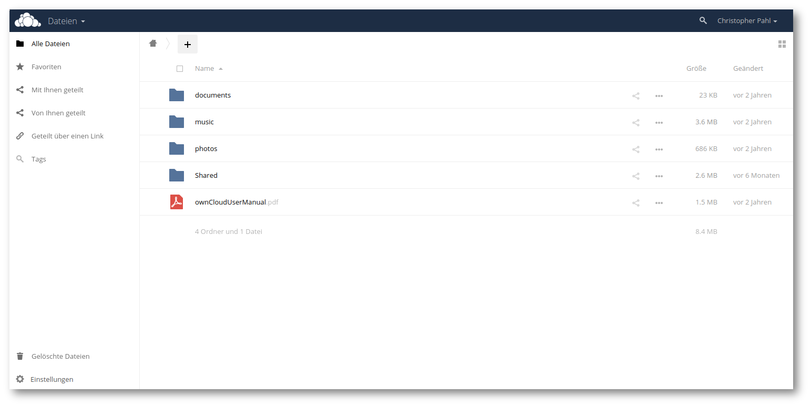

# Stand der Technik {#sec:stand-der-technik}

In diesem Kapitel wird ein kurzer Überblick über die wissenschaftlichen
Arbeiten und Produkte auf den Markt rund um das Thema Dateisynchronisation
gegeben. Darauf aufbauend wird von verschiedenen Perspektiven aus überlegt,
welche Eigenschaften ``brig`` übernehmen kann und von wem und in welchem Rahmen
die Software eingesetzt werden kann.

## Begriffe

XXX

synchronisation

nat

nat traversal

prüfsumme

peer to peer

partner oder teilnehmer

gateway

## Projektziel

XXX: In Einleitung verschieben?

Ziel des Projektes ist die Entwicklung einer sicheren und dezentralen
Alternative zu Cloud--Storage Lösungen wie Dropbox, die sowohl für Unternehmen,
als auch für Heimanwender nutzbar sind. Trotz der Prämisse, einfache Nutzbarkeit
zu gewährleisten, wird auf Sicherheit sehr großen Wert gelegt.  Aus Gründen der
Transparenz wird die Software dabei quelloffen unter der »``AGPLv3``«--Lizenz
entwickelt.

Nutzbar soll das resultierende Produkt, neben dem Standardanwendungsfall der
Dateisynchronisation, auch als Backup- bzw. Archivierungs--Lösung sein.
Weiterhin kann es auch als verschlüsselter Daten--Safe oder als
»Werkzeugkasten« für andere, verteilte Anwendungen dienen -- wie beispielsweise
aus dem Industrie--4.0--Umfeld.

Als weiteres Abgrenzungsmerkmal setzt ``brig`` nicht auf möglichst hohe
Effizienz (wie es typischerweise verteilte Dateisysteme tun) sondern versucht
möglichst generell anwendbar zu sein und über Netzwerkgrenzen hinweg zu funktionieren.
Dadurch soll es zu einer Art »Standard« werden, auf den sich möglichst viele
Anwender einigen können.

Um einen ersten Eindruck von ``brig`` und seinen Fähigkeiten in der Praxis zu
bekommen, wird an dieser Stelle das *Benutzerhandbuch* in
[@sec:benutzerhandbuch] empfohlen.

## Ähnliche Arbeiten

Es gibt viele unterschiedliche wissenschaftliche Arbeiten rund um das Thema der Dateiverteilung
in P2P--Netzwerken. Die meisten Arbeiten scheinen sich mehr auf das Thema
des Dateiaustausches an sich zu konzentrieren und weniger auf das Thema der Dateisynchronisation,
wo eine Menge von Dateien auf dem selben Stand gehalten werden muss.
Die vorhandenen Arbeiten legen ihren Fokus dabei meist auf die Untersuchung und
Implementierung verteilter Dateisysteme, die sehr ähnliche Probleme lösen
müssen, aber mehr auf Effizienz als auf Einfachheit Wert legen.

Stellvertretend für eine solche Arbeit soll hier die Dissertation von Julien
Quintard *»Towards a worldwide storage infrastructure«*[@quintard2012towards]
genannt werden. In dieser wird die Implementierung und die Konzepte hinter dem
verteilten Dateisystem *Infinit* vorgestellt. Obwohl der Fokus hier auf
Effizienz liegt, hat *Infinit* einige auffällige Ähnlichkeiten mit den Zielen
von ``brig``:

* Weltumspannendes P2P-Netzwerk als Grundlage.
- Nutzung von FUSE[^FUSE_EXPL]  als Frontend zum Nutzer.
- Verschlüsselte Speicherung der Daten.
* Eingebaute Deduplizierung.
* Eine Versionierung der Dateien ist geplant.

[^FUSE_EXPL]: Eine Technik, um ein Dateisystem im Userspace zu implementieren. Dem Nutzer kann dadurch ein normaler Ordner mit beliebigen Daten als Dateien präsentiert werden.

Der Hauptunterschied ist allerdings die Zielgruppe. Während das bei ``brig``
der »Otto--Normal--Nutzer« als kleinster Nenner ist, so ist *Infinit* auf
Entwickler und Administratoren ausgelegt und leider nur teilweise quelloffen
[^INFINIT_SOURCE], also keine »Free Open Source Software« *(FOSS)*.

[^INFINIT_SOURCE]: Siehe auch: <https://infinit.sh/open-source>

Eine sehr detaillierte Gegenüberstellung vieler Produkte rund um das Thema
Dateisynchronisation findet sich in der Dokumentation von ``inifinit``[^INF_COMP]

[^INF_COMP]: Beispielsweise mit Dropbox: <https://infinit.sh/documentation/comparison/dropbox>

[^INFINIT]: Mehr Informationen unter: <https://infinit.sh>  --- *Anmerkung:* Neben dem verteilten Dateisystem bietet das Unternehmen
auch noch eine reine Datei--Transfer--Lösung namens *Infinit Transfer*. Dazu gibt es hier mehr Informationen: <https://infinit.io>

Es gibt eine Reihe nicht--kommerzieller Projekte, die teilweise eine ähnliche
Ausrichtung wie ``brig`` haben und daher mindestens eine Erwähnung verdienen.
Im Folgenden werden die Ähnlichkeiten zu ``brig`` genannt:

**bazil:**[^BAZIL_ORG]  Ein Werkzeug um Dateien verschlüsselt und dezentral zu
verteilen. In seinen Zielen ist es sehr ähnlich zu ``brig``, besonders da
es ebenfalls ein FUSE--Dateisystem implementiert.[^FUSE_NOTE] Es ist eher an
technisch versierte Nutzer gerichtet und momentan noch nicht
für den Produktivbetrieb geeignet. Zu diesem Zeitpunkt funktioniert es
nur lokal auf einem System ohne mit anderen Knoten kommunizieren zu können.

**Tahoe-LAFS:**[^TAHOE_LAFS] Ein verteiltes Dateisystem, welches Dateien auf
eine Menge an Rechnern möglichst ausfallsicher verteilen kann, selbst wenn
einzelne Rechner ausfallen. Es richtet sich tendenziell an Administratoren und
technisch versierte Nutzer, die eine große Menge an Daten sicher lagern wollen.
Ähnliche Produkte in diesem Bereich gibt es mit *XtreemFs*[^XTREEMFS],
*LizardFs*[^LIZARDFS] und *MooseFs*[^MOOSEFS].

**restic:**[^RESTIC] Ein in *Go* geschriebenes Backup--Programm. Es
synchronisiert zwar keine Dateien über das Netzwerk, setzt aber eine
Versionsverwaltung mittels *Snapshots* um. Zudem verschlüsselt es alle ihm
bekannten Dateien in einem *Repository* und gewährleistet mittels eines
speziellen Dateiformats deren Integrität.
``brig`` verwendet analog zu ``restic`` (und ``git``) den Begriff *Repository*
für den Ordner, in dem es seine Daten ablegt.

[^BAZIL_ORG]: Siehe auch: <https://bazil.org>
[^FUSE_NOTE]: Der Entwickler von ``bazil``  Tommi Virtanen betreut auch dankenswerterweise die FUSE--Bindings für *Go*, die auch ``brig`` nutzt.
[^TAHOE_LAFS]: Siehe auch: <https://tahoe-lafs.org/trac/tahoe-lafs>
[^RESTIC]: Siehe auch: <https://restic.github.io>
[^LIZARDFS]: Siehe auch: <https://lizardfs.com/>
[^XTREEMFS]: Siehe auch:  <http://www.xtreemfs.org>
[^MOOSEFS]: Siehe auch: <http://moosefs.org/>

## Wissenschaftliche Lücke

{#fig:science-hole width=66%}

Die wissenschaftliche Neuerung der vorliegenden Arbeit ist die Zusammenführung
vieler wissenschaftlicher Teildisziplinen, die es nach Wissen des Autors vorher
noch nicht in dieser Form gab. Dabei werden viele bestehende Ideen und
Konzepte genommen, um sie in einer Software zu vereinen, die ein versioniertes
und verteiltes Dateisystem implementiert. Dieses soll nicht nur »sicher« (im
weitesten Sinne, siehe [@cpiechula], Kapitel TODO) sein, sondern auch
für ein Großteil der Anwender benutzbar sein.
Im Konkreten bestehen die Neuerungen hauptsächlich aus den folgenden Punkten:

* Eine Erweiterung des Datenmodells von ``git``, welches Metadaten von den eigentlichen Daten trennt,
  leere Verzeichnisse sowie umbenannte Pfade nativ unterstützt und eine eigene Historie pro Datei mit sich bringt.
* Die Möglichkeit nur die Metadaten zu synchronisieren und die eigentlichen Daten dynamisch
  nachzuladen und nach Anwendungsfall zu »pinnen«. Dateien mit einem *Pin* werden dabei auf dem lokalen Rechner
  gespeichert, Dateien ohne Pin dürfen falls nötig wieder gelöscht werden.
- Ein Verschlüsselungsformat (ähnlich dem Secretbox der freien NaCl[^NACL] Bibliothek), welches effizienten wahlfreien Zugriff erlaubt.
- Ein Kompressionsformat, welches blockbasierten, wahlfreien Zugriff und den Einsatz verschiedener Algorithmen erlaubt.
- Ein Konzept und Implementierung zur dezentralen Benutzerverwaltung, ohne dass ein Nutzer dabei registriert werden muss.
- Verschiedene Ansätze um die Usability zu verbessern ohne an Sicherheit zu verlieren.

[^NACL]: Mehr Informationen unter <https://nacl.cr.yp.to/secretbox.html>

## Markt und Wettbewerber

XXX: wiki footnote

Bereits ein Blick auf Wikipedia[@wiki_filesync] zeigt, dass der momentane Markt
an Dateisynchronisationssoftware sehr unübersichtlich ist.
Ein näherer Blick zeigt, dass die Softwareprojekte dort oft nur in Teilaspekten
gut funktionieren oder mit anderen unlösbaren Problemen behaftet sind.

Im Folgenden wird eine unvollständige Übersicht über bekannte
Dateisynchronisationsprogramme gegeben. Davon stehen nicht alle in Konkurrenz zu
``brig``, sind aber zumindest aus Anwendersicht ähnlich.

#### Dropbox + Boxcryptor

{#fig:scrn-dropbox}

Dropbox ist der vermutlich bekannteste und am weitesten verbreitete zentrale Dienst zur
Dateisynchronisation. Verschlüsselung kann man mit Tools wie ``encfs``
(Open--Source, siehe auch [^ENCFS]) oder dem etwas umfangreicheren, proprietären
``boxcryptor`` nachrüsten. Was das Backend genau tut ist leider das Geheimnis von
Dropbox --- es ist nicht Open--Source.

[^ENCFS]: Mehr Informationen unter <https://de.wikipedia.org/wiki/EncFS>

Die Server von Dropbox stehen in den Vereinigten Staaten von Amerika, was spätestens seit
den Snowden--Enthüllungen Besorgnis um die Sicherheit der Daten weckt. Wie oben
erwähnt, kann diese Problematik durch die Verschlüsselungssoftware ``boxcryptor``
abgemildert werden. Diese kostet aber zusätzlich und benötigt noch einen
zusätzlichen zentralen Keyserver[^KEYSERVER]. Ein weiterer Nachteil ist hier die
Abhängigkeit von der Verfügbarkeit des Dienstes.

[^KEYSERVER]: Mehr Informationen zum Keyserver unter <https://www.boxcryptor.com/de/technischer-\%C3\%BCberblick\#anc09>

XXX: noch korrekt? https://www.dropbox.com/de/help/137

Technisch nachteilhaft ist vor allem, dass jede Datei »über den Pazifik« hinweg
synchronisiert werden muss, nur um schließlich auf dem Arbeitsrechner
»nebenan« anzukommen.

#### ``ownCloud`` / ``nextCloud``

{#fig:scrn-owncloud}

Eine Alternative zu einem von einem Unternehmen bereitgestellten zentralen
Dienst, ist die Nutzung einer eigenen »Private Cloud« mithilfe der
Open--Source Lösung ``ownCloud`` (beziehungsweise dessen Fork ``nextCloud``).

Nutzer hosten auf ihren Servern selbst eine ``ownCloud``--Instanz und stellen
ausreichend Speicherplatz bereit. Vorteilhaft ist also, dass die Daten auf den
eigenen Servern liegen. Nachteilig hingegen, dass das zentrale Modell von Dropbox
lediglich auf eigene Server übertragen wird. Einerseits ist ``ownCloud`` nicht so
stark wie ``brig`` auf Sicherheit fokussiert, andererseits ist die Installation
eines Serversystems für viele Nutzer eine große Hürde und somit zumindest für
den Heimanwender nicht praktikabel.

#### ``syncthing``

{#fig:scrn-syncthing}

Das 2013 veröffentlichte quelloffene ``syncthing`` versucht diese zentrale Instanz
zu vermeiden, indem die Daten jeweils von Peer zu Peer (XXX: Schreibweise?) übertragen werden. Es ist
allerdings kein vollständiges Peer--to--peer--Netzwerk: Geteilte Dateien liegen
immer als vollständige Kopie bei allen Teilnehmern, welche die Datei haben.
Alternativ ist nur die selektive Synchronisation bestimmter Dateien möglich.

XXX: Referenz?

``Syncthing`` besitzt eine Art »intelligentes Routing«, bei dem Dateien
vom nahegelegenen Peers mit der höchsten Bandbreite übertragen werden.
Praktisch ist auch, dass ``syncthing``--Instanzen mittels eines zentralen
Discovery--Servers entdeckt werden. Nachteilig hingegen ist die fehlende
Benutzerverwaltung: Man kann nicht festlegen von welchen Nutzern man Änderungen
empfangen will und von welchen nicht.

#### ``resilio``

{#fig:scrn-resilio}

Das kommerzielle und proprietäre ``resilio`` (früher *Bittorrent Sync*) nutzt
eine Modifikation (XXX: ref) des bekannten und freien BitTorrent Protokoll zur
Übertragung. Vom Feature--Umfang ist es in etwa vergleichbar mit *Syncthing*.
Die Anlegung von verschlüsselten Repositories ist möglich.

Genauere Aussagen über die verwendete Technik kann man aufgrund der
geschlossenen Natur des Programms und der eher vagen Werbeprosa nicht treffen.
Ähnlich zu ``syncthing`` ist allerdings, dass eine Versionsverwaltung nur mittels
eines »Archivordners« vorhanden ist. Gelöschte Dateien werden in diesen
Ordner verschoben und können von dort wiederhergestellt werden.
Etwas mehr Details liefert der Vergleich des *Infinit*--Projekts.[^RESILIO_INFINIT]

[^RESILIO_INFINIT]: <https://infinit.sh/documentation/comparison/bsync>

#### ``git-annex``

![Screenshot des ``git-annex``--Assistenten[^ANNEX_SRC]](images/2/git-annex-assistant.png){#fig:scrn-git-annex}

[^ANNEX_SRC]: Bildquelle: <http://code.178.is/git-annex-is-magic/git-annex-assistant2.png>

Das 2010 erstmals von Joey Hess veröffentlichte ``git-annex``[^ANNEX] geht in
vielerlei Hinsicht einen anderen Weg als die oben genannten Werkzeuge. Einerseits ist es in der funktionalen
Programmiersprache Haskell geschrieben, andererseits nutzt es intern das
Versionsverwaltungssystem ``git``[@git], um die Metadaten zu den Dateien
abzuspeichern, die es verwaltet. Auch werden Dateien standardmäßig nicht
automatisch synchronisiert, hier ist die Grundidee die Dateien selbst zu
»pushen«, beziehungsweise zu »pullen«.

[^ANNEX]: Webpräsenz: <https://git-annex.branchable.com/>

Dieser »Do-it-yourself« (XXX: schreibweise) Ansatz ist sehr nützlich, um ``git-annex`` als Teil der
eigenen Anwendung einzusetzen. Für den alltäglichen Gebrauch scheint es aber selbst
für erfahrene Anwender zu kompliziert, um es praktikabel einzusetzen.

Trotzdem sollen zwei interessante Features genannt werden, welche auch
für ``brig`` interessant sind:

* *Special Remotes:* »Datenablagen« bei denen ``git-annex`` nicht installiert
  sein muss. Damit können beliebige Cloud--Dienste als Speicher genutzt werden.
+ *N-Copies:* Von wichtigen Dateien kann ``git-annex`` bis zu ``N`` Kopien
  speichern. Versucht man eine Kopie zu löschen, so verweigert ``git-annex``
  dies.

*Zusammenfassung:* Obwohl ``brig`` eine gewisse Ähnlichkeit mit verteilten
Dateisystemen, wie *GlusterFS* hat, wurden diese in der Übersicht weggelassen
--- einerseits aus Gründen der Übersicht, andererseits weil diese andere Ziele
verfolgen und von Heimanwendern kaum genutzt werden. Zudem ist der
Vollständigkeit halber auch OpenPGP zu nennen, was viele Nutzer zum
Verschlüsseln von E-Mails benutzen. Aber auch hier ist der größte Nachteil die
für den Ottonormalbenutzer schwierige Einrichtung und Benutzung.
Auch das freie Projekt ``librevault``[^LIBREVAULT] wurde im Vergleich
ausgelassen, da es sich noch im Alpha--Stadium befindet und bei einem Test
reproduzierbar abstürzte.

[^LIBREVAULT]: Mehr Informationen hier: <https://librevault.com>

In [@tbl:table-technical-overview] und [@tbl:table-practical-overview] findet
sich zusammenfassend eine Übersicht, mit den aus Sicht des Autors wichtigsten
Eigenschaften. Die Bewertung ist in Punkten wie *»Einfach nutzbar«*
subjektiver Natur.

(XXX: überprüfen ob das passt)

|                      | **Dezentral**       | **Verschlüsselung (Client)**     | **Versionierung**                      |  **Quotas**       | **N-Kopien**    |
| -------------------- | ------------------- | -------------------------------- | -------------------------------------- | ------------------|------------------|
| *Dropbox/Boxcryptor* | \xmark              | \xmark                           | \textcolor{YellowOrange}{Rudimentär}   |  \xmark           | \xmark          |
| ``ownCloud``         | \xmark              | \xmark                           | \textcolor{YellowOrange}{Rudimentär}   |  \xmark           | \xmark          |
| ``syncthing``        | \cmark              | \cmark                           | \textcolor{YellowOrange}{Archivordner} |  \xmark           | \xmark          |
| ``resilio``          | \cmark              | \cmark                           | \textcolor{YellowOrange}{Archivordner} |  \xmark           | \xmark          |
| ``git-annex``        | \cmark              | \xmark                           | \cmark                                 |  \xmark           | \cmark         |
| ``infinit``          | \cmark              | \xmark                           | \xmark                                 |  \cmark           | \textcolor{YellowOrange}{Nur kommerziell}|
| ``brig`` *(Prototyp)*  | \cmark            | \cmark                           | \cmark                               |  \xmark           | \xmark         |
| ``brig`` *(Ziel)*      | \cmark            | \cmark                           | \cmark                               |  \cmark           | \cmark         |

: Vergleich der Software aus technischer Sicht {#tbl:table-technical-overview}

|                      | **FOSS**            | **Einfach nutzbar** | **Einfache Installation**  | **Intell. Routing**   | **Kompression** |
| -------------------- | ------------------- | ------------------- |--------------------------  | ------------------------- |-----------------|
| *Dropbox/Boxcryptor* | \xmark              | \cmark              | \cmark                     |  \textcolor{YellowOrange}{LAN--Sync} | \xmark          |
| ``ownCloud``         | \cmark              | \cmark              | \xmark                     |  \xmark             | \xmark          |
| ``syncthing``        | \cmark              | \cmark              | \cmark                     |  \cmark             | \xmark          |
| ``resilio``          | \xmark              | \cmark              | \cmark                     |  \cmark             | \xmark          |
| ``infinit``          | \xmark              | \xmark              | \cmark                     |  \cmark             | \xmark          |
| ``git-annex``        | \cmark              | \xmark              | \xmark                     |  \xmark             | \xmark          |
| ``brig`` *(Prototyp)*  | \cmark            | \xmark              | \textcolor{YellowOrange}{Auf Linux} |  \cmark             | \cmark          |
| ``brig`` *(Ziel)*      | \cmark            | \cmark              | \cmark                     |  \cmark             | \cmark          |

: Vergleich der Software aus Nutzersicht {#tbl:table-practical-overview}

## Zielgruppen

Die primären Zielgruppen von ``brig`` sind Unternehmen und Heimanwender.
Aufgrund der starken Ende-zu-Ende Verschlüsselung ist ``brig`` allerdings auch
insbesondere für Berufsgruppen attraktiv, bei denen eine hohe Diskretion
bezüglich Datenschutz gewahrt werden muss. Hier wären in erster Linie
Journalisten, Anwälte, Ärzte mit Schweigepflicht und auch Aktivisten und politisch
verfolgte Minderheiten, zu nennen.

Im Folgenden werden die verschiedenen Zielgruppen und Plattformen genauer
besprochen und wie diese von ``brig`` profitieren können.

### Unternehmen

Unternehmen können ``brig`` nutzen, um ihre Daten und Dokumente intern zu
verwalten. Besonders sicherheitskritische Dateien entgehen so der Lagerung in
Cloud--Services oder der Gefahr von Kopien auf unsicheren
Mitarbeiter--Endgeräten. Größere Unternehmen verwalten dabei oft ein
Rechenzentrum in dem firmeninterne Dokumente gespeichert werden. Von den
Nutzern werden diese dann meist mittels Diensten wie *ownCloud*[^NEXTCLOUD]
»händisch« heruntergeladen.

[^NEXTCLOUD]: Siehe auch <https://owncloud.org>, bzw. dessen Fork *Nextcloud* <https://nextcloud.com>

In diesem Fall könnte man ``brig`` im Rechenzentrum und auf allen Endgeräten
installieren. Das Rechenzentrum würde die Datei mit tiefer Versionierung
vorhalten. Endanwender würden alle Daten sehen, aber auf ihrem Gerät nur die
Daten tatsächlich speichern, die sie auch benötigen. Hat beispielsweise ein
Kollege im selben Büro die Datei bereits vorliegen, kann ``brig`` diese dann
direkt transparent vom Endgerät des Kollegen holen. Das »intelligente Routing«
erlaubt den Einsatz von ``brig`` auf Smartphones, Tablets und anderen
speicherplatz-limitierten Geräten. Nutzer, die eine physikalische Kopie der Datei
auf ihrem Gerät haben wollen, können das entsprechende Dokument »pinnen«. Ist
ein Außendienstmitarbeiter beispielsweise im Zug unterwegs, kann er vorher ein
benötigtes Dokument pinnen, damit ``brig`` die Datei persistent verfügbar macht.

XXX: nötig

Indirekt sorgt auch die einfache Usability von ``brig`` für höhere
Sicherheit, da Mitarbeiter sich weniger durch die Sicherheitsrichtlinien ihres
Unternehmens gegängelt fühlen und nicht die Notwenigkeit sehen, wichtige
Dokumente auf private Geräte oder Speicher zu kopieren. Dies wirkt ebenfalls
Gefahren wie Industriespionage entgegen.

``brig`` kann auch das Teilen von öffentlichen Dateien mittels Hyperlinks unterstützen.
So wäre beispielsweise ein Kunde eines Ingenieurbüros nicht genötigt
``brig`` installieren zu müssen. Die öffentlichen Dateien könnten vom Kunden
mittels eines »Gateways« auf Seite des Ingenieurs vom Browser des Kunden aus empfangen werden.

### Privatanwender

Privatanwender können ``brig`` für ihren Datenbestand aus Fotos, Filmen, Musik
und sonstigen Dokumenten nutzen. Ein typischer Anwendungsfall wäre dabei ein
Network--Attached-Storage--Server (NAS), der alle Dateien mit niedriger
Versionierung speichert. Endgeräte, wie Laptops und Smartphones, würden dann
ebenfalls ``brig`` nutzen, aber mit deutlich geringeren Speicherquotas
(maximales Speicherlimit), so dass nur die aktuell benötigten Dateien
physikalisch auf dem Gerät vorhanden sind. Die anderen Dateien lagern im Netz
und können transparent von ``brig`` von anderen verfügbaren Knoten geholt
werden.

### Plattform für industrielle Anwendungen

Da ``brig`` auch komplett automatisiert und ohne Interaktion nutzbar sein soll,
kann es auch als Plattform für andere Anwendungen genutzt werden, die Dateien
sicher austauschen und synchronisieren müssen. Eine Anwendung in der Industrie 4.0
wäre beispielsweise die Synchronisierung von Konfigurationsdateien im gesamten Netzwerk.

### Einsatz im öffentlichen Bereich

Aufgrund der Ende-zu-Ende Verschlüsselung und einfachen Usability ist eine
Nutzung an Schulen, Universitäten sowie auch in Behörden zum Dokumentenaustausch
denkbar. Vorteilhaft wäre für die jeweiligen Institutionen hierbei vor allem,
dass man sich aufgrund des Open--Source--Modells an keinen Hersteller bindet
(Stichwort: *Vendor Lock--In*) und keine behördlichen Daten in der Cloud
landen. Eine praktische Anwendung im universitärem Bereich wäre die Verteilung
von Studienunterlagen an die Studenten. Mangels einer Standardlösung ist es
heutzutage schwierig Dokumente sicher mit Behörden auszutauschen. ``brig``
könnte hier einen Standard etablieren und in Zukunft als eine Plattform
dienen, um beispielsweise medizinische Unterlagen mit einem Krankenhaus auszutauschen.

### Berufsgruppen mit hohen Sicherheitsanforderungen

Hier wären in erster Linie Berufsgruppen mit Schweigepflicht zu nennen wie
Ärzte, Notare und Anwälte aber auch Journalisten und politisch verfolgte
Aktivisten. Zum jetzigen Zeitpunkt ist keine Anonymisierung
vorgesehen, die es erlauben würde auch die Quelle der Daten unkenntlich zu
machen. Dies könnte allerdings später mit Hilfe des Tor Netzwerks[^TOR] (Tor
Onion Routing Projekt) realisiert werden.

[^TOR]: Siehe auch: <https://www.torproject.org>

## Einsatszenarien

Basierend auf den vorgestellten Nutzergruppen lassen sich einige konkrete
Einsatszenarien ableiten:

**Synchronisationslösung:** Spiegelung von zwei oder mehr Ordnern und das
Teilen desselben zwischen ein oder mehreren Nutzern. Ein häufiger
Anwendungsfall ist dabei die Synchronisation zwischen mehreren Geräten eines
einzigen Nutzers. Eine selektive Synchronisation bestimmter Ordner ist vorerst
nicht vorgesehen.

**Transferlösung:** Veröffentlichen von Dateien nach Außen mittels eines *Gateway*
über den Browser. Eine beliebige Anzahl an anonymen
Teilnehmern können die Datei herunterladen.

**Versionsverwaltung:** Alle Modifikationen an den bekannten Dateien werden
aufgezeichnet. Bis zu einer bestimmten Tiefe können Dateien
wiederhergestellt werden.

**Backup- und Archivierungslösung:** Es ist möglich Knoten so zu konfigurieren, dass
alle Dateien gepinned werden. Ein solcher Knoten kann dann
anderen Teilnehmern automatisch als Archiv für alte Dateien dienen.

**Verschlüsselter Safe:** Da alle Dateien verschlüsselt sind, müssen sie beim Zugriff
der Software erst entschlüsselt werden. Da die entschlüsselten Daten nur
im Hauptspeicher vorgehalten werden, ist nach Beenden der Software kein
Zugriff mehr möglich.

Es gibt natürlich auch einige Einsatzzwecke, für die ``brig`` weniger geeignet
ist. Diese werden im [@sec:evaluation] beleuchtet, da die dortige Argumentation
teilweise ein Verständnis von der internen Architektur benötigt.

## Annahmen

Das Design von ``brig`` basiert auf einigen Annahmen, die im Voraus getroffen
werden mussten:

**Durchschnittlicher Netzwerkkonfiguration:** Für den Prototypen wird ein
normales Heimnetzwerk mit mehren Computern angenommen, welche typischerweise
hinter einem NAT (XXX: siehe kapitel 3) liegen. Diese sollen sich mit anderen
Computern in anderen Heimnetzwerken über das Internet austauschen können.

**Durchschnittlicher Arbeitsrechner:** Das Design wurde nicht auf leistungsschwache
Hardware ausgerichtet. Ausgegangen wird vom Vorhandensein eines normalen
Arbeitsrechners mit normalen Prozessor und mindestens 2GB Arbeitsspeicher.
Auch eine typische Arbeitsweise wird angenommen. Im Konkreten bedeutet das,
dass eine Datei öfters gelesen als geschrieben wird. XXX: drin lassen?

**Stabilität von ``ipfs:``** Es wird angenommen, dass ``ipfs`` stetig
weiterentwickelt wird und im momentanen Zustand keine gravierenden
Sicherheitsmängel. Zudem wird angenommen, dass es für die Zwecke von ``brig``
ausreichend hohe Performanz bietet.

**Keine Kollision der Prüfsummen:** ``brig`` kann (genau wie ``ipfs``) Dateien
nicht auseinander halten, die einen unterschiedlichen Inhalt besitzen, aber die
selbe Prüfsumme erzeugen. Auch wenn dieser Fall in der Theorie eintreten mag,
so ist dieser extrem schwer zu erreichen. Der von
``ipfs`` standardmäßig verwendete Algorithmus ist *sha256* (XXX: ref), welcher eine Prüfsumme
von 256 Bit Länge liefert. Wie in [@eq:hash-collision] gezeigt, müssten aufgrund des
Geburtstagsparadoxons[@wiki:geburtstagsparadoxon] unpraktikabel viele
Prüfsummen erzeugt werden, um eine Kollisionswahrscheinlichkeit von $0.1\%$ zu
erreichen, selbst wenn man sehr optimistisch annimmt, dass die Berechnung einer
einzigen Prüfsumme nur eine Pikosekunde dauert.

$$(\frac{1}{1000} \times 2^{\frac{256}{2}}) \times 10^{-12}s \simeq 10^{35.5} \times 10^{-12}s \simeq 10^{15} \text{Jahre}$$ {#eq:hash-collision}

XXX: formel nötig
