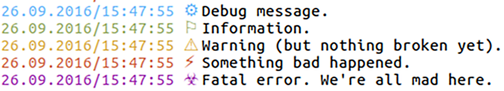

# Implementierung {#sec:implementierung}

<!-- Das Kapitel liest sich etwas holprig -->

Dieses Kapitel dokumentiert die Implementierung.
Der praktische Status der Implementierung kann in [@sec:benutzerhandbuch] betrachtet werden.
Dort werden nur Funktionen gezeigt, die auch tatsächlich schon existieren.
An dieser Stelle werden eher Implementierungsdetails gezeigt, die einen Einstieg in die
technische Umsetzung von ``brig`` geben sollen.

## Wahl der Sprache

Als Sprache zur Implementierung wurde die relativ junge Programmiersprache *Go*
ausgewählt. *Go* ist eine an *C* angelehnte Sprache, die von Ken Thompson, Rob
Pike und Robert Griesemer initiiert wurde und mittlerweile von Google getragen
und weiterentwickelt wird (siehe auch [@go_programming_language], S. XI ff.).
Für dieses spezielle Projekt bietet die Sprache aus Sicht des Autors folgende
Vorteile:

**Garbage--Collector:** Erleichtert die Entwicklung lang laufender Dienste und
erleichtert den Programmierer die Arbeit durch den Wegfall der manuellen
Speicherallokation und Bereinigung.

**Hohe Grundperformanz:** Zwar erreicht diese nicht die Performanz von C, liegt
aber zumindest in der selben Größenordnung (vgl. [@pike2009go], S. 37).

**Weitläufige Standardbibliothek:** Es sind wenig externe Bibliotheken nötig.
Insbesondere für die Entwicklung von Netzwerk- und Systemdiensten gibt es eine
breite Auswahl von gut durchdachten Bibliotheken. Besonders Erwähnenswert ist
das umfangreiche Angebot an gut dokumentierten kryptografischen Primitiven, die
eine unsichere Benutzung möglichst ausschließen sollen[^ECB_MODE].

[^ECB_MODE]: So wurde beispielsweise der unsichere ECB--Betriebsmodus für Blockchiffren absichtlich weggelassen: <https://github.com/golang/go/issues/5597>

**Schneller Kompiliervorgang:** Selbst große Anwendungen werden in wenigen
Sekunden in eine statisch gelinkte Binärdatei ohne Abhängigkeiten übersetzt. Kleinere
bis mittlere Anwendungen können ähnlich wie bei einer Skriptsprache direkt
mittels des ``go run`` Befehls ausgeführt werden.

**Cross--Kompilierung:** Anwendungen können für viele verschiedene Systeme
von einem Entwicklungsrechner aus gebaut werden. Da die entstehende Binärdatei
statisch gelinkt ist, werden zudem keine weiteren Abhängigkeiten benötigt.
Dadurch ist es möglich für verschiedene Systeme bereits gebaute Binärdateien anzubieten.

**Eingebauter Scheduler:** Parallele und nebenläufige Anwendungen wie
Netzwerkserver sind sehr einfach zu entwickeln ohne für jede Aufgabe einen
dedizierten Thread starten zu müssen. Stattdessen wechseln sich viele
Koroutinen[@conway1963design] (*Go-Routinen* genannt) auf einer typischerweise
geringeren Anzahl von Threads ab. Dadurch entfällt die Implementierung eines
expliziten Mainloops und das Starten von Threads per Hand.

**Hohe Portabilität:** Die meisten Programme lassen sich ohne Anpassung auf den
gängigsten Desktop--Betriebssystemen kompilieren. Die Möglichkeit native Anwendungen
für Android und iOS zu entwickeln ist ebenfalls in der Entwicklung[^MOBILE].

**Große Anzahl mitgelieferter Werkzeuge:** Im Gegensatz zu anderen Sprachen
umfasst das *Go*--Paket nicht nur die Sprache, sondern auch ein Buildsystem,
ein Race--Condition--Checker, ein Testrunner, ein Dokumentationsgenerator, ein
Static--Code--Checker, eine Formattierungshilfe und eine Art Paketmanager.

**Einfache Installation und rapides Prototyping:** Durch das ``go
get``--Wekzeug ist es möglich direkt Bibliotheken und Anwendungen von
Plattformen wie *GitHub* zu installieren. Gleichzeitig ist es einfach
eigene Bibliotheken und Anwendungen einzustellen.

**Einheitliche Formatierung:** Durch das »``go fmt``« Werkzeug und strikte
Stilrichtlinien[^STILRICHT] sieht jeder *Go*--Quelltext ähnlich und damit vertraut aus.
Dies erleichtert externen Entwicklern den Einstieg.

[^STILRICHT]: Siehe auch: <https://blog.golang.org/go-fmt-your-code>

**Geringe Sprachkomplexität:** Die Sprache verzichtet bewusst auf Konstrukte,
die die Implementierung des Compilers verlangsamen würden oder das Verständnis
des damit produzierten Quelltextes erschweren würde. Daher ist *Go* eine
Sprache, die verglichen mit *Python* zwar relativ wiederholend und gesprächig
ist, aber dadurch gleichzeitig auch sehr einfach zu lesen ist.

[^MOBILE]: Siehe dazu: <https://golang.org/wiki/Mobile>

Auch *Go* ist keine perfekte Sprache. Daher werden nachfolgend
einige kleinere Nachteile und deren Lösungen im Kontext von ``brig``
aufgezählt:

**Schwergewichtige Binärdateien:** Da bei *Go* alles statisch gelinkt wird, ist die
entstehende Binärdatei relativ groß. Im Falle des ``brig``--Prototypen sind das
momentan etwa 35 Megabyte. Werkzeuge wie ``upx``[^UPX] können dies auf
rund 8 Megabyte reduzieren, ohne dass der Anwender die Binärdatei selbst entpacken
muss.

**Vendor:** Der »Paketmanager« von ``go`` beherrscht nicht die
Installation einer bestimmten Paketversion.  Stattdessen
wird einfach immer die momentan aktuelle Version installiert. Viele Projekte,
``brig`` eingeschlossen, brauchen und bevorzugen aber einen definierten
Versionsstand, der von den Entwicklern getestet werden konnte. Dienste wie
*gopkg.in*[^GOPKG] versuchen eine zusätzliche Versionierung anzubieten, der
aktuelle »Standard« ist die Nutzung des ``vendor`` Verzeichnisses. Diese Lösung
läuft darauf hinaus alle benötigten Abhängigkeiten in der gewünschten Version
in das eigene Quelltext--Repository zu kopieren. Diese unelegante
aber gut funktionierende Lösung, wird von ``brig`` verwendet[^VENDOR].

[^GOPKG]: <http://labix.org/gopkg.in>
[^VENDOR]: Eigenes Repository für verwendete Bibliotheken: <https://github.com/disorganizer/brig-vendor>

[^UPX]: Ein Packprogramm für Binärdateien. Mehr Informationen unter <http://upx.sourceforge.net>

## Status der Implementierung

Die momentane Implementierung setzt die vorher besprochene Architektur
größtenteils um. Der Code der zuständig für die Synchronisierung ist
funktioniert zwar, ist jedoch noch nicht so detailliert wie in der Architektur
ausgearbeitet. Insbesondere beherrscht er noch nicht die Synchronisation leerer
Verzeichnisse und kann kompatibel Änderungen nur sehr bedingt auflösen.
Ansonsten unterscheidet sich die tatsächliche Implementierung und die
theoretische Architektur nur in Details.

### Umfang

Die Statistik in [@tbl:cloc-output] wurde mit dem freien Werkzeug
``cloc``[^CLOC] erstellt. Autogenerierte Dateien wurden dabei nicht mit
eingerechnet, Testdateien hingegen schon. Auch fehlen in der Statistik die
Module aus [@sec:dev-history], die zwar geschrieben worden sind, aber aufgrund
sich ändernder Designanforderungen wieder gelöscht worden sind. Es wurde
versucht, die Quelltextbasis möglichst klein zu halten.

| **Sprache**              | **Dateianzahl** | **Leerzeilen** | **Kommentare**    | **Codezeilen**
| ------------------------ | --------------- | ------------   | ----------------- | --------
| *Go*                     | 88              | 2833           | 1824              | 10813
| *Go Tests*               | 24              | 573            | 100               | 2698
| *Protocol Buffers*       | 4               | 97             | 58                | 323
| *Bourne Shell*           | 4               | 8              | 5                 | 44
| *make*                   | 4               | 5              | 1                 | 34
| $\sum{}$                 | *124*           | *3516*         | *1988*            | *13912*

:Quelltextumfang, gestaffelt nach Sprache. {#tbl:cloc-output}

TODO: Update wenn Implementierung  final.

[^CLOC]: <https://github.com/AlDanial/cloc>

### Dokumentation

Die Implementierung ist nicht auf ein Paradigma festgelegt. Zwar wird wie bei vielen
Projekten hauptsächlich auf *objektorientierte Programmierung (OOP)* gesetzt, doch
erlaubt *Go* auch die Anwendung prozeduraler und funktionaler Programmiertechniken.
Aus diesem Grund macht eine Beschreibung der Implementierung als UML für
``brig`` wenig Sinn, da einige Konzepte von dieser Beschreibungssprache nicht
ausreichend gut abgebildet werden können. Zudem würde eine Beschreibung aller
implementierten Typen schlicht den Rahmen dieser Arbeit sprengen.

Einen guten Überblick über die Implementierung und aller benutzten Typen
erlaubt die API--Dokumentation, die unter *»godoc.org«*[^BRIG_GODOC] einsehbar
ist. Die Software ist möglichst nahe an der Beschreibung von *Effective Go*
gehalten[^EFFECTIVE_GO], was den Einstieg für andere *Go*--Programmierer erleichtern sollte.
Eines der meist genutzten Idiome bildet dabei die strikte Fehlerbehandlung, bei der jede
Funktion die einen Fehler zurückgeben kann, einen zweiten ``error``--Wert zurückgibt.
Dieser wird innerhalb der Funktion möglichst früh zurückgeben. So entstehen zwei »vertikale Linien«
im optischen Aussehen des Quelltextes.  Die eine Linie kümmert sich um die Fehlerbehandlung, die
andere um den Erfolgsfall. [@lst:two-lines] zeigt ein Beispiel für diese Regel:

```{#lst:two-lines .go}
func someAction(msg string) (int, error) {
	//  | Fehlerbehandlung ist eingerückt.
	if len(msg) < 10 {
		return -1, ErrTooShort
	}// |
     // |
	if len(msg) > 20 {
	    return -1, ErrTooLong
	}// |
     // |
	// Erfolgsfall ist nicht eingerückt.
	return len(msg) * len(msg), nil
}
```

[^EFFECTIVE_GO]: <https://golang.org/doc/effective_go.html>

[^BRIG_GODOC]: <https://godoc.org/github.com/disorganizer/brig>

### Paketübersicht

{#fig:package-diagram}

[@fig:package-diagram] zeigt die Aufteilung des Quelltextes in die einzelnen Go--Pakete.
Die Software ist dabei in fünf Hauptpakete und drei »umliegende« Pakete aufgeteilt.
Die Hauptpakete sind dabei:

* ``repo``: Implementiert das Anlegen, Laden und Schreiben einer Repository--Struktur samt Konfiguration.
  Dient zudem als oberster Eintrittspunkt in die API von ``brig``, da hier alle
  wichtigen Instanzen (``ipfs``--Layer, *Stores* etc.) vereint sind.
* ``store``: Implementiert das eigentliche Datenmodell und alle Operationen darauf.
* ``daemon``: Implementiert die Netzwerkschnittstelle zwischen ``brigctl`` und ``brigd``.
* ``id``: Implementiert das Benutzermanagement, Identitätsvalidierung und die Remote--Liste.
* ``transfer``: Implementiert  den RPC--Mechanismus zwischen zwei ``brig``--Knoten und alle
  darin aufrufbaren Methoden.

Die umliegenden Pakete bestehen aus:

* ``cmdline``: Implementiert die Kommandozeile.
* ``fuse``: Implementiert die Dateisystemschicht.
* ``util``: Implementiert allgemein nützliche Funktionen für alle Pakete.

## Ausgewählte Themen

Aufgrund des großen Umfangs der Implementierung würde eine detaillierte
Beschreibung derselben den Rahmen dieser Arbeit sprengen. Stattdessen werden
hier einige ausgewählte Stellen der Implementierung näher beleuchtet.
Besonderer Wert wird dabei auf Details gelegt, die in der Besprechung der
Architektur noch nicht vorkamen.

### Aufbau des *Store*

Der *Store* kapselt alle Knoten des MDAG und implementiert die Operationen auf
diesen Knoten. Die besondere Schwierigkeit bei der Implementierung ist dabei,
dass jede Modifikation des Stores serialisiert werden muss, damit sie nach einem Neustart
oder Absturz von ``brigd`` noch weiterhin vorhanden ist. Für diesen Zweck setzt
``brig`` eine eingebettete[^EMBED] Key--Value--Datenbank namens *BoltDB*[^BOLT_DB] ein.

[^EMBED]: Also eine Datenbank, die ohne eigenen Datenbankserver funktioniert.
[^BOLT_DB]: MIT--Lizensiert; Webseite: <https://github.com/boltdb/bolt>

BoltDB verfolgt ein sehr minimales Konzept, indem keine besonderen Datentypen
unterstützt werden. Alle Schlüssel und Werte sind ausschließlich Binärdaten, um
deren Serialisierung sich der Programmierer zu kümmern hat. Im Falle von
``brig`` wird jeder Knoten als Protobuf--Nachricht in der Datenbank gespeichert
und wieder ausgelesen. Die Verschachtlung von Daten wird durch sogenannte
*Buckets* (dt. Eimer) unterstützt. Jeder Schlüssel kann einen Bucket enthalten,
der wiederum weitere Buckets und normale Schlüsselwertpaare enthalten kann.
Dadurch ist die Bildung einer Hierarchie möglich.

Für jeden Knotentypen (File, Directory, Commit) und Metadatentypen (Checkpoint,
Ref) wurde eine eigene, gleichnamige Go--Struktur eingeführt, welche die Daten
in der Datenbank kapselt und alle Operationen darauf implementiert. Jede dieser
Knotenstrukturen implementiert dabei ein gemeinsames Interface namens ``Node``.
Jedes ``Node`` weiß wie ein Knoten serialisiert und deserialisiert wird. Zudem
fasst das Interface Metadaten zusammen, die für alle Knotentypen gleich sind
(also Prüfsumme, Elternpfad, eigener Name, Größe, Änderungszeitpunkt und UID).
Ein Verzeichnis speichert dabei allerdings nicht seine Kindknoten (siehe
[@lst:hash-ref]) als weitere Verzeichnisstrukturen, sondern verweist auf diese
indirekt über deren Prüfsumme:

```{#lst:hash-ref .go}
type Directory {
	// Keine direkten Links: children []*Directory
	// Stattdessen Referenzierung über Prüfsumme:
	children []*Hash

	// Nutze 'fs' als Auflöser für diese Prüfsummen.
	fs *FS
}
```

Würde man die Kindknoten direkt laden, so müsste beim Laden des
``HEAD``--Commit der *gesamte* Graph geladen werden, da ``HEAD`` wiederum auf
ein Wurzelverzeichnis und sein Vorgänger--Commit verweist. Es muss nun
allerdings eine zentrale Instanz geben, die einen Knoten basierend auf dessen
Prüfsumme auflösen kann. Diese zentrale Instanz heißt bei ``brig`` *FS* (kurz
für *Filesystem*, dt. Dateisystem), da ihre Funktionalität dem Kern eines
Dateisystems ähnelt. Genau wie ein Dateisystem organisiert *FS* den Inhalt der
*BoltDB* und macht ihn über Pfade und Prüfsummen höheren Programmebenen
zugreifbar. Um diese Aufgabe zu lösen, forciert *FS* eine hierarchische Ablagestruktur
(gezeigt in [@fig:bolt-layout]) innerhalb der BoltDB, die an ``git`` angelehnt
ist.

{#fig:bolt-layout}

Basierend auf dieser Struktur kann *FS* die folgenden Funktionen effizient implementieren:

**func** ``NodeByHash(hash *Hash) (Node, error)``{.go}: Lädt die Metadaten eines Knoten
anhand seiner Prüfsumme. Dabei wird zuerst in »``stage/objects/<NODE_HASH>``«
nachgesehen und dann in »``objects/<NODE_HASH>``« falls der erste Schlüssel nicht
existiert.

**func** ``ResolveNode(nodePath string) (Node, error)``{.go}: Löst einen Pfad zu einem
``Node`` auf. Es wird probiert die Prüfsumme des Knotens »``stage/tree/<PFAD>``«
beziehungsweise »``tree/<PFAD>``« nachzuschlagen. Falls das Nachschlagen erfolgreich war,
wird ``NodeByHash()`` mit der so ermittelten Prüfsumme aufgerufen. Im Falle von
Verzeichnissen wird dem Pfad vorher ein ».« angehängt. Das ist nötig, da sonst
der Bucket zu dem Verzeichnisinhalten (»``/photos/``«) gefunden werden würde
und nicht das Verzeichnis an sich (»``/photos/.``«). Letztere Idee stammt
dabei aus dem normalen Unix--Dateisystem, wo ein einzelner Punkt ebenfalls
auf das aktuelle Verzeichnis zeigt. Es gibt allerdings noch kein
Äquivalent zu »``..``«, welches auf das Elternverzeichnis zeigen würde.

**func** ``StageNode(node Node) error``{.go}: Fügt dem Staging--Bereich einem
Eintrag hinzu. Der Pfad des Knoten und seine Prüfsumme werden unter
»``stage/...``« abgespeichert. Dabei sorgt die Funktion auch dafür, dass alle
Elternverzeichnisse des Knotens im Staging--Bereich abgespeichert werden, da
auch dessen Prüfsummen sich nach einer Modifikation von ``node`` verändert
haben.

**func** ``StageCheckpoint(ckp *Checkpoint) error``{.go}: Fügt einen Checkpoint dem
Staging--Commit unter ``stage/STATUS`` hinzu und speichert ihn in
»``checkpoints/<UID>/<LAST_IDX> + 1``« ab.

**func** ``MakeCommit(author id.Peer, message string) error``{.go}: Kopiert das
Wurzelverzeichnis des Staging--Commits und all seine Kinder in das Archiv
(``objects/`` und ``tree/``). Der bisherige Staging--Commit wird der neue
``HEAD`` und ein neuer, leerer Staging--Commit wird angelegt, auf den ``CURR``
zeigt. Der Rest des Staging--Bereichs wird geleert.

**func** ``ResolveRef(refname string) (Node, error)``{.go}: Schlägt die Prüfsumme unter
»``refs/<refname>``« nach und übergibt diese ``NodeByHash()``.

**func** ``SaveRef(refname string, nd Node) error``{.go}: Setzt den Wert unter
»``refs/<refname>``« auf die Prüfsumme des übergebenen Knoten.

**func** ``History(uid uint64) (History, error)``{.go}: Lädt alle Checkpoints für ein
bestimmtes Dokument anhand der UID des Dokuments. Für jeden neu angelegten
Knoten wird eine neue UID generiert, indem die in »``stats/node-count``«
abgespeicherte Ganzzahl um eins inkrementiert wird.

**func** ``LookupNode(repoPath string) (Node, error)``{.go}: Löst das Wurzelverzeichnis
des Staging--Commits auf und versucht mittels des übergebenen Pfades von dort
auf das angeforderte Kind zu kommen, indem die Kinder eines Verzeichnisses mit
``NodeByHash()`` nachgeladen werden. Diese Funktion unterscheidet sich von
``ResolveNode()`` dadurch, dass gelöschte Pfade berücksichtigt werden.
``ResolveNode()`` gibt hingegen den letzten Stand eines Knoten zurück, der an dieser
Stelle gespeichert war.

**func** ``MetadataPut(key string, value []byte) error``{.go}: Erlaubt das Setzen bestimmter
Schlüsselwertpaare unterhalb des ``metadata``--Bucket. Aufrufender Code kann dies
nutzen, um spezielle Werte persistent zu hinterlegen.

**func** ``MetadataGet(key string) ([]byte, error)``{.go}: Holt den Wert unter
»``metadata/<key>``« aus der BoltDB.

Bei jeder Operation werden also die Daten direkt aus *BoltDB* geladen,
deserialisiert und zu einer ``Node``--Struktur umgewandelt. Als
Effizienzsteigerung werden bereits aufgelöste Prüfsummen in ein assoziatives
Array und bereits aufgelöste Pfade in einem Patricia--Trie[^PATRIE]
gespeichert. Sobald eine Reihe von Änderungen an einem im Speicher befindlichen
``Node`` gemacht wurde (beispielsweise eine Änderung der Prüfsumme nach einer
Modifikation), wird der ``Node``, und all seine Eltern (da dessen Prüfsummen
sich ja auch geändert haben), in den Staging--Bereich eingefügt (durch Aufruf
von ``StageNode()``). Der »``stage/...``« Bereich fungiert also als
persistentes Sammelbecken für alle Änderungen, während die Änderungen im
Speicher den jeweils aktuellsten Stand wiederspiegeln.

Jede weitere Operation auf dem Stores läuft auf eine Sequenz von
Aufrufen der oben gezeigten Operationen hinaus. Beim Anzeigen aller Commits
(``Log()``) wird beispielsweise die Referenz ``HEAD`` aufgelöst (mittels ``ResolveRef()``). Dessen Eltern--Commit wird
dann rekursiv aufgelöst (mittels ``NodeByHash()``), bis kein weiterer Eltern--Commit gefunden werden
konnte. Die so gefundenen Commits werden dann von ``Log()`` in einem Array
zurückgegeben.

[^PATRIE]: Auch Radix--Baum genannt. Speichert gemeinsame Präfixe nur einmal und eignet sich daher gut, um bei vielen Pfaden Speicher zu sparen.
         Siehe auch: <https://de.wikipedia.org/wiki/Patricia-Trie>

Beim Abspeichern in der Datenbank wird der sich im Speicher befindliche ``Node``
wieder in eine Protobuf--Nachricht übertragen (siehe [@lst:node-proto]).
Diese fasst für alle Knotentypen gemeinsame Attribute zusammen:

```{#lst:node-proto .c}
message Node {
  required NodeType type = 1;     // Knotentyp (Enumeration)
  required uint64 ID = 2;         // UID des Knoten.
  required uint64 node_size = 3;  // Größe in Byte.
  required bytes mod_time = 4;    // Letzte änderung als RFC 3339 Timestamp.
  required bytes hash = 5;        // Prüfsumme.
  required string basename = 6;   // Basename der Datei.
  required string dirname = 7;    // Verzeichnis in dem die Datei liegt.

  // Unternachrichten für die eigentlichen Knoten:
  optional File file = 8;
  optional Directory directory = 9;
  optional Commit commit = 10;
}
```

### FUSE--Dateisystem

*Filesystem in Userspace* (kurz *FUSE*[^FUSE_WIKI]) ist eine Technik, die es
ermöglicht einen Ordner anzuzeigen, in dem von einem Programm (dem
*Userspace--Treiber*) generierte Dateien angezeigt werden. Technisch basiert es
darauf, dass ein Programm die spezielle Blockdatei ``/dev/fuse`` öffnet und
mithilfe dieser mit dem Kernel kommuniziert. Die API, die dabei implementiert
werden muss ist relativ umfangreich weswegen sich ein Wrapper anbietet, der
eine »saubere« API für die jeweilige Sprache anbietet. Für *Go* gibt es mit
``bazil/fuse``[^BAZIL_FUSE] eine sehr gute, entsprechende Bibliothek.

[^FUSE_WIKI]: Siehe auch: <https://de.wikipedia.org/wiki/Filesystem_in_Userspace>
[^BAZIL_FUSE]: <https://github.com/bazil/fuse>

Die API basiert dabei auf Callbacks. Werden bestimmte Aktionen vom Nutzer
getriggert (Beispiel: Er öffnet eine Datei), so wird im FUSE--Layer von ``brig`` eine
entsprechende Funktion namens ``Open()`` aufgerufen. Dieser wird immer ein
*Request-* sowie ein *Response--Objekt* mitgegeben. Die Aufgabe der
aufgerufenen Funktion ist das Auslesen der Details aus dem *Request--Objekt*
(Beispiel: In welchem Modus soll die Datei geöffnet werden?), das Ausführen
einer Aktion (Beispiel: Öffne Datenstrom von ``ipfs``) und das Befüllen des
*Response--Objekts* (Beispiel: Kein Fehler, neuer Dateideskriptor wird
zurückgegeben). Bei Fehlern kann verfrüht abgebrochen werden und ein spezieller
Fehlercode wird zurückgegeben werden (Beispiel: ``fuse.EIO`` für einen
Input/Output--Fehler). Auf diese Weise können die meisten
Systemaufrufe[^SYSCALL] (die normal vom Kernel vorgegeben sind) durch eigenen
Code implementiert werden. Beispielsweise wird auch ein Callback aufgerufen, wenn
das Kind eines Verzeichnisses nachgeschlagen werden muss.

[^SYSCALL]: Siehe Wikipedia für eine Liste: <https://de.wikipedia.org/wiki/Liste_der_Linux-Systemaufrufe>

Die meisten Operationen wie ``mkdir()``, ``create()``, ``rename()`` und
``remove()`` haben in der API des Store eine natürliche Entsprechung und sind
entsprechend einfach zu implementieren. Schwieriger ist das Auslesen und vor
allem die Modifikation von Dateiströmen. Die Sprache *Go* bietet mit dem Konzept von
``io.Reader`` und ``io.Writer`` ein sehr leicht wiederverwendbares Pattern, mit dem sich komplexe
Dateistromverarbeitungen für den Nutzer transparent erledigen lassen, indem mehrere ``io.Reader``
ineinander verschachtelt werden. [@fig:io-stack] zeigt auf der linken Seite
alle nötigen ``io.Reader``, um dem Nutzer des FUSE--Dateisystems den Inhalt einer Datei zu liefern.

FUSE fordert dabei Daten blockweise an. Das bedeutet, dass ein Funktionsaufruf
einen Block nach einem bestimmten Offset in der Datei zurückliefert. Da der
Nutzer des Dateisystems frei darin ist, beliebig oft ``Seek(<offset>)`` auf
einen Dateideskriptor aufzurufen, kann die Reihenfolge dieser Leseoperationen
beliebig sein. Hier erklärt sich auch der Grund warum das Verschlüsselungs- und
Kompressionformat- auf effizienten wahlfreien Zugriff Wert legt.
Wird ein Block angefragt, so muss er also erst von ``ipfs`` beschafft werden, dann entschlüsselt,
dann dekomprimiert und dann mit eventuellen Modifikationen vereint werden.

{#fig:io-stack}

Wird eine Datei schreibbar geöffnet, müssen zusätzlich die gemachten Änderungen
zurück geschrieben werden. Problematisch ist dabei, dass im Moment nur die
gesamte Datei neu zu ``ipfs`` hinzugefügt werden kann. Würde das bei jedem
Aufruf der ``Write()``--Funktion im FUSE--Layer geschehen, wäre das spätestens
bei großen Dateien sehr ineffizient. Als Kompromisslösung wird jeder
geschriebene Block samt seinen Offset im Hauptspeicher zwischengelagert. Erst
beim Aufruf von ``Close()`` (Schließen des Dateideskriptors) oder ``Flush()``
(explizites Herausschreiben aller zwischengelagerten Daten) werden die
gespeicherten Blöcke mit dem darunter liegenden Datenstrom wie in
[@fig:writer-overlay] kombiniert. Die kombinierte Version wird dann wieder
komprimiert, verschlüsselt und ``ipfs`` übergeben. Die Implementierung ist
etwas trickreich, da durch eine Modifikation auch der darunterliegende
Datenstrom verlängert (durch mehrere ``Write()``--Aufrufe am Ende) oder
verkürzt werden kann (durch ein ``Truncate()``).

Nachteilig an dieser Vorgehensweise ist vor allem, dass der Hauptspeicher sehr
schnell überlaufen kann, wenn eine große Datei komplett neu geschrieben wird.
Zukünftige Implementierungen sollten hier einzelne Blöcke auf die Festplatte
auslagern können oder ``ipfs`` so erweitern, dass individuelle Blöcke direkt
zurückgeschrieben werden können. Letzteres war im Rahmen dieser Arbeit zu
zeitintensiv, um akkurat implementiert zu werden.

{#fig:writer-overlay}

### Repository Struktur

{#fig:brig-repo-tree width=60%}

[@fig:brig-repo-tree] zeigt den Aufbau eines Repositories auf der Festplatte,
kurz nach dem Anlegen wenn ``brigd`` noch nicht läuft. Alle Daten sind nicht
direkt im Repository hinterlegt, sondern liegen in einem Unterordner namens »``.brig``«.
Ursprünglich sollte das FUSE--Dateisystem über das (größtenteils) leere Verzeichnis
gelegt werden, um es wie einen normalen Ordner aussehen zu lassen. Das ist technisch möglich,
wenn vor dem Erstellen des FUSE--Dateisystems ein offener Dateideskriptor auf das ``.brig``--Verzeichnis
vorhanden ist. Leider unterstützt ``ipfs`` dies nicht und stürzt beim versuchten Zugriff auf seine
Datenbank ab.

Nach dem Anlegen eines Repositories sind einige Dateien noch verschlüsselt
(Endung mit ``.locked``). Erst durch Eingabe des Passworts beim Starten von
``brigd`` werden diese Dateien entschlüsselt. Der Schlüssel wird dabei vom
Passwort mit der Schlüsselableitungsfunktion ``scrypt``[@percival2015scrypt]
generiert. Das Verschlüsselungsformat entspricht dabei dem in [@sec:encryption]
beschriebenen Verfahren.

Ansonsten haben die Dateien folgenden Inhalt:

* ``config:`` Enthält die Konfiguration des ``brig``--Repositories.
* ``remotes.yml.locked``: Enthält für jedes bekannte Remote seine Prüfsumme
  und einen Zeitstempel, wann dieser zuletzt online war.
* ``index/``: Enthält für jeden Benutzer eine BoltDB mit seinen Metadaten.
* ``ipfs/``: Ein ``ipfs``--Repository. Hier werden die eigentlichen Daten gespeichert.
  Die Struktur des Verzeichnisses selbst wird von ``ipfs`` bestimmt.
* ``shadow``: Enthält die Prüfsumme der vom Nutzer angegebenen Passphrase.
  Wird zum Abgleich der Passphrase beim Öffnen des Repositories genutzt.
* ``master.key``: Noch keine Verwendung. Wird zufällig beim Anlegen eines Repositories generiert.
  Soll als Basis einer Schlüsselhierarchie dienen (vgl. [@cpiechula]).

### Nennenswerte Bibliotheken

Einige Bibliotheken haben bei der Entwicklung von ``brig`` sehr geholfen.
Bei der Auswahl wurde auf drei Kriterien geachtet:

* Lizenz der Bibliothek muss mit der APGLv3--Lizenz von ``brig`` kompatibel sein.
* Die Bibliothek sollte plattformübergreifend funktionieren.
* Die Bibliothek sollte möglichst rein in *Go* geschrieben sein. Dies
  vereinfacht die Installation, da neben *Go* keine weiteren Abhängigkeiten installiert werden müssen.

Nennenswert sind dabei folgende Bibliotheken, die sich alle auf *GitHub* befinden.
In Klammern wird jeweils die Lizenz der Bibliothek mit angegeben:

* ``urfave/cli:``  Umfangreiche Bibliothek um Kommandozeilen zu parsen. (*MIT*)
* ``golang/snappy:`` Go--Implementierung des Snappy--Kompressionsalgorithmus. (*BSD--3--Clause*)
* ``bkaradzic/go-lz4:`` Go--Implementierung des LZ4--Kompressionsalgorithmus. (*BSD--3--Clause*)
* ``dustin/go-humanize:`` Enthält nützliche Konvertierungsfunktionen, um beispielsweise Bytes in eine passende, menschenlesbare Form zu formatieren. (*MIT*)
* ``jbenet/go-multihash:`` Implementiert die Enkodierung und Dekodierung des *Multihash*--Format. (*MIT*)
* ``VividCortex/godaemon:`` Wird benutzt um den Pfad zur eigenen ausführbaren Datei plattformübergreifend zu finden. (*MIT*)
* ``gogo/protobuf/proto:`` Optimierte Version des Original--Protobuf--Compilers.  (*BSD--3--Clause*)
* ``codahale/chacha20poly1305:`` Nutzt die Streaming--Cipher
  *ChaCha20* und die MAC *Poly1305* um authentifizierte Verschlüsselung
  umzusetzen. (Siehe auch: [@nir2015chacha20], *MIT*).
* ``chzyer/readline:`` Komfortable Eingabe von Text auf dem Terminal. (*MIT*)
* ``nbutton23/zxcvbn-go:`` Prüft eine Passphrase auf ihre Entropie. (*MIT*)

### Sonstiges

**Logging:** ``brigd`` nutzt eine farbige Log--Ausgabe und Unicode--Glyphen, um
dem Entwickler das Erkennen von verschiedenen Log--Leveln zu erleichtern (siehe
[@fig:log-levels]). Farbig ist die Ausgabe nur, wenn ``brigd`` im Vordergrund
läuft und auf ``stdout`` ausgibt. Läuft der Daemon im Hintergrund werden die
Log--Ausgaben in eine Datei geschrieben und die Farbinformationen weggelassen.

{#fig:log-levels width=75%}

**Konfiguration:** Einige Parameter von ``brig`` sind konfigurierbar. Diese
werden in einer menschenlesbaren YAML--Datei[^YAML] gespeichert.
Der Zugriff auf einen Wert erfolgt dabei durch einen mit ».« getrennten Pfad.
So liefert der Schlüssel »``daemon.port``« dem Schlüssel »``port``« in der
assoziativen Array »``daemon``« (siehe Beispiel [@lst:local-config]).

[^YAML]: <https://de.wikipedia.org/wiki/YAML>

```{#lst:local-config .yaml}
daemon:
  port: 6666                       # Port von brigd.
ipfs:
  path: /tmp/alice/.brig/ipfs      # Pfad zum Repository.
  swarmport: 4001                  # Port von ipfs.
repository:
  id: alice@wonderland.lit/laptop  # Nutzername.
```

**Global--Config:** Es ist möglich mehrere ``brig``--Repositories auf einem
Rechner parallel laufen zu lassen. Dabei ist allerdings darauf zu achten, dass
``brigd`` zwei Ports pro laufender  Instanz benötigt (4001 für ``ipfs`` und
6666 für ``brigd`` selbst). Deshalb hinterlegt jedes angelegte Repository in der sogenannten
*Global Config* einen Eintrag, welche Ports es nutzt. Neu angelegte Repositories
konsultieren die *Global Config*, um automatisch einen vernünftige Portkonfiguration
zu erhalten. Die Konfiguration ist wie die lokale Konfiguration eine YAML--Datei und
befindet sich im Home--Verzeichnis des Nutzers unter ``.brig-config/``. [@lst:global-config]
zeigt ein Beispiel mit zwei unterschiedlichen Repositories.
Die *Global Config* ist zudem dazu gedacht, globale Standardwerte für neue Repositories
zu definieren (ähnlich wie die globale ``git config``).

```{#lst:global-config .yaml}
# ~/.brig-config/repos
repos:
  - alice@wonderland.lit/desktop:
      repopath: /home/alice/.brig
      daemonport: 6666
      ipfsport: 4001
  - rabbithole@wonderland.lit/desktop:
      repopath: /var/rabbithole/.brig
      daemonport: 6667
      ipfsport: 4002
```

**Umgebungsvariablen:** Das Verhalten von ``brig`` wird teilweise auch über
Umgebungsvariablen gesteuert, sofern diese nicht von der Kommandozeile
überschrieben werden. Momentan gibt es drei Variablen, die gesetzt werden
können.

* ``BRIG_PATH:`` Falls gesetzt, operiert ``brig`` auf diesen Verzeichnis anstatt
  dem aktuellen Arbeitsverzeichnis. Kann dazu genutzt werden, um außerhalb des Repositories
  zu arbeiten.
* ``BRIG_LOG:`` Schreibt die Logdatei an den Pfad in der Umgebungsvariable.
* ``BRIG_PORT:`` Überschreibt den konfigurierten Port mit der Ganzzahl in der Umgebungsvariable.

## Entwicklungsumgebung

Die gesamte Implementierung wurde auf einem herkömmlichen Linux--System mit
aktuellen Softwarestand geschrieben und getestet.
Als Editor kam »neovim«[^NEOVIM_LINK] mit dem »vim-go«--Pluginset zum Einsatz.

Neben der von *Go* mitgelieferten Toolbox werden für die Verwaltung von
``brig`` noch ``glide``[^GLIDE] und ``gometalinter``[^GOMETALINTER] verwendet. Ersteres
verwaltet alle Abhängigkeiten von ``brig`` und wird genutzt, um sie aktuell zu
halten. Letzteres ist ein Programm zur statischen Code--Analyse. Es lässt viele
verschiedene in der Go--Welt gebräuchlichen Programme auf den Quelltext laufen
und sammelt deren Ergebnisse in einer konsistenten Ausgabe. Die Prüfungen dabei
sind vergleichsweise strikt und umfangreich. Beispielsweise werden nicht nur
undokumentierte Funktionen gefunden, sondern auch duplizierter Code. Es wurde
versucht ein Großteil der so gefundenen Probleme zu reparieren.

[^NEOVIM_LINK]: <https://neovim.io>
[^GLIDE]: <https://github.com/Masterminds/glide>
[^GOMETALINTER]: <https://github.com/alecthomas/gometalinter>

Der gesamte Quelltext wird mit ``git`` verwaltet und zu mindestens drei
verschiedenen Rechnern synchronisiert. Dazu gehört der bereits genannte
GitHub--Account (<https://github.com/disorganizer/brig>), sowie ein von
Herrn Schöler dankenswerterweise bereitgestelltes GitLab--Repository[^GITLAB_BRIG].
Zusätzlich wird der Quelltext noch auf einem privaten Rechner synchronisiert und
ist auf den Entwicklerrechnern vorhanden.

[^GITLAB_BRIG]: <https://r-n-d.informatik.hs-augsburg.de:8080/brig/brig>

Dabei wird sämtlicher Code auf dem ``master``--Branch entwickelt.
Nach einem öffentlichen Release sollte der ``master``--Branch stets den
aktuellsten, stabilen Stand von ``brig`` widerspiegeln, während der ``develop``--Branch
alle möglicherweise instabilen Änderungen sammelt. Vom ``develop``--Branch sollten
``feature/<name>`` oder ``bugfix/<name>``--Branches abgezweigt werden, in denen unabhängig ein eigenes
Feature entwickelt wird. Später werden diese »Feature«--Branches dann wieder
mit dem ``develop``--Branch zusammengeführt, welcher ebenfalls vor dem Release
einer neuen Version mit dem ``master``--Branch zusammengeführt wird.
Jedes Release soll zudem mit einem *Tag* versehen werden, dessen Name sich
nach den Regeln des *Semantic Versioning*[^SEMVER_LINK] richtet.

[^SEMVER_LINK]: Mehr Informationen hier: <http://semver.org>

Bei jedem veröffentlichten Commit auf GitHub werden zudem von der
Continuous--Integration--Plattform *Travis* alle Tests automatisch ausgeführt.
Bei Fehlern wird man durch eine E--Mail benachrichtigt. Diese Plattform ist für
freie Softwareprojekte dankenswerterweise kostenfrei.

[^TRAVIS]: Siehe hier: <https://travis-ci.org/disorganizer/brig>

## Entwicklungshistorie {#sec:dev-history}

Der Beginn der Entwicklung reicht bis in den November des Jahres 2015 zurück.
Zu diesem Zeitpunkt war ``brig`` konzeptuell noch anders gelagert und es wurde beispielsweise
die Verwendung von ``ssh`` und ``rsync`` als Backend diskutiert. Erst nach der
Beschäftigung mit ``ipfs`` und seinen Möglichkeiten entstand der Grundgedanke
der hinter dem heutigen ``brig`` steht.

### Sackgassen bei der Entwicklung {#sec:sackgasse}

Leider wurden auch einige Techniken sehr zeitaufwendig ausprobiert und wieder
verworfen. Dazu gehört auch der geplante Einsatz von *XMPP*[^XMPP] als sicherer Steuerkanal
und als Möglichkeit ein Benutzermanagement zu implementieren. Nach kurzer Recherche
stellte sich heraus, dass zum damaligen Zeitpunkt für *Go* noch keine verwertbaren,
Bibliotheken existierten.
Daher wurde ein eigener XMPP--Client entwickelt, der in Kombination mit
*Off--the--Record--Messaging (OTR)[^OTR]* für eine sichere Verbindung zwischen zwei
``brig``--Knoten sorgen sollte. Nach einigem Implementierungsaufwand stellte
sich dieser als zu langsam und ineffizient heraus (teilweise Verbindungsaufbau
$>$ 30 Sekunden)[^XMPP_IMPL]. Zudem handelt es sich bei *XMPP* um kein gänzlich dezentralisiertes
Protokoll, da die meisten Nachrichten über zentrale Server geleitet werden.
Von *XMPP* ist im heutigen Konzept nur das Format der Benutzernamens
geblieben, welcher an die JID angelehnt ist.

[^XMPP]: <https://de.wikipedia.org/wiki/Extensible_Messaging_and_Presence_Protocol>
[^OTR]: <https://de.wikipedia.org/wiki/Off-the-Record_Messaging>
[^XMPP_IMPL]: Alte Implementierung: <https://github.com/disorganizer/brig/tree/253208a0651b8649d54b159024b2756319458b94/im>

Als Ersatz für XMPP wurde *MQTT*[^MQTT] erwogen. Dabei handelt es sich um ein
offenes Machine--to--Machine Nachrichtenprotokoll. Clients registrieren sich
bei einem (normalerweise zentralen) Broker auf benannte Kanäle (*Topics*
genannt) und werden benachrichtigt, wenn ein anderer Client eine Nachricht auf
einem registrieren Topic veröffentlicht. Die Idee war, jeden ``brig``--Knoten
zu einem MQTT--Broker zu machen. Dabei ist jeder Knoten auch ein *Client* der
auf den *Topics* des eigenen Brokers und aller anderen, benachbarten Knoten
hört. Aus einem zentral aufgebauten Protokoll wurde so ein dezentrales
Protokoll gemacht. Und obwohl die Lösung dem ursprünglichen Konzept von *MQTT*
widersprach, hat ein Prototyp zufriedenstellend funktioniert.
Nachteilig war aber vor allem die schwierige Absicherung des Datenverkehrs und
dass ein zusätzlicher
Port für MQTT gebraucht wurde. Als beinahe unlösbar hat sich auch die
Notwendigkeit herausgestellt, MQTT über NAT--Grenzen hinweg zu betreiben.
Zusammen haben diese »Sackgassen« zwei bis drei Monate Entwicklungszeit verschlungen.

[^MQTT]: <https://de.wikipedia.org/wiki/MQ_Telemetry_Transport>

Bevor das in [@sec:architektur] beschriebene Datenmodell eingeführt wurde,
wurde sehr lange Zeit ein simpleres Datenmodell genutzt. Dieses existierte
alleine im Speicher und wurde zu bestimmten Anlässen in seiner Gesamtheit in die *BoltDB*
geschrieben. Die Basis hat ein Patricia--Trie gebildet, der alle Pfade
als Schlüssel und die Metadaten als deren zugeordnete Werte gespeichert hat. Aufgrund
von Problemen bei der Erweiterbarkeit in Richtung Versionsverwaltung und Wartung wurde dieses Datenmodell mit
dem heutigen ersetzt. In der Anfangszeit der Entwicklung wurde ``ipfs`` nicht
als Bibliothek genutzt, sondern es wurde direkt das ``ipfs``--Programm als Subprozess für
jedes auszuführende Kommando (Beispiel: ``ipfs add``) gestartet.
Aufgrund von schlechter Effizienz wurde dieser Ansatz nicht weiter verfolgt.

Als Lehre wurden drei Abstraktionsschichten in ``brig`` eingebaut, die die
Austauschbarkeit einiger Komponenten erleichtern soll. Diese sind wie folgt:

* Abstraktionsschicht zwischen ``brig`` und ``ipfs``. Jede benötigte
  ``ipfs``--Funktion erhält eine eigene Funktion im Paket ``ipfsutil``.
  Sollte sich die Semantik bestimmter Funktionen ändern, so
  kann dies an zentraler Stelle angepasst werden, auch wenn ``ipfs`` selbst
  bisher nicht sinnvoll zu ersetzen ist.
* Abstraktionsschicht zwischen ``brig`` und BoltDB. Es wird nicht direkt
  auf die API von BoltDB zugegriffen. Stattdessen kommt auch hier
  ein »Wrapper« zum Einsatz, hinter dem auch eine andere Key--Value--Datenbank,
  der Hauptspeicher  oder sogar ein normales Dateisystem stehen können.
* Abstraktionsschicht zwischen ``brig`` und Transfer--Schicht. Diese wurde
  zur selben Zeit eingeführt wie das oben genannte MQTT--Experiment. Deshalb konnte MQTT später
  relativ schnell durch ein eigenes Kommunikationsprotokoll basierend auf ``ipfs``
  ersetzt werden.

\newpage

### Beiträge zu anderen Projekten

Im Laufe der Entwicklung wurden einige kleinere Beiträge zu anderen Projekten
gemacht. Teilweise auch zu Projekten, die zu diesem Zeitpunkt gar nicht mehr
von ``brig`` genutzt werden.  Diese werden hier der Vollständigkeit halber in
umgekehrter chronologischer Reihenfolge aufgelistet:

* <https://github.com/bazil/fuse/pull/152>: Option für »*AllowNonEmpty*« hinzugefügt.
* <https://github.com/ipfs/go-ipfs/issues/2567>: Fehler in einer ``Seek()`` Funktion von ``ipfs``.
* <https://github.com/ipfs/go-ipfs-util/pull/1>: Konstante für den *DefaultHash* hinzugefügt.
* <https://github.com/tang0th/go-ecdh/pull/1>: Änderung kaputter Import--Pfade.
* <https://github.com/cathalgarvey/go-minilock/issues/8>: Crashreport für *minilock*.
* <https://github.com/tucnak/climax/pull/3>: Gruppierung mehrerer Subkommandos.
* <https://github.com/chzyer/readline/pull/18>: Beispiel für ein zuvor angeregten Passwortprompt hinzugefügt.
* <https://github.com/ipfs/go-ipfs/pull/1981>: Erwähnung von ``IPFS_PATH`` in der Hilfe.
* <https://github.com/tsuibin/goxmpp2/pull/1>: Flexibleres Nachschlagen des SRV--Eintrags.
