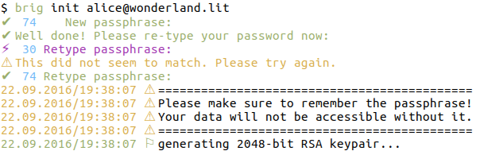
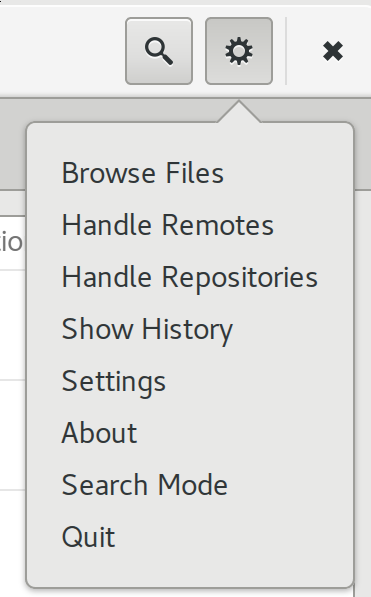
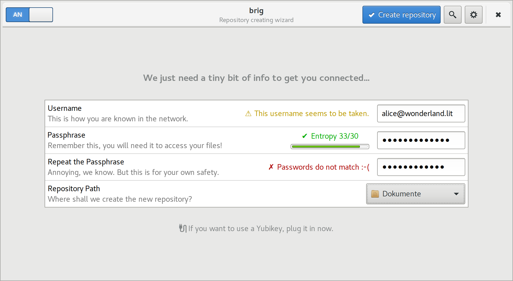
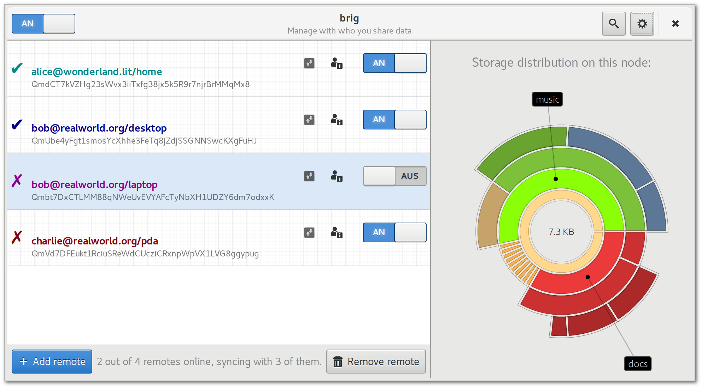
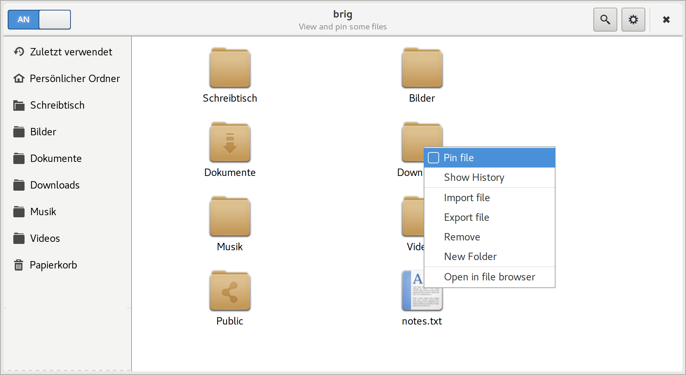
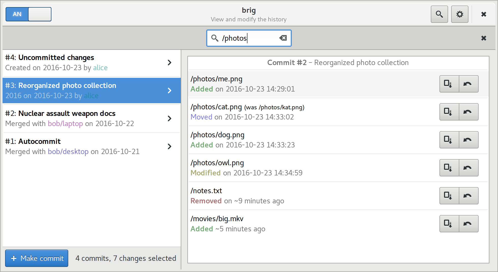
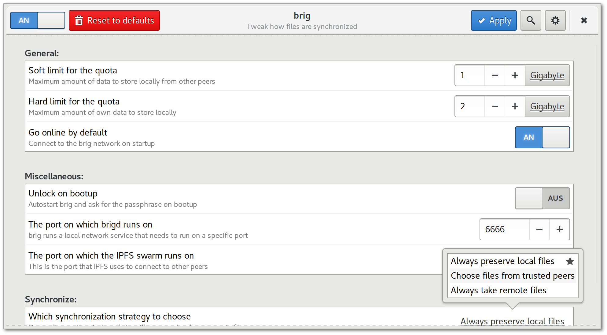

# Benutzbarkeit {#sec:benutzbarkeit}

In diesem Kapitel werden Anforderungen beleuchtet, die ``brig`` zu einer für
den »Otto--Normal--Nutzer« benutzbaren Software machen sollen. Zudem sollen die
in Zukunft notwendigen Schritte beschrieben werden, um die Anforderungen
umzusetzen. Dazu gehört unter anderem die Konzeption einer grafischen
Oberfläche.

## Einführung

Ob eine Bedienoberfläche verständlich ist oder ästhetisch auf den Benutzer wirkt,
ist leider sehr subjektiver Natur. Es können nur empirisch Daten gesammelt werden,
ob ein gewisser Prozentanteil der Nutzer die Software verständlich und ästhetisch fanden.
Aus diesem Grund ist der unten gezeigte Vorschlag für eine Bedienoberfläche lediglich
ein Konzept unter vielen möglichen.
Im Folgenden wird der Begriff »Benutzbarkeit« gleichbedeutend mit dem englischen Begriff
»Usability« verwendet. Eine gängige Übersetzung ist »Benutzerfreundlichkeit«, dieser stellt
aber nur einen Teil der englischen »Usability« dar. (TODO: ref?)

## Anforderungen an die Benutzbarkeit

Eine besondere Schwierigkeit bei ``brig`` ist, dass Sicherheit, Funktionalität
und Benutzbarkeit gegeneinander abgewogen werden müssen. Zu viel (und zu
schnell präsentierte) Funktionalität erschwert dem Nutzer den Einstieg in die
Software. Zu viele sichtbare Sicherheitsmechanismen schrecken den normalen
Nutzer ohne technischen Hintergrund ab. Hingegen werden Nutzer mit technischen
Hintergrund tendenziell eher mehr Funktionalität und striktere
Sicherheitsmechanismen erwarten.

Es ist daher schwierig, die Anforderung beider Nutzergruppen von einer
gemeinsamen Oberfläche erfüllen zu lassen. Deshalb erscheint es sinnvoller mehr
als eine Oberfläche anzubieten. Momentan wurde dabei nur zwischen
*Kommandozeile* (für technisch versierte Nutzer) und einer grafischen
Oberfläche die im Folgenden ``brig-ui`` genannt wird.

Für beide Varianten lassen sich trotzdem gemeinsame Anforderungen finden:

1)  Die Oberfläche muss möglichst immer im Hintergrund bleiben. Nur wenn sie benötigt
    wird soll der Benutzer sich mir ihr beschäftigen müssen.
2)  Es sollten nur das Minimum an nötigen Informationen angezeigt werden, um
    den »Cognitive Load«(TODO: ref wiki oder paper) des Nutzers zu mindern.
3)  Die Oberfläche soll einfach installierbar sein. Da Nutzer meist einfach »nur
    ein Problem« lösen wollen, greifen sie oft zur schnellst möglich
    installierbaren (und damit nutzbaren) Variante.
4)  Die Oberfläche muss dem Nutzer vertraute Konzepte (Listen, Auswahlmenüs...) und
    Metaphern (Dateien, Verzeichnisse...) bieten.
5)  Die Oberfläche muss konsistent in ihrer Benutzung sein. Sieht etwas in der
    Applikation gleich oder ähnlich aus, so muss es auch gleich oder ähnlich
    funktionieren. Im Umkehrschluss werden auch Begriffe wie »Passphrase« statt »Passwort« genutzt,
	um anzuzeigen, dass die Eingabe länger sein soll als ein herkömmliches »Passwort«.
6)  Die Oberfläche muss sich möglichst gut in das System des Benutzers integrieren.
    Im Falle einer grafischen Oberfläche bedeutet dies die Nutzung nativer Desktopapplikation
    (anstatt Webapplikation), die nativ *Drag&Drop* unterstützen und ein *Trayicon* anzeigen können.
7)  Die Oberfläche soll möglichst nicht »altbacken« wirken und soll möglichst ästhetisch wirken.
8)  Alle verwendeten Texte sollten in die lokale Sprache des Benutzers übersetzt werden.
9)  Die Funktionsweise der Oberfläche soll sich durch Konfiguration an die
    Bedürfnisse des Benutzers anpassen lassen, aber vernünftige Standardwerte
    mitbringen.
10) Die Oberfläche sollte dem Nutzer direkt Feedback geben, ob eine Aktion erfolgreich war.
    Unwichtige Fehler sollten nach Möglichkeit ignoriert werden, wichtige Fehler sollten
    Handlungsinstruktionen beinhalten.

Diese Anforderungen wurden teilweise von *www.usabilitynet.org*[^USABILITY]
abgeleitet und ergaben sich teilweise nach Betrachtung der existierenden
Synchronisationswerkzeuge. Die Liste ist natürlich sehr subjektiv und
keineswegs komplett. Obwohl beispielsweise ``syncthing`` sich als *»Easy to
use«*[^EASY_TO_USE] bezeichnet, verletzt es unter anderem die Anforderung *2)*
und präsentiert dem Nutzer in der Hauptansicht die Systemauslastung und andere
Informationen, die in diesem Kontext nicht wichtig sind.

[^USABILITY]: <http://www.usabilitynet.org/trump/methods/recommended/requirements.htm>
[^EASY_TO_USE]: <https://syncthing.net>

TODO: ref zu screenshot

## Die Kommandozeile

Momentan ist die Kommandozeile ``brigtctl`` die einzige, implementierte Möglichkeit die gesamte
Funktionalität von ``brig`` zu nutzen. Die genaue Funktionsweise der
Kommandozeile wird in [@sec:benutzerhandbuch] beleuchtet. Beim Design der
Optionen und Unterkommandos wurde darauf geachtet, dass ``git``--Nutzer die
Benutzung schnell *vertraut* vorkommt, wo die Konzepte sich ähneln (``brig
remove/remote``). Wo sie sich unterscheiden, wurden bewusst andere Namen
gewählt (``brig stage`` statt ``git add`` und ``brig sync`` statt ``git
pull/push``).

Eine eingebaute Hilfe kann für ein bestimmtes Kommando mit dem Befehl
``brig help <topic or command>`` angezeigt werden.
Das initiale Anlegen eines Repositories erfordert eine Passphrase mit einer
bestimmten Mindestentropie. Wie man in [@fig:pwd-input] erahnen kann, wird die
Entropie live bei der Eingabe des Passworts angezeigt, um den Nutzer direkt
Feedback zu geben.

Momentan wurde die Kommandozeile noch nicht in weitere Sprache übersetzt, da
sie sie noch wie der Rest der Implementierung in steten Wandel befindet.

{#fig:pwd-input width=50%}

Eine weitere Verbesserung wäre die Unterstützung von *Shorthashes*. Der
Benutzer muss immer eine volle Prüfsumme angeben
(``QmSiM3qaUMxCrLiWwVvEeGZTrKUXLD7bULo22WYoGfHwZD``), auch wenn meist ein
kleiner Präfix (``QmSiM3``) davon bereits eindeutig identifizierbar ist. In der
Ausgabe von ``brig`` sollte dann auch möglichst die Präfixform bevorzugt
werden, um die Ausgabe klein und verständlich zu halten.

## Grafische Oberfläche

Für normale Benutzer ist eine grafische Oberfläche aus unserer Sicht unabdingbar.
Für die Akzeptanz der Oberfläche ist es wichtig, dass sie dem Benutzer
vertraute Konzepte bietet. Daher wird ein großer Teil der Benutzung durch einen
normalen Dateisystemordner abgewickelt, der sich kaum von anderen Ordner
unterscheidet. Daher hat die grafische Oberfläche eher die Aufgabe
einer Konfigurationsanwendung und eines Einrichtungs--Wizard, der nur bei Bedarf
aufgerufen wird. Konkret sind die nötigen Aufgabenbereiche wie folgt:

* Einrichtung und Konfiguration eines neues Repositories.
* Oberfläche zur Versionsverwaltung.
* Schalter, um zwischen Online- und Offline--Modus zu wechseln.
* Hinzufügen und Verwalten von Remotes.
* Integrierter Dateibrowser, um Dateien zu verwalten und zu pinnen.
* Versionsverwaltung und Auflösung von Konflikten.

Bestehende grafische Oberflächen sind aus Portabilitätsgründen meist
web--basiert und fügen sich daher meist nicht optimal in eine Desktopumgebung
ein. Daher wurde das nachfolgende Konzept als native Desktopanwendung für den
GNOME--Desktop (TODO: ref) entworfen. Dabei wurde die Oberflächenbibliothek
*GTK+* (TODO: ref) benutzt. Neben den obigen Anforderungen wurde versucht
möglichst alle Regeln der *»Gnome Human Interface Guidelines«* (GNOME HIG[^GNOME_HIG])
umzusetzen. Es handelt sich dabei um einer Anleitung des GNOME--Projekts, um
den Oberflächenentwurf zu vereinfachen und einheitlich zu gestalten. Offizielle
GNOME--Anwendung müssen diesen Guidelines folgen.

*GTK+* wurde benutzt, weil der Autor sich mit dieser Bibliothek auskennt und bereits
eine im Aussehen »ähnliche« Anwendung geschrieben hat, die als Basis für unten stehende
Mockups benutzt wurde.
Leider ist *GTK+* wenig portabel (TODO: ref) und noch gibt es keine gute
Unterstützung für die Programmiersprache *Go*. Da die Anwendung portabel sein
sollte, aber sich trotzdem wie eine native Anwendung anfühlen soll, wäre für
eine tatsächliche Umsetzung eine Bibliothek wie *Gallium*[^GALLIUM] zu
evaluieren. Diese zeigt, vereinfacht gesagt, eine Weboberfläche als
Desktopanwendung.

[^SHREDDER]: *Shredder*, eine grafische Deduplizierungslösung: <https://rmlint.readthedocs.io>

[^GALLIUM]: Siehe auch: <https://github.com/alexflint/gallium>

[^GNOME_HIG]: Siehe auch: <https://developer.gnome.org/hig/stable>

## Mockups von ``brig-ui``

TODO: shredder erwähnen

In [@fig:ui-overview] findet sich eine Übersicht über alle Bildschirme der
Oberfläche, wobei jeder Bildschirm für eine andere Aufgabe zuständig ist. Jedem
Bildschirm gemein ist die sogenannte *»Headerbar«*, eine etwas breitere
Fensterleiste, in der eigene Knöpfe platziert werden können. Auf der linken
Seite derselben findet sich ein Schalter, der anzeigt ob man mit dem Netzwerk
verbunden ist. Ein Klick auf diesen trennt die Verbindung. Auf der rechten
Seite findet sich ein Knopf mit einer Lupe, der die Anwendung in den Suchmodus
schaltet. Die Suche ist kontextspezifisch, findet also je nach Bildschirm etwas
anderes. Neben dem Suchknopf findet sich ein Knopf mit einem Zahnrad. Bei einem
Klick darauf öffnet sich das in [@fig:mockup-menu] gezeigte Menü, von dem aus
jeder weitere Bildschirm erreichbar ist. Meist kommt man aber durch das
Ausführen bestimmter Aktionen automatisch auf einen anderen Bildschirm, ohne
dass man das Menü bemühen muss.
Im Folgenden werden die Aufgaben der einzelnen Bildschirme besprochen.

{#fig:ui-overview}

{#fig:mockup-menu width=25%}

### Anlegen eines neuen Repositories

{#fig:mockup-repo}

Dieser Bildschirm taucht beim erstmaligen Starten der grafischen Oberfläche
auf, sofern kein vorhandenes ``brig`` Repository gefunden werden konnte. Der
Bildschirm fragt alle Daten ab, die auch der Befehle ``brig init`` benötigt.
Ein Vorteil der Oberfläche ist dabei, dass dem Nutzer direkt Feedback bei der
Eingabe gegeben werden kann. Konkret wird dabei der Nutzername auf formaler Korrektheit überprüft und ob bereits ein solcher Name vergeben wurde.
Es wird zudem geprüft, ob das Passwort einer bestimmten Mindestentropie entspricht und ob das wiederholte Passwort
mit dem ersten übereinstimmt.
Dadurch, dass der Nutzer mithilfe der Oberfläche den Anlegeort für das neue Repository auswählt,
wird ein fehlerhafter Pfad ausgeschlossen.

In der späteren Entwicklung soll ``brig`` auch mit Geräten zur
Zweifaktorauthentifizierung (TODO: ref kitteh) wie dem YubiKey[^WIKI_YUBI]
zusammen arbeiten. Daher wird am unteren Bildschirmrand eine
entsprechende Nachricht angezeigt. Ensprechende Schaltflächen zur Konfiguration
werden erst angezeigt, wenn ein angeschlossener YubiKey erkannt wurde.[^MINIMALISMUS]

[^WIKI_YUBI]: Siehe auch: <https://en.wikipedia.org/wiki/YubiKey>
[^MINIMALISMUS]: Dies entspricht Anforderung 2).

Ein auch im Folgenden häufig verwendetes Designelement ist das Hervorheben
einer Aktion als »Empfohlen«. In [@fig:mockup-repo] wird die »Create
Repository«--Aktion blau hervorgehoben, um dem Nutzer anzuzeigen, dass dies die
naheliegende Aktion ist, die er vermutlich nehmen wird. Drückt man diese
»empfohlene Aktion«, so wird das Repository angelegt und der Hintergrunddienst
``brigd`` gestartet. Im Erfolgsfall wird eine Wischanimation zum
Remote--Bildschirm angezeigt. (siehe [@sec:ui-remote]).

### Verwalten und Hinzufügen von Remotes {#sec:ui-remotes}

{#fig:mockup-remotes}

In dieser Ansicht kann der Nutzer existierende Remotes verwalten und Neue
hinzufügen. Eine Idee, die vom Instant--Messanger *Signal* übernommen wurde,
ist die Einfärbung eines Remotes mit einer bestimmten Farbe. Dies soll dem
Nutzer helfen den Kontakt mit dieser Farbe zu assoziieren und stellt
gleichzeitig ein Sicherheitsmechanismus dar, da die Farbe basierend auf der
Identitäts--Prüfsumme des Gegenübers gewählt wird. Ändert sich diese, so wird
auch eine andere Farbe angezeigt.

Auf der linken Seite des Bildschirms findet sich eine Liste aller bekannten
Remotes. Ist die Liste leer, wird dort ein Hinweis angezeigt, dass noch keine
Remotes vorhanden sind und man durch die »empfohlene Aktion« unten links ein
neues Remote anlegen kann.

Jedes Remote wird durch ein Eintrag in der Liste dargestellt. Das \cmark oder
\xmark am Anfang indiziert dabei, ob das betreffende Remote online ist. Daneben
wird in jedem Eintrag der Name des Remotes und seine Prüfsumme angezeigt.
Eventuell wäre hier die alleinige Anzeige des Nutzernamens (``Alice`` statt
``alice@wonderland.lit/home``) benutzerfreundlicher und weniger verwirrend,
sofern der Name ``Alice`` eindeutig unter den Remotes ist. Zur rechten jeder
Zeile finden sich drei Schaltflächen, die  (in dieser Reihenfolge) ein
sofotiges Synchronisieren (Pfeilknopf) bewirken, ein Detailfenster zum
entsprechenden Remote öffnet und das automatische Synchronisieren mit diesem
Remote an oder ausschaltet. Remotes mit denen automatisch synchronisiert wird,
werden mit einem Hintergrund hinterlegt, der kariertem Papier ähnelt. Eine
Synchronisation ist nur möglich, wenn ``brig`` im Online--Modus ist. Im
Suchmodus können die Namen der Remotes zusätzlich durch Angabe eines
Stichwortes gefiltert werden.

In der unteren Statusleiste wird zudem in Zahlen zusammengefasst, wie viele
Remotes online sind und wie vielen davon synchronisiert wird. Der Knopf zum
Löschen eines Remotes wird nur dann angezeigt, wenn mindestens ein Remote aus
der Liste ausgewählt wurde (hellblau hinterlegt).

Die rechte Seite des Bildschirms besteht aus einem segmentierten Kreisdiagramm.
Es wird nur angezeigt wenn genau ein Remote ausgewählt ist. Allerdings kann
auch die Trennlinie in der Mitte des Bildschirms benutzt werden, um das
Diagramm auszublenden, indem es auf die rechte Seite geschoben wird. Das
Diagramm selbst zeigt an welche Teile der synchronisierten Daten das Gegenüber
physikalisch bei sich speichert. Die Gesamtmenge wird in der Mitte als
Dateigröße gezeichnet. Im Beispiel speichert ``bob@realworld.org/laptop``
größtenteils die Dateien aus dem ``music`` und aus dem ``docs``--Ordner. Die
Anzeige kann auch durch den Klick auf ein beliebiges Segment verfeinert werden.
Dann werden nur noch dieses Segment und seine Untersegmente angezeigt. Ein
Klick in die Mitte des Diagramms führt dabei wieder auf die oberste
Segmentebene zurück.

Ein gewisses Usability--Problem stellt noch die initiale Authentifizierung dar.
Der Dialog, der nach einem Klick auf »``Add Remote``« erscheint (nicht
gezeigt), fragt nur nach den Nutzernamen und der Prüfsumme des Gegenübers. Dies
setzt voraus, dass der Nutzer die Prüfsumme kennt, indem beide Teilnehmer sich
vorher über einen Seitenkanal ausgetauscht haben. Leider ist der Austausch der
Prüfsumme schwierig, da es sich um eine schwer merkbare Zeichenkette handelt.
Eine mögliche Lösung für dieses Dilemma wäre die Einführung von QR--Codes
(siehe [@fig:qrcode]), welche die Prüfsumme des Gegenübers visuell enkodieren.
Treffen sich beispielsweise zwei Teilnehmer persönlich, so könnten sie ihre
Mobiltelefone benutzen, um den QR--Code einzuscannen und zu verifizieren. Auch
würde sich der QR--Code eignen, um auf Visitenkarten abgedruckt zu werden.

![QR--Code TODO[^QR_CODE_SRC] ](images/6/qrcode.pdf){#fig:qrcode width=20%}

[^QR_CODE_SRC] Quelle: <https://commons.wikimedia.org/wiki/File:QRCodeWikipedia.svg>

### Dateibrowser

{#fig:mockup-file-browser}

Der Dateibrowser zeigt alle Dateien an, die der jeweilige Synchronisationsteilnehmer verwaltet.
Dies entspricht einer grafischen Sicht auf den FUSE--Dateisystemordner. Den Hauptunterschied bilden
die zusätzlichen Optionen im Kontextmenü:

* *Pin file:* Setzt oder entfernt einen Pin für die Datei oder rekursiv für das Verzeichnis.
* *Show History:* Wechselt zum Versionsverwaltungsbildschirm und zeigt die Historie der Datei (siehe [@sec:ui-vcs]).
* *Import/Export file:* Speichere Datei auf der Festplatte ab. Entspricht ``brig add`` und ``brig cat``.
* *Remove:* Entfernt die Datei im *Staging Bereich*.
* *New Folder:* Entspricht ``brig mkdir``.
* *Open in file browser:* Öffnet den Dateibrowser des Systems. Die ist nützlich
  wenn komplexere Features benötigt werden.

Die Ansicht ist zudem durchsuchbar. Wird ein Teil eines Pfades eingegeben, so
werden alle Dateien angezeigt, die dieses Pfadfragment beinhalten.
Die Oberfläche ähnelt dabei sehr dem Dateibrowser *Nautilus*[^NAUTILUS], da die
selben Widgets zur Anzeige der Dateien benutzt werden.

[^NAUTILUS]: Siehe auch: <https://de.wikipedia.org/wiki/Nautilus_(Dateimanager)>

### Versionsverwaltung {#sec:ui-vcs}

Dieser Bildschirm bietet dem Nutzer Zugriff auf die eingebaute
Versionsverwaltung. Die Ansicht ist zweigeteilt. Auf der linken Seite findet
sich eine Liste mit allen bekannten Commits (entspricht etwa ``brig log``).
Jede Commitzeile enthält dabei den Index des Commits, der Commit--Message, dem
Erstellungsdatum und dem (farbig hervorgehobenen) Autor. Auf der rechten Seite
jeder Zeile findet sich der *Checkout*--Button, mit dem der aktuelle Stand auf
dem Stand im ausgewählten Commit zurücksetzen lässt. Unter dem Namen
*Uncommited Changes* findet sich an oberster Stelle zudem immer der *Staging
Commit*. Im linken, unteren Bereich wird zudem eine Statusleiste eingeblendet,
in der als empfohlene Aktion das Anlegen eines neuen Commits möglich ist. Diese
Aktion wird nur eingeblendet wenn ``HEAD`` und ``CURR`` sich unterscheiden.

Auf der rechten Seite werden für den aktuell ausgewählten Commit alle darin
gemachten Änderungen aufgelistet. Dabei wird für jeden Checkpoint des Commits
eine Zeile angezeigt. Diese beinhaltet den Pfadnamen, den Änderungstyp (farbig
kodiert) und den Änderungszeitpunkt. Liegt  der Änderungszeitpunkt noch nicht
lange zurück, so wird er relativ zum aktuellen Zeitpunkt angegeben (*5 minutes ago*).
Auf der rechten Seite jeder Zeile findet sich zwei Knöpfe. Der Linke erlaubt
das Exportieren der Datei in dem entsprechenden Zustand, der Rechte setzt im *Staging--Commit*
die entsprechende Datei auf diesen Stand zurück.

Diese Ansicht ist durchsuchbar. Wird ein Pfad eingegeben (im Beipsiel
``/photos``), so werden alle Commits angezeigt, in denen der
``/photos``--Ordner verändert wurde.

{#fig:mockup-vcs}

### Einstellungen

{#fig:mockup-settings}

Über den Einstellungsbildschirm sind alle verfügbaren Einstellungen erreichbar.
Die Einstellungen sind in mehrere Kategorien aufgeteilt (hier *General*,
*Miscellaneous*, und *Synchronize*). Jedes Einstellungsmerkmal entspricht dabei
einer Zeile, die links jeweils eine kurze und eine etwas längere Beschreibung
der Einstellung beinhaltet. Rechts findet sich je ein Schaltfläche, die den
aktuellen Wert anzeigt und eine Modifikation erlaubt. Dabei erhalten
Größenangaben (*Soft limit*) entsprechend eine Schaltfläche um eine
physikalische Größe einzustellen, während boolesche Werte (*Go online by
default*) einen simplen Aus/An--Schalter erhalten. Enumerationswerte, bei denen
es eine genau festgesetzte Menge an Auswahlmöglichkeiten gibt zeigen nach einem
Klick auf die Schaltfläche ein Auswahlmenü an. In diesem werden alle
Möglichkeiten angezeigt, wobei die Standardmöglichkeiten mit einem Stern
gekennzeichnet wird und die ausgewählte Möglichkeit grau hinterlegt wird.

Die Änderung der Einstellungen muss explizit mit dem (empfohlenen, da blau
hervorgehobnenen) »Apply«--Knopf bestätigt werden. Wechselt man die Ansicht
ohne zu Bestätigen, so werden die Änderungen nicht übernommen. Möchte man alle
Werte auf »Werkseinstellungen« zurücksetzen, so kann er Nutzer den »Reset to
defaults«--Knopf betätigen. Dieser ist rot hervorgehoben, anzuzeigen, dass es
sich hierbei um eine destruktive Operation handelt.

Auch diese Ansicht ist durchsuchbar. Wird ein Stichwort eingegeben, so werden
nur diejenigen Zeilen angezeigt, deren kurze oder lange Beschreibung dieses
Stichwort enthalten.
