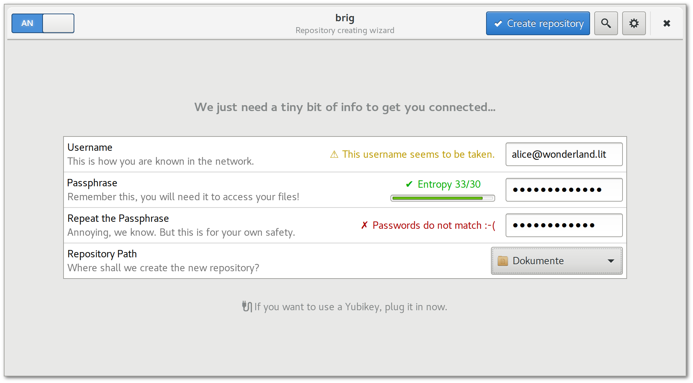

# Benutzbarkeit {#sec:benutzbarkeit}

https://emilonsecurity.wordpress.com/2010/10/17/security-functionality-usability

In diesem Kapitel werden Anforderungen beleuchtet, die ``brig`` zu einer für
den »Otto--Normal--Nutzer« benutzbaren Software machen sollen. Zudem sollen die
in Zukunft notwendigen Schritte beschrieben werden, um die Anforderungen
umzusetzen. Dazu gehört unter anderem die Konzeption einer grafischen
Oberfläche.

## Einführung

Ob eine Bedienoberfläche verständlich ist oder ästhetisch auf den Benutzer wirkt,
ist leider sehr subjektiver Natur. Es können nur empirisch Daten gesammelt werden,
ob ein gewisser Prozentanteil der Nutzer die Software verständlich und ästhetisch fanden.
Aus diesem Grund ist der unten gezeigte Vorschlag für eine Bedienoberfläche lediglich
ein Konzept unter vielen möglichen. Dieses spezielle Konzept wurde auf die folgenden
Merkmale optimiert:

TODO: welche merkmale?

- Minimalismus
- a
- Die Software muss im Hintergrund bleiben.

https://en.wikipedia.org/wiki/Zooko%27s_triangle

Aus unserer Sicht ist eine wichtige Eigenschaft für die Akzeptanz einer
Oberfläche, dass sie dem Benutzer vertraute Konzepte bietet. Daher wird ein
großer Teil der Benutzung durch einen normalen Dateisystemordner abgewickelt,
der sich kaum von anderen Ordner unterscheidet. Lediglich die initiale Konfiguration
die Versionsverwaltung und die Administration benötigt eine grafische Oberfläche, die
den Nutzer durch die jeweiligen Schritt begleitet.

Idee: Bei ID nur Username anzeigen, und Ressource nur wenn doppeldeutig

Vertrautheit: Vertraute Unix--Kommandos für Poweruser.

Internationalisierung? Gettext von error messages?

Fallstudie: Syncthing-GUI (kompliziert, viel unnötige infos)

Größte Probleme: 

- Starten des Hintergrunddienstes ``brigd``.
- Authentifizieren anderer Nutzer (QR-Codes!)

## Anforderungen an die Benutzbarkeit

http://www.usabilitynet.org/trump/methods/recommended/requirements.htm

Understandability
Learnability
Operability
Attractiveness
Configurability is the root of all evil

### Installation

## Kommandozeile

Problem: Noch werden keine short hashes erkannt. (Also Qm123 statt Qm123235AFWFDWEFFWF)

## Grafische oberflächhe

Bereich, die die GUI abdecken muss:

* Versionsverwaltung
* Online/Offline switch
* Remote Verwaltung
* Einrichtung von mounts und repos
* Sync button
* Conflicts window

TODO: Mockups mit Glade/GTK machen.

(nicht implementiert, aber wie könnte sie aussehen?)

Idee: Kontakte mit wieder erkennbaren Farben einfärben, wie bei Signal. -> Farbe von ID-Hash ableiten?

{#fig:mockup-file-browser}

{#fig:mockup-remotes}

{#fig:mockup-repo}

{#fig:mockup-settings}

{#fig:mockup-vcs}

{#fig:mockup-menu}

## Verhalten bei Fehlern

(Netzwerkfehler zB)

Aufbau von Fehlermeldungen
