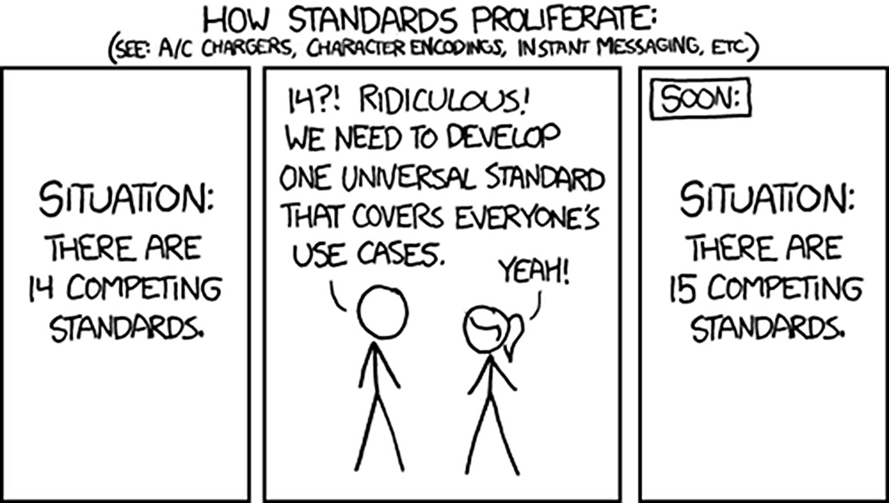

# Fazit {#sec:fazit}

## Zusammenfassung

Ambitioniertes Projekt,
trotzdem positive Resultate trotz Zeitmangels.

Relativ interdisplizinär: 

- Sicherheit
- P2P
- Softwarearchitektur
- Usability

Mix aus vielen bestehenden Technologien, Ansätzen und Ideen. (git und co.)

cloc-statistiken

Zeitaufteilung, was hat wie lang gedauert, was waren die größten Zeitfresser

Aufgrund privater Probleme von Herrn Piechula, konnte dieser nicht mit voller Kapazität
mitarbeiten.

`tree` vom source

### Abgrenzung von IPFS

Momentan wird ``brig`` vollkommen separat von ``IPFS`` entwickelt. Bleibt das so?

### Selbstkritik

Was würde man anders machen: Prototypischere Entwicklung, vlt. sogar einfach in bash oder python.

Aufteilung von brig in kleinere Teilprogramme, wie die plumbing commands bei git,
um Robustheit und Fehlertoleranz zu erhöhen.

{#fig:xkcd-standards width=50%}

### Zukunft der Autoren

Weiterentwicklung gewährleistet?

Finanzierung

### Veröffentlichung und Bekanntmachung

Wie man das angeht. reddit?

Veröffentlichung als beta -> Problem: Internas können sich noch ändern,
Inkompatiblitäten können entstehen.
Testing mit verschiedenen Prüfsummen.
