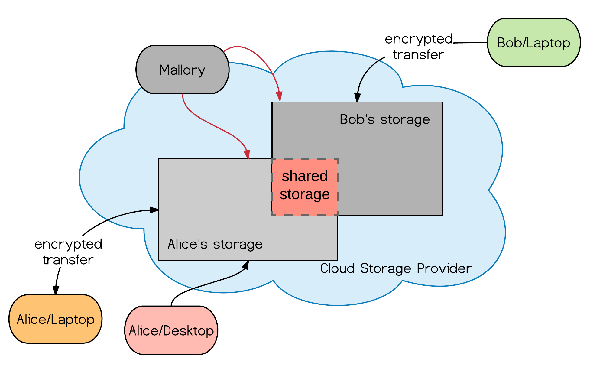
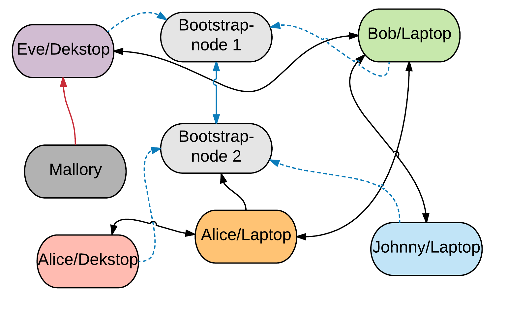

# Stand von Wissenschaft und Technik

## Sicherheit und Usability von Dateiverteilungssystemen

### Allgemeines

Zentrale und dezentrale Systeme sind die Basis für den Austausch von
Informationen. Ob ein System zentral oder dezentral fungiert ist nicht immer
klar abgrenzbar. Oft kommen auch hybride Systeme zum Einsatz, welche zwar
dezentral funktionieren, jedoch eine zentrale Instanz benötigen, hier wäre
beispielsweise das *Torrent*--Konzept zu nennen. Weitere Informationen hierzu
sind unter [@cpahl] zu finden. 

### Der »Sicherheitsbegriff« {#sec:sicherheit}

Betrachten man die »Sicherheit« von Dateiverteilungssystemen, so müssen
verschiedene Teilaspekte betrachten werden. Leider ist das Umfeld der
Sicherheit sehr groß und die Begrifflichkeiten nicht immer eindeutig definiert.
In der Fachliteratur (vgl. [@pauly2004netzwerk]) spricht man oft von
»IT--Sicherheit«. Zu den fünf Hauptaspekten dieser gehören in der Regel:

* Vertraulichkeit: Schutz der Daten vor Zugriff durch Dritte.
* Integrität: Schutz der Daten vor Manipulation.
* Authentifizierung: Eindeutige Identifikation von Benutzern.
* Autorisierung: Definiert die Zugangs-- und Zugriffssteuerung auf Dienste.
* Verfügbarkeit: Dienste stehen legitimen Benutzern tatsächlich zur Verfügung.

### Angriffe und Bedrohungen

Die Sicherheit eines System lässt sich nicht mit einem einfachen »ja« oder
»nein« beantworten. Betrachtet man ein System bezüglich seiner Sicherheit, so
muss auch genau definiert werden, gegen welches »Angriffsszenario« ein System
»sicher« ist. Auch ein System das aus kryptographischer Sicht als »sicher« zu
betrachten wäre, kann im einfachsten Fall, durch die Weitergabe von Zugangsdaten
an Dritte, kompromittiert werden.

![Scherzhafte Darstellung eines möglichen Angriff auf eine Festplattenverschlüsselung mit optimalem Kosten/Nutzen--Verhältnis.[^src-xkcd]](images/security.png){#fig:img-security width=70%}

[^src-xkcd]:Quelle: <http://imgs.xkcd.com/comics/security.png>

Neben dem technischen Ansatz beim »Angriff« auf ein System, gib es auch die
psychologische Komponente, den Menschen, welcher wahrscheinlich die größte
Schwachstelle in den meisten Systemen darstellt.

Beim technischen Ansatz werden in der Regel Fehler in der Software oder
Infrastruktur ausgenutzt um sich unbefugten Zugriff auf Informationen zu
verschaffen.

Beim nicht--technischen »Angriff« wird der Benutzer auf »psychologischer Ebene«
manipuliert und mit sogenannten »Social Hacking«--, auch »Social
Engineering«--Methoden dazu verleitet beispielsweise sein Passwort
weiterzugeben. Auch der Einsatz von »Phishing« (TODO: Ref), ist eine Variante
von »Social Engineering«. [@fig:img-security] zeigt scherzhaft eine weitere
Variante für welche Menschen anfällig sind.

### Datenaustausch über zentrale Lösungen

Zentrale Dienste klassifizieren sich im Kontext dieser Arbeit durch die
Eigenschaft, dass es eine zentrale Instanz gibt, welche zum Austausch der Daten
benötigt wird. Dies sind in den meisten Fällen die Storage--Server der
Cloud--Service--Anbieter, welche für die Kommunikation und Speicherung der
Daten verantwortlich sind. [@fig:img-cloud] zeigt schematisch das Konzept
beim Austausch von Daten über einen Cloud--Dienst. Hierbei werden die Daten
verschlüsselt zum Cloud--Dienst übertragen.

Beim Einsatz zentraler Dienste hängt die Sicherheit der Daten in erster Linie
vom Dienstanbieter ab. Beim »iCloud«--Dienst von Apple beispielsweise werden
die Daten verschlüsselt bei Drittanbietern wie der »Amazon S3«-- oder »Windows
Azure«--Cloud gespeichert[^ios-secguide]. Die Metadaten und kryptographische
Schlüssel verwaltet Apple auf seinen eigenen Servern. Dropbox hat laut
Medienberichten mittlerweile von der »Amazon«--Cloud auf eine eigene
Infrastruktur migriert[^dropbox-s3-own].

[^dropbox-s3-own]:Dropbox Exodus Amazon Cloud Empire: <http://www.wired.com/2016/03/epic-story-dropboxs-exodus-amazon-cloud-empire/>
[^ios-secguide]: Apple iOS Security: <http://www.apple.com/business/docs/iOS_Security_Guide.pdf>

Das Problem hierbei ist die Umsetzung der Daten--Verschlüsselung der gängigen
Cloud--Storage--Anbieter. Anbieter wie Dropbox verschlüsseln laut eigener
Aussage die Daten in der Cloud nach aktuellen Sicherheitsstandards. Das Problem
hierbei ist jedoch, dass beispielsweise Dropbox und nicht der Endbenutzer der
Schlüsselinhaber ist. Es ist also, auch wenn es laut internen
Dropbox--Richtlinien verboten ist, möglich dass Mitarbeiter beziehungsweise
dritte Parteien die Daten des Nutzers einsehen können (vgl. [@ko2015cloud] S.
103 ff.). 

Ein weiteres Problem ist, dass der Cloud--Anbieter an sich ein zentrales
Angriffsziel bildet. Erst kürzlich wurde bekannt, dass Angreifer im Jahr 2012
ungefähr 70 Millionen Zugangsdaten[^db-dataleak] entwendet haben. Hat ein
Angreifer also die Zugangsdaten erbeutet, bringt die Verschlüsselung die der
Cloud--Dienst betreibt in diesem Fall nichts. Die gestohlenen Passwörter waren
nicht im Klartext einsehbar, moderne Angriffsmöglichkeiten auf Passwörter
zeigen jedoch, dass das nichtsdestotrotz ein großes Problem ist, siehe hierzu
TODO: Sicherheit von Passwörtern.

[^db-dataleak]: Dropbox <http://www.telegraph.co.uk/technology/2016/08/31/dropbox-hackers-stole-70-million-passwords-and-email-addresses/>

Abhilfe würde in diesem Fall eine zusätzliche Verschlüsselung auf Seiten des
Nutzers helfen, jedoch ist die Software hier für den Endverbraucher oft zu
kompliziert, aufgrund Fehlern in der Implementierung nicht optimal geeignet
(EncFS Audit[^encfsaudit]) oder proprietär (Boxcryptor[^boxcryptor]).

[^encfsaudit]:  EncFS Audit: <https://defuse.ca/audits/encfs.htm>
[^boxcryptor]: Boxcryptor: <https://de.wikipedia.org/wiki/Boxcryptor>

Den meisten Anbietern kann man allerhöchstens Vertrauen, dass diese mit den
Daten und Schlüsseln sorgsam umgehen. Auch wenn sich viele Anbieter wie beispielsweise Dropbox
bemühen, aus den Fehlern der Vergangenheit zu lernen und verbesserte
Sicherheitsmechanismen wie beispielsweise Zwei--Faktor--Authentifizierung in
ihre Software zu integrieren, bleibt jedoch die Krux der proprietären Software.
Laut Meinung der Autoren von »brig«, sowie auch vieler Sicherheitsexperten,
wird den Einsatz proprietärer Software die Sicherheit untergraben, da bei
proprietärer Software explizit eingebaute Hintertüren nicht ausgeschlossen
werden können und es auch keine Möglichkeit der Prüfung auf solche durch den
Endbenutzer gibt.

{#fig:img-cloud width=80%}

Die Sicherheit des Systems hängt in diesem Fall nicht alleine vom Schlüssel ab.
Nach Kerckhoffs' Prinzip sollte die »Sicherheit« nur von der Geheimhaltung des
Schlüssel abhängen. Die Vergangenheit hat beispielsweise beim GSM--Standard
oder DVD--Kopierschutz »CSS«[^css] gezeigt, dass durch die Geheimhaltung von
Systemkomponenten erfolgreiche Angriffe nicht unterbunden werden können (vgl.
[@spitz2011kryptographie], [@ertel2012angewandte, S. 23]). 

[^css]: Cryptanalysis of Contents Scrambling System: <http://www.cs.cmu.edu/~dst/DeCSS/FrankStevenson/analysis.html>

Weiterhin gibt es bei der Cloud--Storage--Lösung auch die Möglichkeit einen
eigenen Cloud--Storage--Dienst aufzusetzen. Hierfür wird oft die
Open--Source--Lösung *Owncloud* genommen. Der Nachteil hierbei ist, dass der
Benutzer selbst für die Bereitstellung der Infrastruktur verantwortlich ist.
Eine weitere Hürde stellt für den Verbraucher das fehlende Know--How dar,
welches essentiell für das Betreiben eines Cloud--Dienstes ist.

### Datenaustausch über dezentrale Lösungen

Der dezentrale Bereich klassifiziert sich durch den Dateiaustausch, welcher
in der Regel *ohne* eine zentrale Instanz auskommt. In der Regel handelt es sich
hierbei um Systeme aus dem Bereich des Peer-to-Peer--Models. Eins der
bekanntesten Vertreter der P2P--Protkolle ist BitTorrent[^bittorrent]. Das
Protokoll kommt beispielsweise bei der Verbreitung von Linux--Distributionen
oder der Verteilung von Updates bei diversen Spieleherstellern zum Einsatz.

[@fig:img-p2p] zeigt schematisch den Austausch von Daten in einem dezentralen
Netzwerk. Die dezentralen Systeme unterliegen in der Regel keiner Regulierung
durch eine zentrale Instanz. Je nach verwendeter Technologie zum
Datenaustausch, existieren beispielsweise bei »IPFS« sogenannten
»Bootstrap--Nodes«, welche einen Einstiegspunkt für die jeweiligen Teilnehmer
darstellen. Für weitere Details zu dezentralen Architekturen siehe TODO: Ref Elch?

{#fig:img-p2p width=80%}

Zu den Vertretern der etablierten dezentralen Systeme gibt es vergleichsweise
zu den Cloud--Diensten nur wenige Produkte, welche für die Synchronisation von
Daten beziehungsweise den Austausch von Dokumenten eingesetzt werden können. Zu
den bekannten Lösungen gehören:

* Resilio (ehem. BitTorrent-Sync, proprietär)
* Infinit (proprietär, [@quintard2012towards])
* git--annex (Open--Source)
* Syncthing (Open--Source)
* Librevault (Open--Source)

Bei den bekannten Vertretern wie dem BitTorrent--Client werden die Daten in der
Regel unverschlüsselt übertragen und gespeichert. Eine Authentifizierung finden
in der Regel nicht statt. Alternativen wie Syncthing, Resilio, Librevault oder
Infinit ermöglichen Benutzern auf Basis von dezentralen Netzwerken Dateien zu
tauschen. Ob die Daten verschlüsselt gespeichert und übertragen werden ist je
nach Projekt unterschiedlich und unterliegt Änderungen in der aktuellen
Entwicklungshase. @tbl:1 zeigt den aktuellen Stand bestimmter Features.

<!--
|                      | **Dezentral**       | **Verschlüsselung (Client)**     | **Versionierung**                      |  **Quotas**       | **N-Kopien**    |
| -------------------- | ------------------- | -------------------------------- | -------------------------------------- | ------------------|------------------|
| *Dropbox/Boxcryptor* | \xmark              | \xmark                           | \textcolor{YellowOrange}{Rudimentär}   |  \xmark           | \xmark          |
| *ownCloud*           | \xmark              | \xmark                           | \textcolor{YellowOrange}{Rudimentär}   |  \xmark           | \xmark          |
| *Syncthing*          | \cmark              | \cmark                           | \textcolor{YellowOrange}{Archivordner} |  \xmark           | \xmark          |
| *BitTorrent Sync*    | \cmark              | \cmark                           | \textcolor{YellowOrange}{Archivordner} |  \xmark           | \xmark          |
| ``git-annex``        | \cmark              | \cmark                           | \cmark                                 |  \xmark           |  \cmark         |
| ``brig``             | \cmark              | \cmark                           | \cmark                                 |  \cmark           |  \cmark         |

**Praktische Aspekte:**

|                      | **FOSS**            | **Einfach nutzbar** | **Einfache Installation**  | **Intelligentes Routing** | **Kompression** |
| -------------------- | ------------------- | ------------------- |--------------------------  | ------------------------- |-----------------|
| *Dropbox/Boxcryptor* | \xmark              | \cmark              | \cmark                     |  \xmark                   | \xmark          |
| *ownCloud*           | \cmark              | \cmark              | \xmark                     |  \xmark                   | \xmark          |
| *Syncthing*          | \cmark              | \cmark              | \cmark                     |  \cmark                   | \xmark          |
| *BitTorrent Sync*    | \xmark              | \cmark              | \cmark                     |  \cmark                   | \xmark          |
| ``git-annex``        | \cmark              | \xmark              | \xmark                     |  \xmark                   | \xmark          |
| ``brig``             | \cmark              | \cmark              | \cmark                     |  \cmark                   | \cmark          |

Table: Demonstration of a simple table. {#tbl:1}

-->

Einen bisher nicht genannter, relativ neuen dezentraler Ansatz bietet das
InterPlanetary--File--System, als Teil seiner Funktionalität. Dieses ist in der
aktuellen Implementierung jedoch eher als ein fortgeschrittener Prototyp
anzusehen. Der Ansatz des IPFS--Protokolls ist vielversprechend. IPFS
kombiniert dabei viele bereits bekannte Technologien zu einem einzigen Projekt.
Hierdurch lassen sich schwächen aktuell genutzter Systeme abmildern oder gar
vermeiden. 

Datenintegrität behandeln.

* Datensicherheit
* Ausfallsicherheit

### Ähnliche Arbeiten

Von den genannten Projekten haben die folgenden Gemeinsamkeiten mit »brig«,
verfolgen jedoch unterschiedliche Ziele:

* Infinit
* Resilio
* Syncthing
* Bazil[^bazil] 

[^bazil]: Projektseite: <https://bazil.org/>

## Markt und Wettbewerber

* Google Drive/Dropbox mit »EncFS« oder »Boxcryptor«
* Syncthing
* git--annex
* Btsync 

Verschiedene Alternativen

Es gibt Alternativen, diese haben jedoch Probleme:

* kompliziert
* unsicher
* propritär
* ...

Tabelle: ...

## Gesellschaftliche und Politische Aspekte

Seit den Snowden--Enthüllungen[^nsa-leak] ist offiziell bekannt, dass Unternehmen im
Notfall rechtlich gezwungen werden können personenbezogene Daten rauszugeben.

[^nsa-leak]: Globale Überwachungs-- und Spionageaffäre: <https://de.wikipedia.org/wiki/Globale_%C3%9Cberwachungs-_und_Spionageaff%C3%A4re>

* Snowden--Affäre
* Gesellschaftliche Aspekte: Ich habe nichts zu verbergen
* politische Lage und Probleme

>> *Arguing that you don’t care about the right to privacy because you have
>> nothing to hide is no different than saying you don’t care about free speech
>> because you have nothing to say.* -- Edward Snowden
