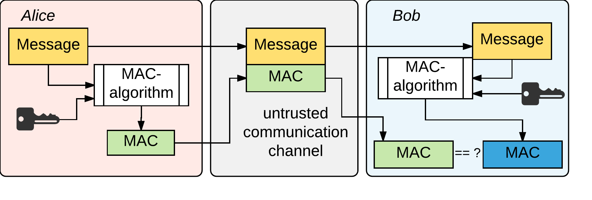

# Kryptographische Primitiven und Protokolle

## Einleitung

Software--Entwickler sind in der Regel keine Sicherheitsexperten. Nicht nur
Fehler in der Software gefährden ganze Systeme und Benutzerdaten, sondern auch
der immer wieder fehlerhafte Einsatz von Kryptographie ist immer wieder für
katastrophale Sicherheitsprobleme verantwortlich. Es ist *sehr schwer*
Kryptographie *korrekt* zu Implementieren. Sogar der früher weit verbreitete
Standard IEEE 802.11, *WEP (Wired Equivalent Privacy)*, zur verschlüsselten
drahtlosen Kommunikation, weist gleich mehrere Designschwächen auf. Eine
Analyse[^FN_WEP_ANALYSIS] kommt zu der Einschätzung , dass Kryptographische
Primitiven missverstanden und auf ungünstige Art kombiniert wurden. Weiterhin
ist es ein Hinweis dafür, dass man hätte Experten aus dem Bereich der
Kryptographie einbeziehen sollen um solche Fehler zu vermeiden (vgl. auch
[@martin2012everyday], S. 430).

[^FN_WEP_ANALYSIS]: WEP Analysis: <http://www.isaac.cs.berkeley.edu/isaac/wep-faq.html>

Sogar bei Unternehmen welche explizit mit *starker Kryptographie* für ihre
Produkte werben[^FN_HDD_ENCRYPTION_FAIL] und auch für welche Kryptographie zum
Tagesgeschäft gehört, machen immer wieder fatale Fehler bei der Implementierung
ihrer Produkte.

[^FN_HDD_ENCRYPTION_FAIL]: Festplattenverschlüsselung: <http://www.heise.de/security/artikel/Verschusselt-statt-verschluesselt-270058.html>

Selektiv gewählte Sicherheitsprinzipien werden betrachtet um zu sensibilisieren
jedoch viel mehr um eine »sinnvollen« Einsatz für »brig« definieren zu können.

## Verschlüsselung

### Symmetrische Verschlüsselungsverfahren

#### Grundlegende Funktionsweise

[@fig:img-symmetric] zeigt die Verschlüsselung von Daten mittels symmetrischer
Kryptographie. Bei symmetrischer Kryptographie wird der gleich Schlüssel um
ver-- und entschlüsseln der Daten verwendet.

Beim Datenaustausch über unsichere Netze, muss der Schlüssel zuerst zwischen
den Kommunikationspartnern ausgetauscht werden. In [@fig:img-symmetric]
verschlüsselt *Alice* die Daten mit dem *gemeinsamen Schlüssel*. Anschließend
sendet Sie die verschlüsselten Daten an *Bob*, welcher den *gemeinsamen
Schlüssel* verwendet um die Daten wieder zu entschlüsseln.

Symmetrische Verfahren sind im Vergleich zu asymmetrischen Verfahren sehr
effizient. Die Grundlage für symmetrische Algorithmen, stellen Manipulationen
(Substitutionen, Permutationen[^FN_SUB_PERM_NETWORK] oder
Feistelrunden[^FN_FEISTEL]) auf Bit--Ebene dar, welche umkehrbar sind.

[^FN_FEISTEL]: Feistelchiffre: <https://de.wikipedia.org/wiki/Feistelchiffre>
[^FN_SUB_PERM_NETWORK]: Substitutions--Permutations--Netzwerk: <https://de.wikipedia.org/wiki/Substitutions-Permutations-Netzwerk>

Das Grundsätzliche Problem, welches bei Anwendung symmetrischer Verschlüsselung
besteht, ist der *sichere* Schlüsselaustausch.

{#fig:img-symmetric width=85%}

#### Unterschied zwischen Block-- und Stromverschlüsselung

Das symmetrische Verschlüsseln unterteilt sich in die beiden
Verschlüsselungsverfahren Stromverschlüsselung und Blockverschlüsselung. Bei
der Stromverschlüsselung wird direkt jedes Zeichen (Bit) des Klartextes mittels
eines kryptografischen Schlüssels direkt (XOR) in ein Geheimtext Zeichen
umgewandelt.

Bei der Blockverschlüsselung hingegen sind die Daten in Blöcke einer bestimmten
Größe unterteilt. Die Verschlüsselung funktioniert auf Blockebene. Wie oder ob
die Daten--Blöcke untereinander abhängig sind und welche Informationen bei der
Verschlüsselung neben dem Schlüssel mit in die Verschlüsselung einfließen,
bestimmt die sogenannte Betriebsart. [@fig:img-streamblock] zeigt exemplarisch
den Unterschied zwischen Strom-- und Blockverschlüsselung.

{#fig:img-streamblock width=80%}

#### Betriebsarten der Blockverschlüsselung

Die Betriebsart beschreibt auf welche Art und Weise die Blöcke verschlüsselt
werden. Dies ist insofern wichtig, da sich durch die Betriebsart die
Eigenschaften und somit der Einsatzzweck ändern kann. Folgend zwei
Betriebsarten zum besserem Verständnis:

**Electronic Code Book Mode (ECB):** Diese Betriebsart werden die
Klartextblöcke unabhängig von einander verschlüsselt. Dies hat den Nachteil,
dass gleiche Klartextblöcke immer in gleiche Geheimtextblock, bei Verwendung
des gleichen Schlüssels, ergeben. [@fig:img-ecbvschaining] zeigt eine
»Schwäche« dieses Verfahrens.

![Bild zur graphischen Verdeutlichung des ECB--Modus im Vergleich zu einem block chaining cipher.[^FN_TUX_ECB]](images/ecbvschaining.png){#fig:img-ecbvschaining width=80%}

[^FN_TUX_ECB]:Bildquelle *ECB*: <https://de.wikipedia.org/wiki/Electronic_Code_Book_Mode>

**Cipher Feedback Mode (CFB):** Beim *CFB*--Modus fließt, neben dem Schlüssel,
der Geheimtextblock vom Vorgänger ein. Durch diese Arbeitsweise haben im
Gegensatz zum *ECB*--Modus gleiche Klartextblöcke unterschiedliche
Geheimtextblöcke. Weiterhin wird bei dieser Arbeitsweise aus der
Blockverschlüsselung eine Stromverschlüsselung.

{#fig:img-streamblock width=100%}

Neben den genannten Betriebsarten gibt es noch weitere die sich in der
Funktionsweise unterscheide beziehungsweise für bestimmte Anwendungen
konzipiert sind. Je nach Betriebsart ist ein paralleles Ver-- und Entschlüsseln
oder auch Wahlfreier Zugriff möglich.  Weiterhin variiert auch die
Fehleranfälligkeit und Sicherheit. [@tbl:t-betriebsarten] zeigt gängige
Betriebsarten und ihre Eigenschaften.

----------------------------------------------------------
*Eigenschaft/Betriebsart*          ECB  CBC  CFB  CTR OFB
--------------------------------   ---  ---- ---- --- ----
*Verschlüsseln parallelisierbar*   ja   nein nein ja  nein

*Entschlüsseln parallelisierbar*   ja   ja   ja   ja  nein

*Wahlfreier Zugriff möglich*       ja   ja   ja   ja  nein
----------------------------------------------------------

Table: Laut ISO 10116 Standard definierte Betriebsarten für blockorientierte
Verschlüsselungsalgorithmen. {#tbl:t-betriebsarten} 

#### Gängige Algorithmen, Schlüssellängen und Blockgrößen

Der ursprünglich seit Ende der 70er--Jahre verwendete *DES (Data Encryption
Standard)*, welcher eine effektive Schlüssellänge von 56--Bit hatte, war ende
der 90er--Jahre nicht mehr ausreichend sicher gegen *Brute--Force*--Angriffe.
In einer öffentlichen Ausschreibung wurde ein Nachfolger, der Advanced
Encryption Standard (kurz *AES*) bestimmt. Gewinner des Wettbewerbs sowie der
heutige »Quasistandard« wurde der Rijndael--Algorithmus.

Neben dem bekanntem *AES (Rijndael)*--Algorithmus, gibt es noch weitere
Algorithmen die heutzutage Verwendung finden. Zu den *AES*--Finalisten gehören
weiterhin *MARS*, *RC6*, *Serpent* und der von *Bruce Schneier* entwickelte
*Twofish*. Alle genannten Algorithmen arbeiten mit einer Blockgröße von 128 Bit
und unterstützen jeweils die Schlüssellängen 128 Bit, 192 Bit und 256 Bit.

*AES* ist die aktuelle Empfehlung vom *BSI (Bundesamt für Sicherheit in der
Informationstechnik)*.

### Asymmetrische Verschlüsselungsverfahren

#### Grundlegende Funktionsweise

Im Vergleich zu symmetrischen Verschlüsselung, werden bei der asymmetrischen
Verschlüsselung die Daten mit einem unterschiedlichen Schlüssel ver-- und
entschlüsselt. Der Vorteil zu symmetrischen Verschlüsselung ist, dass die
kommunizierenden Parteien keinen gemeinsamen Schlüssel kennen müssen.

Um Daten mittels asymmetrischer Verschlüsselung auszutauschen,  müssen die
Beiden Kommunikationspartner *Alice* und *Bob* ein Schlüsselpaar, bestehend aus
einem *privaten* und einem *öffentlichen* Schlüssel erstellen. Anschließend
tauschen beide Parteien den *öffentlichen* Schlüssel aus. Der *private*
Schlüssel ist geheim und darf nicht weitergegeben werden. [@fig:img-asymmetric]
zeigt die Funktionsweise bei asymmetrischer Verschlüsselung.

{#fig:img-asymmetric width=100%}

Im Unterschied zu symmetrischen Verfahren, beruht die asymmetrische
Verschlüsselung auf der Basis eines mathematischen Problems, welches eine
Einwegfunktion ist. Das heißt, dass die Berechnung in die eine Richtung sehr
leicht ist, die Umkehrfunktion jedoch sehr schwierig zu berechnen ist. Die
zugrundeliegenden mathematischen Probleme sind das Faktorisierungsproblem
(*RSA*--Verfahren) großer Primzahlen und das diskreter Logarithmusproblem
(*ElGamal*--Verfahren).

#### Gängige Algorithmen, Einsatzzwecke und Schlüssellängen 

Zu den gängigen Algorithmen der asymmetrischen Verschlüsselungsverfahrens
gehören *RSA* und *ElGamal*. Beide Verfahren ermöglichen sowohl die Ver-- und
Entschlüsselung von Daten sowie das Signieren von Daten. Zu den
Signatur--Verfahren gehören die RSA--Signatur und *DSA (ElGamal--Signatur)*. 

Weiterhin gibt es eine Variante des *DSA*--Verfahrens welche
Elliptische--Kurven--Kryptographie verwendet, das *ECDSA (elliptic curve DSA)*.
Die Verfahren auf elliptischen Kurven haben den Vorteil, dass die
Schlüssellängen um Faktor 6--30 kleiner sind, was vergleichbaren
Sicherheitsniveau Ressourcen sparen kann, obwohl die Operationen auf
Elliptischen Kurven aufwendiger zu berechnen sind als Operationen in
Vergleichbar großen endlichen Körpern.

Heutzutage typische Schlüssellängen bei asymmetrischer Verschlüsselung sind
1024 Bit, 2048 Bit und 4096 Bit. Die Schlüssellängen sind nicht direkt mit den
der symmetrischen Verschlüsselungsverfahren vergleichbar. [@tbl:t-keys] zeigt
die Schlüssellängen der verschiedenen Verschlüsselungsverfahren im Vergleich zu
ihren äquivalenten Vertretern der symmetrischen Verfahren. Die Daten
entsprechen der empfohlenen ECRYPTII--Einschätzung[^FN_ECRYPTII].

---------------------------------------------------------------------------------
*RSA modulus* 	*ElGamal Gruppengröße* 	*Elliptische Kurve* 	*sym. Äquivalent*
-------------  -----------------------  -------------------     -----------------
480            480                      96                      48

640            640                      112                     56

816            816                      128                     64

1248           1248                     160                     80

2432           2432                     224                     112

3248           3248                     256                     128

5312           5312                     320                     160

7936           7936                     384                     192

15424          15424                    512                     256
---------------------------------------------------------------------------------

Table: Auf ECRYPTII--Einschätzung basierende effektive Schlüsselgrößen
asymmetrischer und symmetrischer Verfahren im direkten Vergleich. {#tbl:t-keys}

[^FN_ECRYPTII]:ECRYPT II Yearly Report on Algorithms and Key Lengths (2012): <http://www.ecrypt.eu.org/ecrypt2/documents/D.SPA.20.pdf>

### Hybride Verschlüsselungsverfahren

Asymmetrische Verschlüsselungsverfahren sind im Vergleich zu symmetrischen
Verschlüsselungsverfahren sehr langsam, haben jedoch den Vorteil, dass kein
*gemeinsamer* Schlüssel für die Verschlüsselte Kommunikation bekannt sein muss.
Symmetrische Verfahren hingegen sind sehr effizient, ein Hauptproblem, welches
sie jedoch haben ist der Austausch eines gemeinsamen Schlüssels zum Ver-- und
Entschlüsseln.

Bei den *Hybriden Verschlüsselung* macht man sich die Vorteile beider Systeme
zu Nutzen. Bevor *Alice* und *Bob* Kommunizieren könne, tauschen Sie mittels
Public--Key--Kryptographie den *gemeinsamen* Schlüssel, welchen Sie
anschließend für die symmetrische Verschlüsselung verwenden, aus.

## Diffie--Hellmann--Schlüsseltausch

Aus dem Diffie--Hellman--Schlüsselaustausch (kurz *DH*) geht das
ElGamal--Verschlüsselungsverfahren hervor. *DH*  ist ein
Schlüsselaustauschprotokoll, welches es zwei Kommunikationspartnern ermöglicht
einen *gemeinsamen* Schlüssel zu bestimmen, ohne diesen über den potentiell
unsicheren Kommunikationskanal austauschen zu müssen.

{#fig:img-dh width=75%}

[@fig:img-dh] zeigt Ablauf des *DH*--Protokolls:

1) *Alice* und *Bob* einigen sich auf große Primzahl $p$ und natürliche Zahl $g$, die kleiner ist als $p$.
2) *Alice* und *Bob* generieren jeweils eine »geheime Zufallszahl« $a$ und $b$.
3) *Alice* berechnet $A=g^{a} (\mod p)$  und schickt $A$ an *Bob* (dies
   entspricht im Grunde einem temporärem *ElGamal* Schlüsselpaar: $a$ = privater
   Schlüssel, $g^a$ = öffentlicher Schlüssel)
4) *Bob* berechnet $B=g^{b}(\mod p)$ und schickt  $B$ an *Alice*.
5) *Alice* erhält $B$ von *Bob* und berechnet mit $a$ die Zahl $K_{1}=B^{a} (\mod p)$. 
6) *Bob* berechnet analog $K_{2}=A^{b}(\mod p)$. 

Beide haben den gleichen Schlüssel berechnet, da gilt:

$$ K_{1} = B^{a} = (g^{b})^{a} = (g^{a})^{b} = A^{b} = K_{2} $$

## Hashfunktionen

### Kryptographische Hashfunktionen

Hashfunktionen werden in der Informatik verwendet um eine beliebige endliche
Eingabemenge auf einer Prüfsumme (Hashwert) einer bestimmten Länge abzubilden.
Prüfsummen können verwendet werden um beispielsweise die Integrität von Daten
zu validieren. Ein Praxisbeispiel wäre die Korrektheit von übertragenen Daten
zu validieren, beispielsweise nach dem Download eine *Linux*--Images.

Kryptographische Hashfunktionen sind spezielle Formen von Hashfunktionen welche
folgende Eigenschaften bieten:

* Einwegfunktion
* schwache Kollisionsresistenz: praktisch unmöglich zu gegebenen Wert $x$ ein
  weiteres $x'$ zu finden, welches den selben Hashwert besitzt: $h(x) = h(x), x \ne x'$
* starke Kollisionsresistenz: praktisch unmöglich, zwei verschiedene
  Eingabewerte $x$ und $x'$ mit dem gleichen Hashwert zu finden $h(x) = h(x'), x
  \ne x'$ zu finden.

### Message Authentification Codes

Um nicht nur die Integrität der von Daten, sondern auch deren Quelle zu
validieren werden so genannten Message Authentification Codes (kurz MAC)
verwendet. *MACs* sind schlüsselabhängige Hashfunktionen. Neben Hashfunktionen
werden auch Blockchiffren verwendet. [@fig:img-hmac] zeigt die Übertragung von
Daten mit einer *HMAC*.

{#fig:img-hmac width=85%}

## Authentifizierungsverfahren

Bei den praktischen Authentifizierungsverfahren ist das Passwort immer noch ein
sehr weit verbreitete Möglichkeit der Authentifizierung. Passwörter sind eine
sehr problematische Möglichkeit der Authentifizierung weil sie auf gute
»Entropie« angewiesen sind. Das heißt, dass Passwörter nach Möglichkeit so gut
wie nur möglich, »zufällig« sein müssen. Passwörter die leicht zu erraten sind,
sind *de facto* schlechte Authentifizierungsmechanismen.

Die Problematik mit den Passwörtern kennt heutzutage jedes Unternehmen. Sind
die Passwort--Richtlinien zu kompliziert, werden die Passwörter oft von
Benutzern aufgeschrieben, gibt es keine Passwort--Richtlinien, dann verwenden
Mensch oft schwache Passwörter, oft auch das gleiche »einfache« Passwort für
mehrere Anwendungen.

Die Situation lässt sich jedoch auf recht einfache Art und Weise durch den
Einsatz seines zusätzlichen *Faktors* verbessern. Diese Art der
Authentifizierung wird Zwei--Faktor-- oder auch Mehr--Faktor--Authentifizierung
genannt. Als zweiter *Faktor* kann beispielsweise ein biometrisches Merkmal
verwendet werden. Eine weitere Form der Zwei--Faktor--Authentifizierung wäre
beispielsweise die Chipkarte der Bank. Hierbei wird einerseits die *PIN* (etwas
das man weiß) und die Chipkarte (etwas das man hat) benötigt. Eine
erfolgreiche Authentifizierung findet in dem Fall nur bei korrekter *PIN* unter
Verwendung der Chipkarte der Bank statt.

## Keymanagement

### Sichere Speicherung von Schlüsseln

Das Keymanagement (Schlüsselverweltung) ist eine der größten sensibelsten
Bereiche bei der Implementierung eines System. Sind die Schlüssel unzureichend
geschützt oder die Einsatzweise der Schlüssel fraglich, so kann ein System
meist einfach kompromittiert werden.

### Key--Seperation

Neben sicherer Verwaltung der Schlüssel, ist auch die Beschränkung auf einen
bestimmten Einsatzzweck essentiell.

## Weiteres

Die Sicherheit des Systems hängt in diesem Fall nicht alleine vom Schlüssel ab.
Nach Kerckhoffs' Prinzip sollte die »Sicherheit« nur von der Geheimhaltung des
Schlüssel abhängen. Die Vergangenheit hat beispielsweise beim GSM--Standard
oder DVD--Kopierschutz »CSS«[^FN_CSS] gezeigt, dass durch die Geheimhaltung von
Systemkomponenten erfolgreiche Angriffe nicht unterbunden werden können (vgl.
[@spitz2011kryptographie], [@ertel2012angewandte, S. 23]).

[^FN_CSS]: Cryptanalysis of Contents Scrambling System: <http://www.cs.cmu.edu/~dst/DeCSS/FrankStevenson/analysis.html>

## Softwareentwicklungmodel

* Trusted User
* Signierter Code/Downloads
* Audits

## Sicherheit und Angriffsszenarien

* Welche Sicherheitsprobleme existieren?
