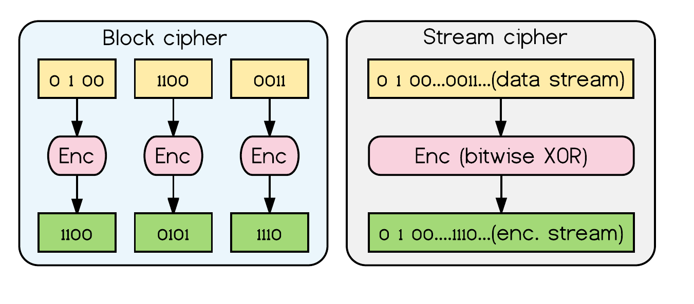
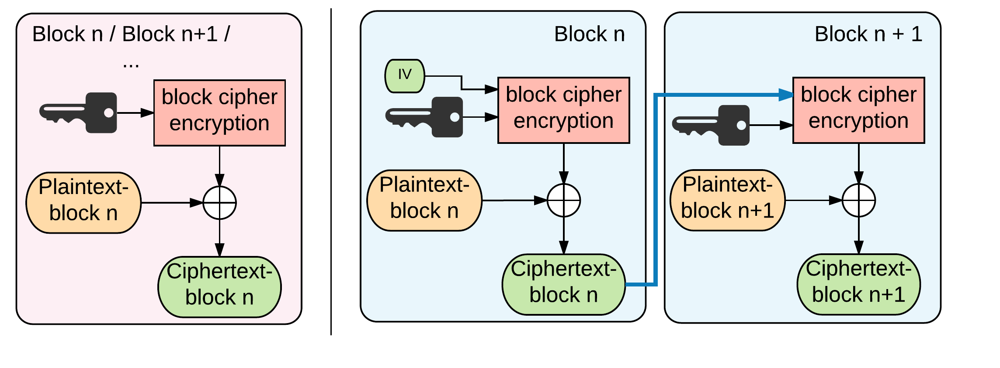

# Betrachtung grundlegender Sicherheitskonzepte

## Einleitung

Software--Entwickler sind in der Regel keine Sicherheitsexperten. Nicht nur
Fehler in der Software gefährden ganze Systeme und Benutzerdaten, sondern auch
der immer wieder fehlerhafte Einsatz von Kryptographie ist immer wieder für
katastrophale Sicherheitsprobleme verantwortlich. Es ist *sehr schwer*
Kryptographie *korrekt* zu Implementieren. Sogar der früher weit verbreitete
Standard *WEP (Wired Equivalent Privacy)*, zur Verschlüsselten drahtlosen
Kommunikation, weist gleich mehrere Designschwächen auf (vgl.
[@martin2012everyday], S. 430).

Sogar bei Unternehmen welche explizit mit *starker
Kryptographie* werben und auch für welche Kryptographie zum Tagesgeschäft
gehört, machen immer wieder fatale Fehler bei der Implementierung ihrer
Produkte. 

Verschlüssehttp://www.heise.de/security/artikel/Verschusselt-statt-verschluesselt-270058.html

Selektiv gewählte Sicherheitsprinzipien werden betrachtet um zu sensibilisieren jedoch
viel mehr um eine »sinnvollen« Einsatz für »brig« definieren zu können.

## Verschlüsselung

### Symmetrische Verschlüsselung

#### Generelle Funktionsweise

[@fig:img-symmetric] zeigt die Verschlüsselung von Daten mittels symmetrischer Kryptographie. Bei symmetrischer Kryptographie wird der gleich Schlüssel um ver-- und entschlüsseln der Daten verwendet. 

Beim Datenaustausch über unsichere Netze, muss der Schlüssel zuerst zwischen
den Kommunikationspartnern ausgetauscht werden. In [@fig:img-symmetric]
verschlüsselt *Alice* die Daten mit dem *gemeinsamen Schlüssel*. Anschließend
sendet Sie die verschlüsselten Daten an *Bob*, welcher den *gemeinsamen
Schlüssel* verwendet um die Daten wieder zu entschlüsseln.

Symmetrische Verfahren sind im Vergleich zu asymmetrischen Verfahren sehr effizient.

{#fig:img-symmetric width=85%}

#### Unterschied zwischen Block-- und Stromverschlüsselung

Das symmetrische Verschlüsseln unterteilt sich in die beiden Verschlüsselungsverfahren Stromverschlüsselung und Blockverschlüsselung. Bei der Stromverschlüsselung wird direkt jedes Zeichen (Bit) des Klartextes mittels eines kryptografischen Schlüssels direkt (XOR) in ein Geheimtext Zeichen umgewandelt. 

Bei der Blockverschlüsselung hingegen sind die Daten in Blöcke einer bestimmten Größe unterteilt. Die Verschlüsselung funktioniert auf Blockebene. Wie oder ob die Daten--Blöcke untereinander abhängig sind und welche Informationen bei der Verschlüsselung neben dem Schlüssel mit in die Verschlüsselung einfließen, bestimmt die sogenannte Betriebsart. [@fig:img-streamblock] zeigt exemplarisch den Unterschied zwischen Strom-- und Blockverschlüsselung.

{#fig:img-streamblock width=80%}

#### Betriebsarten der Blockverschlüsselung

Die Betriebsart beschreibt auf welche Art und Weise die Blöcke verschlüsselt
werden. Dies ist insofern wichtig, da sich durch die Betriebsart die
Eigenschaften und somit der Einsatzzweck ändern kann.

Folgend zwei Betriebsarten zum besserem Verständnis:

**Electronic Code Book Mode (ECB):** Diese Betriebsart werden die Klartextblöcke unabhängig von einander verschlüsselt. Dies hat den Nachteil, dass gleiche Klartextblöcke immer in gleiche Geheimtextblock, bei Verwendung des gleichen Schlüssels, ergeben. [@fig:img-ecbvschaining] zeigt eine »Schwäche« dieses Verfahrens.

![Bild zur graphischen Verdeutlichung des ECB--Modus im Vergleich zu einem
block chaining cipher.[^tux]](images/ecbvschaining.png){#fig:img-ecbvschaining
width=80%}

[^tux]:Bildquelle: <https://de.wikipedia.org/wiki/Electronic_Code_Book_Mode>

**Cipher Feedback Mode (CFB):** Beim *CFB*--Modus fließt, neben dem Schlüssel, der Geheimtextblock vom Vorgänger ein. Durch diese Arbeitsweise haben im Gegensatz zum *ECB*--Modus gleiche Klartextblöcke unterschiedliche Geheimtextblöcke. Weiterhin wird bei dieser Arbeitsweise aus der Blockverschlüsselung eine Stromverschlüsselung.

{#fig:img-streamblock width=100%}

Neben den genannten Betriebsarten gibt es noch weitere die sich in der
Funktionsweise unterscheide beziehungsweise für bestimmte Anwendungen
konzipiert sind. Je nach Betriebsart ist ein paralleles Ver-- und Entschlüsseln
oder auch Wahlfreier Zugriff möglich.  Weiterhin variiert auch die
Fehleranfälligkeit und Sicherheit.

----------------------------------------------------------
                                   ECB  CBC  CFB  CTR OFB
--------------------------------   ---  ---- ---- --- ----
*Verschlüsseln parallelisierbar*   ja   nein nein ja  nein

*Entschlüsseln parallelisierbar*   ja   ja   ja   ja  nein

*Wahlfreier Zugriff möglich*       ja   ja   ja   ja  nein
----------------------------------------------------------

Table: Laut ISO 10116 Standard definierte Betriebsarten für blockorientierte Verschlüsselungsalgorithmen. {#tbl:t-betriebsarten} 

#### Gängige Algorithmen und Blockgrößen

### Asymmetrische Verschlüsselung

	* Grundlagen und Einsatzzwecke Asym. Verschlüsselung

## Datenintegrität
	* HMACs
	* CRC
	* ... (unterschiede bzw Vor- und Nachteile)

## Authentifizierung

	* Mechanismen zur Authentifizierung
		* Passwort
		* Mehrfaktor
		* Zero Knowledge

## Keymanagement

	* Hauptprobleme 'sichere' Verwahrung von Schlüsseln
	* Key Seperation
	* Key--Handling

## Softwareentwicklungmodel

	* Trusted User
	* Signierter Code/Downloads
	* Audits

## Sicherheit und Angriffsszenarien

	* Welche Sicherhetisprobleme existieren? 

# Evaluation der IPFS--Basis

	* Wie schaut es mit Verschlüsselung aus?
	* Wie schaut es mit Datenintegrität aus?
	* Welche Authentifizierungsmechanismen gibt es?

# Evaluation brig Implementierung

