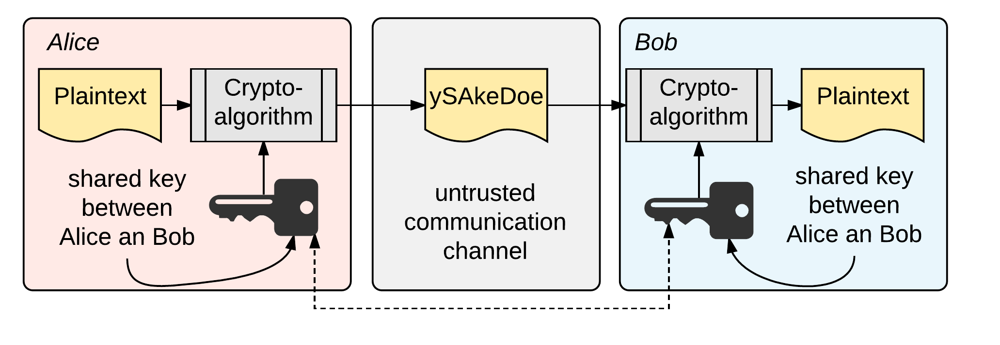

# Betrachtung grundlegender Sicherheitskonzepte

## Einleitung

Entwickler sind in der Regel keine Sicherheitsexperten, Sicherheitsprobleme entstehen
oft weil Implementierung fehlerhaft...
Selektiv gewählte Sicherheitsprinzipien werden betrachtet um zu sensibilisieren jedoch
viel mehr um eine ,,sinnvollen'' Einsatz für brig definieren zu können.

## Verschlüsselung

### Symmetrische Verschlüsselung

#### Funktionsweise

[@fig:img-symmetric] zeigt die Verschlüsselung von Daten mittels symmetrischer Kryptographie. Bei symmetrischer Kryptographie wird der gleich Schlüssel um ver-- und entschlüsseln der Daten verwendet. 

Beim Datenaustausch über unsichere Netze, muss der Schlüssel zuerst zwischen
den Kommunikationspartnern ausgetauscht werden. In [@fig:img-symmetric]
verschlüsselt *Alice* die Daten mit dem *gemeinsamen Schlüssel*. Anschließend
sendet Sie die verschlüsselten Daten an *Bob*, welcher den *gemeinsamen
Schlüssel* verwendet um die Daten wieder zu entschlüsseln.

Symmetrische Verfahren sind im Vergleich zu asymmetrischen Verfahren sehr effizient.

{#fig:img-symmetric width=100%}

#### Betriebsarten

	* AES
	* DES
	* Twofish

	* Grundlagen und Einsatzzwecke Asym. Verschlüsselung

## Datenintegrität
	* HMACs
	* CRC
	* ... (unterschiede bzw Vor- und Nachteile)

## Authentifizierung

	* Mechanismen zur Authentifizierung
		* Passwort
		* Mehrfaktor
		* Zero Knowledge

## Keymanagement

	* Hauptprobleme 'sichere' Verwahrung von Schlüsseln
	* Key Seperation
	* Key--Handling

## Softwareentwicklungmodel

	* Trusted User
	* Signierter Code/Downloads
	* Audits

## Sicherheit und Angriffsszenarien

	* Welche Sicherhetisprobleme existieren? 

# Evaluation der IPFS--Basis

	* Wie schaut es mit Verschlüsselung aus?
	* Wie schaut es mit Datenintegrität aus?
	* Welche Authentifizierungsmechanismen gibt es?

# Evaluation brig Implementierung

