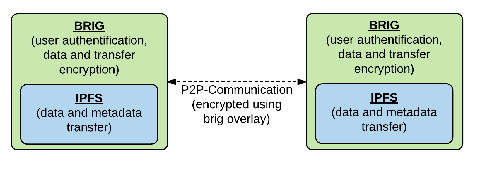

# Evaluation von Brig

## Einleitung

Parallel zu der Arbeit wird der »brig«--Prototyp entwickelt. Das Ziel dieses
Kapitels ist es die bisherige Arbeit aus Sicht der Sicherheit erneut zu
evaluieren und bisher gemachte Fehler zu identifizieren. Für weitere allgemeine
Details zur Architektur von »brig« siehe die Arbeit vom Herrn Pahl[@cpahl].

## Getestete Version

Für die Evaluation wird die Softwareversion mit dem größten Testumfang verwendet:

~~~sh
freya :: code/brig-thesis/security ‹master*› » brig --version
brig version v0.1.0-alpha+0d4b404 [buildtime: 2016-10-10T10:05:10+0000]
~~~

Zum aktuellen Zeitpunkt gibt es zwar bereits eine weitere Iteration in der Entwicklung von »brig«, bei welchem das interne »Store«--Handling geändert wurde. Da die »neue« Stor

## Einleitung »brig«

Das Ziel ist es, mit »brig« ein dezentrales Dateisynchronisationswerkzeug zu
entwickeln welches eine gute Balance zwischen Sicherheit und Usability
bietet. Die Entwicklung eines gut funktionierenden dezentralen
Protokolls/Dateisystems ist nicht trivial.

In [@sec:CAP_DEC_SERVICES] wurden bereits verschiedene dezentrale Protokolle
genannt. Diese sind jedoch hauptsächlich für den generellen Dateiaustausch
ausgelegt. Um die in [@sec:CAP_REQUIREMENTS] aufgeführten Anforderungen zu
realisieren, müssen die genannten Protokolle beziehungsweise das Verhalten des
Peer--To--Peer--Netzwerks an die gesetzten Anforderungen angepasst werden. Als
Basis für die Implementierung eines Prototypen standen die beiden Protokolle
*BitTorrent* und *IPFS* in der engeren Auswahl. Aufgrund der unter
[@sec:CAP_SUMMARY] genannten Funktionalitäten wurde *IPFS* als Basis bevorzugt.

{#fig:img-brig-overlay width=80%}

[@fig:img-brig-overlay] zeigt die Funktionsweise von »brig« als sogenanntes
Overlay--Netzwerk. »brig« wird verwendet um die in [@sec:CAP_SUMMARY] fehlenden
Eigenschaften des *IPFS*--Protokolls zu ergänzen.

## Sicherheit

### »brig«--Identifier

Da *IPFS* an sich keinen Authentifizierungsmechanismus bietet, muss dieser von
»brig« bereitgestellt werden. Im *IPFS*--Netzwerk haben die *Peers* durch die
Prüfsumme über den öffentlichen Schlüssel eine eindeutige Kennung. Diese
Prüfsumme ist aufgrund des Aufbaues und der Länge als Menschen--lesbare Kennung
nicht geeignet. Aus diesem Grund wurde ein »brig«--Identifier (»brig«--*ID*) eingeführt.

Diese *ID* repräsentiert den Benutzer mit einem Benutzernamen im
»brig«--Netzwerk nach außen. Der Aufbau dieses Namens ist an die Semantik des
XMPP--Standard[^FN_XMPPID] angelehnt und mit dem Prefix `brig#user:` versehen.
Diese Definition ermöglicht es Organisationen ihre Mitarbeiter und deren
Ressourcen im »brig«--Netzwerk abzubilden. Weiterhin hat es den Vorteil, dass
eine E-Mail--Adresse auch einen korrekten Benutzernamen darstellen würde.

[^FN_XMPPID]: Jabber--ID: <https://de.wikipedia.org/w/index.php?title=Jabber_Identifier&oldid=147048396>

Um diese Funktionalität bereitzustellen wird ein »Trick« angewendet, bei
welchem die Zeichenkette des Nutzernamen als Block dem *IPFS*--Netzwerk bekannt
gemacht wird (vgl. [@cpahl]). Dieser Block selbst ist nicht eindeutig und
könnte auch von einem Angreifer selbst erstellt worden sein. Um eine
Eindeutigkeit herzustellen, wird der Benutzername direkt an die öffentliche
*ID* (siehe [@sec:CAP_IPFS_ID]) geknüpft. [@fig:img-userlookup] zeigt das
Auffinden von einem Benutzer im *IPFS*--Netzwerk. Für weitere Details siehe auch [@cpahl].

{#fig:img-userlookup width=100%}

Eine Schwierigkeit die sich im Voraus stellt, ist der »sichere« Austausch der Identität, im Konkreten Fall, der sicher Austausch der *IPFS*--Peer--ID.

Welche »Sicherheitsfeatures« sind in brig eingebaut?
Evaluation der Geschwindigkeit der aktuellen »Sicherheitsfeatures«.
https://git.schwanenlied.me/yawning/chacha20

* Keymanagement.
* Key/Identify--Backup.

## Mögliche Probleme

## Angriffsszenarien

## Risikomanagement
