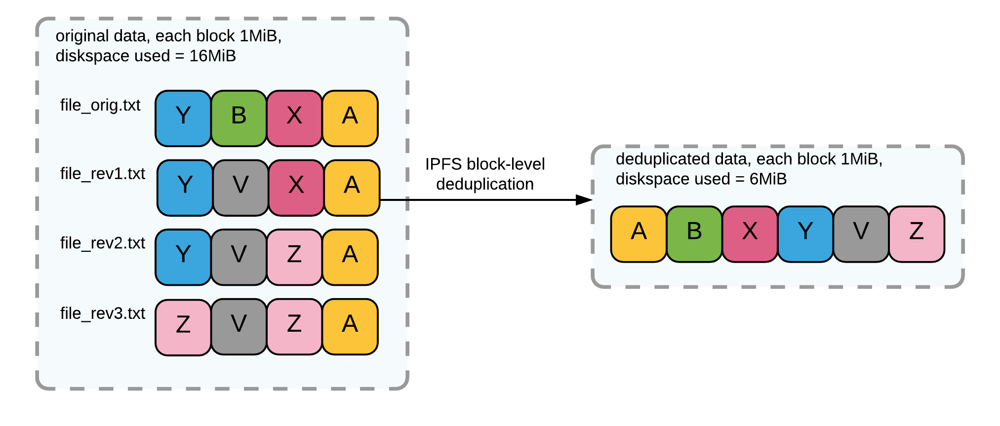

# Evaluation IPFS {#sec:SEC06_EVALUATION_IPFS}

*IPFS* (*InterPlanetary File System*) stellt die Netzwerkbasis für »brig« dar.
Da *IPFS* teilweise andere Ziele als »brig« hat, ist es wichtig, dass die
Anforderungen von »brig« durch die *IPFS*--Basis nicht verletzt werden. Im
Folgenden wird *IPFS* bezüglich bestimmter sicherheitstechnischer Anforderungen
genauer beleuchtet, um Diskrepanzen zu den Zielen von »brig« zu
identifizieren.

Die *IPFS*--Codebasis umfasst aktuell $\approx{900.000}$ *LoC* (siehe
[@sec:APP_IPFS_LOC]). Davon gehören $\approx{100.000}$ *LoC* direkt dem
*IPFS*--Projekt an, $\approx{800.000}$ *LoC* stammen aus Drittanbieter--Bibliotheken.

Im zeitlich begrenzten Umfang der Masterarbeit können nur selektive
Mechanismen der Software untersucht werden. Eine genaue Analyse der
Quelltext--Basis ist aufgrund der Projektgröße und der begrenzten Zeit nicht
möglich.

Es wurde folgende Version aus den *Arch Linux*--Repository evaluiert:

~~~sh
$ ipfs version
ipfs version 0.4.3
~~~

## Einleitung IPFS {#sec:SEC06_EINLEITUNG_IPFS}

Das *InterPlanetary File System* wird als  »content-addressable, peer-to-peer
hypermedia distribution protocol« definiert. Das Besondere an *IPFS* ist, dass
es ein sogenanntes *Content--Addressable--Network (CAN)* darstellt. Ein *CAN*
arbeitet mit einer verteilten Hashtabelle (*Distributed Hash Table (DHT)*),
welche als grundlegende »Datenstruktur« verwendet wird, um die Daten innerhalb
eines Peer--to--peer--Netzwerks zu lokalisieren und zu speichern.

Eine *DHT* als Datenstruktur bringt in der Theorie laut Wikipedia[^FN_DHT]
folgende Eigenschaften mit sich:

[^FN_DHT]: Verteilte Hashtabelle: <https://de.wikipedia.org/w/index.php?title=Verteilte_Hashtabelle&oldid=157901191>

* **Fehlertoleranz:** Das System sollte zuverlässig funktionieren, auch wenn Knoten
  ausfallen oder das System verlassen.
* **Lastenverteilung:** Schlüssel werden gleichmäßig auf alle Knoten verteilt.
* **Robustheit:** Das System sollte »korrekt« funktionieren können, auch wenn ein
  Teil (möglicherweise ein Großteil) der Knoten versucht, das System zu stören.
* **Selbstorganisation:** Es ist keine manuelle Konfiguration nötig.
* **Skalierbarkeit:** Das System sollte in der Lage sein, auch mit einer großen
  Anzahl von Knoten funktionsfähig zu bleiben.

## IPFS--Basis {#sec:SEC06_IPFS_BASIS}

Das *IPFS*--Dateisystem beziehungsweise Protokoll bringt das
Kommandozeilenwerkzeug `ipfs` mit, weiterhin kann es jedoch auch als
Software--Bibliothek verwendet werden. Dieses ermöglicht eine rudimentäre
Nutzung von *IPFS*. Beim Initialisieren von *IPFS* wird ein
*RSA*--Schlüsselpaar generiert. Ein *IPFS*--Repository kann mit dem Befehl
`ipfs init` initialisiert werden. Dabei wird standardmäßig unter `~/.ipfs` ein
Repository angelegt.

~~~sh
$ ipfs init
initializing ipfs node at /home/qitta/.ipfs
generating 2048-bit RSA keypair...done
peer identity: QmbEg4fJd3oaM9PrpcMHcn6QR2HMdhRXz5YyL5fHnqNAET
to get started, enter:

        ipfs cat /ipfs/QmYwAPJzv5CZsnA625s3Xf2nemtYgPpHdWEz79ojWnPbdG/readme
~~~

Bei der Initialisierung wird eine *Peer ID* erzeugt. Anschließend kann
der Benutzer die `readme`--Datei aus dem *IPFS*--Store betrachten.
[@sec:APP_IPFS_SECWARNING] zeigt weiterhin die aktuelle Sicherheitswarnung der
*IPFS*--Software. Es wird explizit ein paar Male darauf hingewiesen, dass sich *IPFS*
im Alphastadium befindet. Weiterhin gibt es in der Datei `security-notes` Details zur Sicherheit, welche analog zur `readme`--Datei betrachtet werden kann.

## IPFS--Backend {#sec:SEC06_IPFS_BACKEND}

### Speicherung und Datenintegrität {#sec:SEC06_SPEICHERUNG_UND_DATENINTEGRITAET}

Die Speicherung von Daten mag auf den ersten Blick simpel erscheinen.
Betrachtet man jedoch die »Rahmenbedingungen«, die zu beachten sind, um Daten
sicher zu speichern, wird die Thematik komplizierter. Das Hauptproblem an
dieser Stelle ist die sogenannte »Silent Data Corruption«(vgl. [@BIB_CERN], [@BIB_SILENT_DATA_CORRUPTION]), oft auch
»Bitrot« genannt. Der Begriff beschreibt den Umstand, dass Fehler in Daten im
Laufe der Zeit auftreten. Für die Fehlerursache können verschiedene Gründe verantwortlich sein, wie beispielsweise:

* Hardwarefehler bedingt durch Alterungsprozess der Festplatte
* Fehler in der Festplatten--Firmware
* Fehler in der Controller--Firmware
* Fehler in der Software (Kernel, Dateisystem)
* Schadsoftware

Gängige Dateisysteme wie beispielsweise *NTFS*[^FN_NTFS] oder *EXT4*[^FN_EXT4]
können Fehler, verursacht durch *Silent Data Corruption*, nicht erkennen und den
Benutzer vor dieser Fehlerart nicht schützen. Um eine Veränderung der Daten
festzustellen, müsste der Benutzer beispielsweise die Daten mit einer
kryptographischen Prüfsumme validieren. Entspricht die Prüfsumme beim Lesen der
Daten, der gleichen Prüfsumme, welche bei der Speicherung der Daten ermittelt
wurde, so sind die Daten mit hoher Wahrscheinlichkeit korrekt an den Benutzer
zurückgegeben worden. Diese Art der Validierung der Integrität ist jedoch
aufgrund des hohen Aufwands nicht praxistauglich.

Dateisysteme wie *BTRFS*[^FN_BTRFS] oder *ZFS*[^FN_ZFS] validieren die Daten und Metadaten 
während der Lese-- und Schreibvorgänge mittels Prüfsummen. Durch dieses
spezielle Feature kann die Verarbeitungskette beim Lesen-- und Speichern der
Daten bezüglich ihrer Integrität validiert werden. Bei der Benutzung eines
*RAID*--System[^FN_RAID] können die Daten sogar automatisiert ohne Zutun des Benutzers
korrigiert[^FN_ZFS_HEALING_VIDEO] werden.

[^FN_ZFS]: ZFS Dateisystem: <https://en.wikipedia.org/w/index.php?title=ZFS&oldid=761908184>
[^FN_BTRFS]: Btrfs Dateisystem: <https://en.wikipedia.org/w/index.php?title=Btrfs&oldid=761911810>
[^FN_RAID]: RAID Wikipedia: <https://en.wikipedia.org/w/index.php?title=RAID&oldid=761073220>
[^FN_ZFS_HEALING_VIDEO]:FreeBSD/ZFS - self-healing example: <https://www.youtube.com/watch?v=VlFGTtU65Xo>
[^FN_NTFS]: NTFS Dateisystem: <https://en.wikipedia.org/w/index.php?title=NTFS&oldid=743913107>
[^FN_EXT4]: EXT4 Dateisystem: <https://en.wikipedia.org/w/index.php?title=Ext4&oldid=738311553>

Das Speichern der Daten erfolgt bei *IPFS* (blockweise, in sogenannten chunks)
mittels eines *Merkle--DAG* (directed acyclic graph, gerichteter azyklischer Graph).

*IPFS* verwendet als Prüfsummen--Format ein eigens entwickeltes
*Multihash*--Format[^FN_MULTIHASH]. [@fig:img-multihash] zeigt das
*Multihash*--Format. Es stellt eine selbstbeschreibende Prüfsumme, welche den
Algorithmus, die Länge und die eigentliche Prüfsumme kombiniert. Dieser wird in
verschiedenen Varianten enkodiert. Beispielsweise `base32` für die interne
Namensvergabe der Datenblöcke oder `base58` für die Repräsentation der
*Peer--ID*.

{#fig:img-multihash width=90%}

Das folgende Listing zeigt den internen Aufbau eines *IPFS*--Repository. Die
Daten sind hierbei in ».data«--Blöcke aufgeteilt und gespeichert. Die
Benennung der Datenblöcke basiert auf dem *Multihash*, die Enkodierung
bei Datenblöcken ist `Base32`.

[^FN_MULTIHASH]: Github Multihash: <https://github.com/multiformats/multihash>

~~~sh
$ tree .ipfs
.ipfs
|--- blocks
|   |--- CIQBE
|   |   |--- CIQBED3K6YA5I3QQWLJOCHWXDRK5EXZQILBCKAPEDUJENZ5B5HJ5R3A.data
|   |--- CIQCL
|   |   |--- CIQCLECESM3B72OM5DWMSFO6C2EA6KNCIO4SFVFDHO6JVBYRSJ5G3HQ.data
...
|   |--- CIQPP
|       |--- CIQPPQVFU2X6L6RB67SNEYN4MPR236SNPL5OML2TBA4RIQQPM4FY6VY.data
|--- config
|--- datastore
|   |--- 000002.ldb
...
|   |--- 000009.log
|   |--- CURRENT
|   |--- LOCK
|   |--- LOG
|   |--- MANIFEST-000010
|--- version

17 directories, 25 files
~~~

Die Speicherung der Daten in einem Merkle--DAG hat den Vorteil, dass die Daten
bei der Speicherung üblicherweise mit einer kryptographischen Prüfsumme
abgelegt werden. Durch diesen Umstand kann *IPFS* eine unerwünschte Veränderung
an den Daten feststellen. Das folgende Beispiel zeigt die unerwünschte
Modifikation der `readme`--Datei direkt im *Store--Backend* und wie die
Integritätsprüfung von *IPFS* die Änderung der Daten erkennt:

~~~sh
# Validierung der Integrität der Daten
$ ipfs repo verify
verify complete, all blocks validated.

# Unerwünschte Modifikation der Daten.
$ echo "Trüffelkauz" >> .ipfs/blocks/CIQBED3K6YA[..]JENZ5B5HJ5R3A.data

# Erneute Validierung der Integrität der Daten
$ ipfs repo verify
block QmPZ9gcCEpqKTo6aq61g2nXGUhM4iCL3ewB6LDXZCtioEB \
was corrupt (block in storage has different hash than requested)
Error: verify complete, some blocks were corrupt.
~~~

Aktuell werden die Daten mittels *SHA256* gehasht. Eine Verschlüsselung der
Daten findet nicht statt. Es gibt zwar Pläne für die Zukunft einen
verschlüsselten *Store* zu realisieren, aktuell wird jedoch in
Feature--Requests[^FN_IPFS_FILEENC] die Möglichkeit der manuellen
Verschlüsselung beispielsweise mittels *OpenSSL/GPG* nahegelegt.

[^FN_IPFS_FILEENC]: *IPFS* file encryption request: <https://github.com/ipfs/faq/issues/116>

### Datendeduplizierung {#sec:SEC06_DATENDEDUPLIZIERUNG}

Neben der Möglichkeit der Datenvalidierung, hat die Speicherung der Daten in
einem Merkle-DAG auch den Vorteil, Daten effizient deduplizieren zu können.
[@fig:img-dedup] zeigt die Deduplizierung auf Blockebene. Eine vier MiByte
große Textdatei wurde hierbei jeweils an verschiedenen Stellen geändert und
unter einem neuen Namen gespeichert. Ohne Deduplizierung wird die Datei jedes
mal jeweils komplett gespeichert. Der Speicherplatz der dafür benötigt wird
würde normalerweise bei 16MiByte liegen, da die Daten auf gewöhnlichen
Dateisystemen wie beispielsweise *ext4* oder *NTFS* redundant abgespeichert
werden. *IPFS* teilt diese Datei --- in diesem Fall nur beispielhaft --- in
1 MiByte große Blöcke auf und speichert nur Datenblöcke, welche dem
*IPFS*--Backend noch nicht bekannt sind (vgl. auch [@cpahl]). Alle bekannten
*Blöcke* werden vom Merkle--DAG nur referenziert. Durch diesen Ansatz reduziert
sich im Beispiel der benötigte Speicherplatz auf 6 MiByte.

{#fig:img-dedup width=90%}

### IPFS--Daten und IPFS--Blöcke {#sec:SEC06_IPFS_DATEN_UND_IPFS_BLOECKE}

Das *IPFS*--Kommandozeilentool kann mittels des `ipfs
add`--Befehl[^FN_IPFS_ADD] Daten dem *IPFS*--Netzwerk hinzufügen. Wie bereits
erwähnt werden die Daten blockweise abgelegt. Weiterhin existiert auch die
Möglichkeit, *IPFS* auf unterster Ebene Blöcke direkt hinzuzufügen. Hierzu wird
das Subkommando `ipfs block`[^FN_IPFS_BLOCK] verwendet. Für weitere Details
siehe [@cpahl].

[^FN_IPFS_BLOCK]: Block Subkommando: <https://ipfs.io/docs/commands/#ipfs-block>
[^FN_IPFS_ADD]: Add Kommando: <https://ipfs.io/docs/commands/#ipfs-add>

## IPFS--ID {#sec:SEC06_IPFS_ID}

### Aufbau {#sec:SEC06_AUFBAU}

Das generierte Schlüsselpaar wird im Klartext auf der Festplatte abgelegt. Der
öffentliche Schlüssel kann mit `ipfs id` angeschaut werden, dies liefert
folgende Ausgabe (gekürzt):

~~~sh
$ ipfs id
{
        "ID": "QmbEg4fJd3oaM9PrpcMHcn6QR2HMdhRXz5YyL5fHnqNAET",
		"PublicKey":
		"CAASpgIwggEiMA0GCSqGSIb3DQEBAQUAA4IBDwAwggEKAoIBAQDGDgKtgJ9FW/EL1qY0Ohz
		 nGGh7dPAszDDpC3fhHcF7rI9iyLp5ei0T9gjfvsj+ULhxKqXHU9qoD7LjiUPUHQKPnND1Yv
		 [...]
		 7X5gVmtkEB8eDjLkcMNCmqMarAjjSb9Sg5uYIQj1WHPPCrvTVQioZIIIHJ6Z7ogWIDpDR5T
		 Og55tS4kW7qSJUQebh54v1gyEVd2mSgUf40MBAgMBAAE=",
        "Addresses": null,
        "AgentVersion": "go-libp2p/3.3.4",
        "ProtocolVersion": "ipfs/0.1.0"
}
~~~

Die unter *ID* gelistete Nummer stellt die Prüfsumme über den öffentlichen
Schlüssel als *Multihash* in `base58`--Enkodierung dar. Mit dieser *ID*
lässt sich ein Benutzer beziehungsweise Peer im *IPFS*--Netzwerk eindeutig
identifizieren.

Der private Schlüssel ist neben weiteren Informationen zum `ipfs`--Repository
in der `~/.ipfs/config`--Datei zu finden, welche beim Anlegen des Repositories
automatisch erstellt wird (gekürzte Ausgabe):

~~~sh
$ cat .ipfs/config | grep PrivKey
	"PrivKey":
	"CAASpwkwggSjAgEAAoIBAQDGDgKtgJ9FW/EL1qY0OhznGGh7dPAszDDpC3fhHcF7rI9iyLp
	 5ei0T9gjfvsj+ULhxKqXHU9qoD7LjiUPUHQKPnND1YvWzpBIZNUhaiuo107J5MztPvroQ8/
	 [...]
	 cWTidFNBZdz5IGzj0P0oO5OK6gadI608TqTvxcLWf4iC/hOMvTUA7W9r1l9dea+YXubchvY
	 VQMS8YcXyzXoE+DQXzM5TqbZT/jxUS/UUFcs7UKhuEu+E9etcYBgpncrMoQckQE="
~~~

Für weitere Details zur Erstellung der *Identität* sollte der
Quelltext[^FN_IPFS_CODE_INIT] zu Rate gezogen werden.

[^FN_IPFS_CODE_INIT]: IPFS Schlüsselgenerierung: <https://github.com/ipfs/go-ipfs/blob/e2ba43c12dd7076357d5627ef02ed56bf2a55c30/repo/config/init.go#L95>

### Authentifizierung {#sec:SEC06_AUTHENTIFIZIERUNG}

Ein Authentifizierungsmechanismus im eigentlichen Sinne existiert bei *IPFS*
nicht. Die Benutzer haben lediglich eine eindeutige globale *Peer--ID*. Dateien
werden nicht direkt von einer bestimmten *Peer--ID*, sondern aus dem
*IPFS*--Netzwerk bezogen.  Schaut man sich beispielsweise mit `ipfs dht
findprovs` an, welche *Peers* die `readme`--Datei anbieten, bekommt man eine
Liste verschiedener Teilnehmer:

~~~sh
$ ipfs dht findprovs QmYwAPJzv5CZsnA625s3Xf2nemtYgPpHdWEz79ojWnPbdG
Qmadh19kRmg1SufioE8ipNvyESd3fwKqqiMdRdFHBJxseH
[...]
QmPKBHmwWJbin2BuzE3zvua9JxsrsEGm6rn69CgWTEU5wn
~~~

Ruft man den Befehl auf der Prüfsumme einer
»persönlichen« Datei im lokalen Netzwerk auf, so bekommt man als einzigen
anbietenden Knoten die *Peer--ID* des Rechners im lokalen Netzwerk:

~~~sh
$ ipfs dht findprovs QmagF4CPz5LCwSwkwhYwn1uZHhJXoXQJDWeV65fcuTyqP1
QmW2jc7k5Ug987QEkUx6tJUTdZov7io39MDCiKKp2f57mD
~~~

Eine Art Authentifizierung kann also nur manuell über einen Seitenkanal
erfolgen. Ein Benutzer kann also nur überprüfen ob eine Datei mit einer
bestimmten Prüfsumme auch auf einem bestimmten System mit der ihm bekannten
*Peer--ID* vorzufinden ist. Hier wäre es denkbar, dass zwei kommunizierende
Parteien ihre *Peer--ID* gegenseitig telefonisch austauschen beziehungsweise
bestätigen. Diese grundlegende Funktionalität der Authentifizierung einer
Quelle ist nur bedingt praxistauglich, da eine nicht persönliche Datei durchaus
mehrere Provider haben kann. 

**Einschub:** Im Gegensatz dazu haben beispielsweise andere dezentrale Systeme
mit einem direkten Kommunikationskanal weitere Möglichkeiten der
Authentifizierung. Der Instant--Messaging--Client *Pidgin*[^FN_PIDGIN] bietet
beispielsweise mit dem *OTR*--Plugin[^FN_OTR] folgende Möglichkeiten für die
Authentifizierung einer gesicherten Verbindung:

[^FN_PIDGIN]: Instant--Messaging--Client Pidgin: <https://de.wikipedia.org/w/index.php?title=Pidgin_(Instant_Messenger)&oldid=155942615>
[^FN_OTR]: Off--the--Record: https://en.wikipedia.org/w/index.php?title=Off-the-Record_Messaging&oldid=741588882

* *Frage und Antwort--Authentifizierung:* *Alice* stellt *Bob* eine Frage zu einem
  gemeinsamen Geheimnis. Beantwortet *Bob* diese Frage korrekt, so wird er vom
  System gegenüber *Alice* authentifiziert --- das heißt, der Fingerabdruck
  (Prüfsumme über eine ID, die *Bob* eindeutig kennzeichnet) wird in Kombination mit
  dem Benutzernamen von *Bob* vom System als valide klassifiziert und
  abgespeichert.

* *Shared--Secret--Authentifizierung*: *Alice* weist *Bob* an, das gemeinsam bekannte
  Geheimnis in einem entsprechenden Programmdialogfenster einzutragen. Alice
  trägt das gemeinsame Geheimnis ebenso in einem Programmdialogfenster ein. Bei
  Übereinstimmung des gemeinsamen Geheimnisses wird *Bob* gegenüber *Alice* vom
  System authentifiziert --- analog zur Frage und Antwort--Authentifizierung wird
  der Fingerabdruck vom System als valide klassifiziert und abgespeichert.

* *Manuelle Verifizierung vom Fingerabdruck:* *Alice* verifiziert den ihr vom System
  angezeigten Fingerabdruck (Prüfsumme über eine eindeutige ID) von Bob. Dazu kann
  sie beispielsweise *Bob* anweisen, ihr über einen Seitenkanal (beispielsweise
  Telefon) die Korrektheit des Fingerabdruck zu bestätigen.

Die genannten Verfahren erlauben eine initiale Authentifizierung zwischen den
Kommunikationspartnern. Bei zukünftiger Kommunikation wird jeweils die *ID* der
Benutzer mit der bei der initialen Authentifizierung gespeicherten *ID* verglichen.

## *IPFS*--Netzwerk {#sec:SEC06_IPFS_NETZWERK}

Das *IPFS*--Netzwerk arbeitet mit einer *DHT*. Standardmäßig sind nach der
Installation eine Reihe von sogenannten *Bootstrap--Nodes* eingetragen, welche
einen initialen »Einstiegspunkt« bieten (gekürzt):

~~~sh
$ ipfs bootstrap list
/ip4/104.131.131.82/tcp/4001/ipfs/QmaCpDMGvV2BGHeYERUEnRQAwe3N8SzbUtfsmvsqQLuvuJ
[..]
/ip4/178.62.61.185/tcp/4001/ipfs/QmSoLMeWqB7YGVLJN3pNLQpmmEk35v6wYtsMGLzSr5QBU3
~~~

Alle Änderungen wie beispielsweise das Hinzufügen von Daten, werden so in dem
durch alle *Nodes* aufgespannten Netzwerk allen Teilnehmern bekannt gemacht. Da
alle Teilnehmer im *IPFS*--Netzwerk gleichberechtigt sind, wird lediglich die
Prüfsumme einer Datei benötigt, um an die Daten zu gelangen.

Aktuell verwendet *IPFS* als Transport--Verschlüsselung ein selbst entwickeltes
Protokoll namens *Secio*[^FN_SECIO], welches laut Entwickleraussagen
([@sec:APP_IPFS_TRANSPORT_SEC]) auf einem TLS1.2--Modi basiert. Es ist geplant
in Zukunft auf TLS1.3 zu migrieren.

[^FN_SECIO]: Github IPFS Secio--Verschlüsselung: <https://github.com/libp2p/go-libp2p-secio>

## Zusammenfassung IPFS--Evaluation {#sec:SEC06_ZUSAMMENFASSUNG_IPFS_EVALUATION}

Aus Datenhaltungs-- und Netzwerksicht stellt *IPFS* zum
aktuellen Zeitpunkt eine attraktive Basis für die Entwicklung des
»brig«--Prototypen dar. Aus Datenhaltungssicht sind insbesondere folgende
Features interessant:

* Möglichkeit der Deduplizierung von Daten (Aufgrund der Speicherung in einem Merkle-DAG)
* Möglichkeit der Validierung der Integrität der Daten (SHA256--basiert)

Aus Sicht der Sicherheit muss *IPFS* um folgende Funktionalitäten erweitert werden:

* Verschlüsselte Lagerung der Daten und kryptographischen Schlüssel
* Mechanismus zur Authentifizierung von Kommunikationspartnern
* Möglichkeit einer einfachen Begrenzung der am *IPFS*--Netzwerk teilnehmenden Benutzer
* Standardisiertes Protokoll zum verschlüsselten Austausch von Metadaten
* Schlüsselmanagement (Verwaltung und Sicherung von Schlüsseln, Identitäten)
