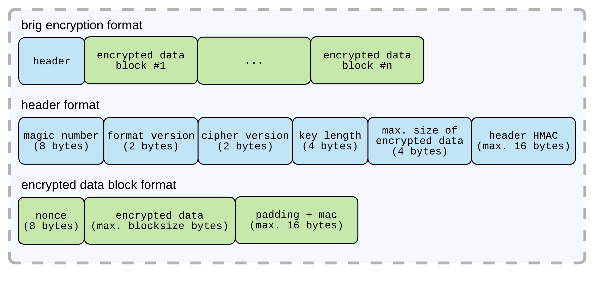

# Evaluation von Brig {#sec:SEC07_EVALUATION_VON_BRIG}

## Einleitung {#sec:SEC07_EINLEITUNG}

Parallel zu der Arbeit wird der »brig«--Prototyp entwickelt. Das Ziel dieses
Kapitels ist es die bisherige Arbeit aus Sicht der Sicherheit erneut zu
evaluieren und bisher gemachte Fehler zu identifizieren. Für weitere allgemeine
Details zur Architektur von »brig« siehe die Arbeit vom Herrn Pahl[@cpahl]. Für
die Evaluation wird die folgende Softwareversion *brig v0.1.0* verwendet:

~~~sh
$  brig --version
brig version v0.1.0-alpha+0d4b404 [buildtime: 2016-10-10T10:05:10+0000]
~~~

## Einleitung »brig« {#sec:SEC07_EINLEITUNG_BRIG}

Das Ziel ist es, mit »brig« ein dezentrales Dateisynchronisationswerkzeug zu
entwickeln welches eine gute Balance zwischen Sicherheit und Usability
bietet. Die Entwicklung eines gut funktionierenden dezentralen
Protokolls/Dateisystems ist nicht trivial.

In [@sec:SEC02_FUNKTIONSWEISE_DEZENTRALER_DIENSTE] wurden bereits verschiedene
dezentrale Protokolle genannt. Diese sind jedoch hauptsächlich für den
generellen Dateiaustausch ausgelegt. Um die in [@sec:SEC03_ANFORDERUNGEN]
aufgeführten Anforderungen zu realisieren, müssen die genannten Protokolle
beziehungsweise das Verhalten des Peer--To--Peer--Netzwerks an die gesetzten
Anforderungen angepasst werden. Als Basis für die Implementierung eines
Prototypen standen die beiden Protokolle *BitTorrent* und *IPFS* in der engeren
Auswahl. Aufgrund der unter [@sec:SEC06_ZUSAMMENFASSUNG_IPFS_EVALUATION]
genannten Funktionalitäten wurde *IPFS* als Basis bevorzugt.

{#fig:img-brig-overlay width=80%}

[@fig:img-brig-overlay] zeigt die Funktionsweise von »brig« als sogenanntes
Overlay--Netzwerk. »brig« wird verwendet um die in
[@sec:SEC06_ZUSAMMENFASSUNG_IPFS_EVALUATION] fehlenden Eigenschaften des
*IPFS*--Protokolls zu ergänzen.

## Datenverschlüsselung {#sec:SEC07_DATENVERSCHLUESSELUNG}

Standardmäßig werden die Daten bei *IPFS* unverschlüsselt gespeichert.
Weiterhin basiert die aktuelle Transportverschlüsselung der Daten auf einem
nicht standardisiertem Protokoll.

### Datenverschlüsselungsschicht {#sec:SEC07_DATENVERSCHLUESSELUNGSSCHICHT}

Um die gesetzten Anforderungen (Vertraulichkeit von Daten,
[@sec:SEC03_SICHERHEIT]) zu erreichen muss »brig« die
Funktionalität von *IPFS* so erweitern, dass die Authentizität und
Vertraulichkeit der Daten bei lokaler Speicherung aber auch bei der Übertragung
gewährleistet ist. Für diesen Einsatzzweck wurde eine Verschlüsselungsschicht
vor das *IPFS*--Backend [@fig:img-enclayer] eingeführt.

{#fig:img-enclayer width=40%}

Die Verschlüsselungsschicht ist so ausgelegt, dass die verwendete
Verschlüsselungstechnik austauschbar ist. Für den anfänglichen Prototypen
wurden zwei Verfahren (AES, ChaCha20) implementiert. Die Entscheidung ist neben
dem weit etablierten *AES*--Standard auf Chacha20 gefallen, da dieses recht
neue Verfahren welches Geschwindigkeitsvorteile[^FN_CHACHA20_PERF1][^FN_CHACHA20_PERF2] auf
schwächerer und mobiler Hardware, insbesondere bei Hardware ohne
kryptographischer Beschleunigung, bieten soll.

[^FN_CHACHA20_PERF1]:Do the ChaCha: better mobile performance with cryptography: <https://blog.cloudflare.com/do-the-chacha-better-mobile-performance-with-cryptography/>
[^FN_CHACHA20_PERF2]: AES-NI SSL Performance: <https://calomel.org/aesni_ssl_performance.html>

[@fig:img-aesgcm] zeigt das Containerformat welches für »brig« entwickelt wurde
um diese Anforderungen zu erreichen.

{#fig:img-aesgcm width=100%}

Das Container--Format wurde so angelegt um wahlfreier Zugriff auf Daten zu
ermöglichen und den Verschlüsselungsalgorithmus austauschbar zu machen. Falls
Schwächen bei einem bestimmten Algorithmus auftauchen sollten, kann die
Vertraulichkeit der Daten durch den Wechseln auf einen noch sicheren
Algorithmus gewährleistet werden.

### Verwendete Algorithmen {#sec:SEC07_VERWENDETE_ALGORITHMEN}

Die aktuelle Softwareversion[^FN_SYMALGO] beherrscht die *AEDA*--Blockchiffren[^AEAD]:

* AES--GCM [@gcm] mit 256 bit Schlüssellänge  mit 256 bit Schlüssellänge
* ChaCha20/Poly1305 mit 256 bit Schlüssellänge (externe Bibliothek[^FN_CHACHA20])

[^FN_SYMALGO]: Aktuell von »brig« unterstützte symmetrische Verschlüsselungsverfahren: <https://github.com/disorganizer/brig/blob/fa9bb634b4b83aaabaa967ac523123ce67aa217d/store/encrypt/format.go>
[^FN_CHACHA20]: ChaCha20/Poly1305--Bibliothek: <https://github.com/codahale/chacha20poly1305>
[^AEAD]: Authenticated encryption: <https://en.wikipedia.org/wiki/Authenticated_encryption>

Der *AEAD*--Betriebsmodi wurde gewählt, weil er den Vorteil hat, dass er neben
der Vertraulichkeit auch Authentizität und Integrität sicherstellt. 

### Geschwindigkeitsevaluation {#sec:SEC07_GESCHWINDIGKEITSEVALUATION}

Der bisherigen »brig«--Benchmarks unter [@cpahl] haben die Performance von
»brig« mit *IPFS* verglichen. Hierbei ist auffällig gewesen, dass die
Performance bei Verschlüsselung vergleichsweise stark eingebrochen ist.

Um Verschlüsselungsoperationen zu beschleunigen, gibt es neben der Wahl
verschiedener Blockcipher, auch die Möglichkeit einer hardwarebasierten
Beschleunigung. Moderne Prozessoren bieten eine Beschleunigung mit dem
sogenannten *AES--NI*--Befehlserweiterungssatz. Diese müssen jedoch vom
Betriebssystem und der jeweiligen Anwendung genutzt werden.

Von *cloudflare* gibt es einen Go--Fork [^FN_CLOUDFLARE] welcher
AES--NI--Erweiterungen unterstützt und somit eine erhöhte Performance auf
bestimmten Systemen bieten sollte.

[^FN_CLOUDFLARE]: CloudFlare Go--Crypto--Fork: <https://blog.cloudflare.com/go-crypto-bridging-the-performance-gap/>

Der *AES--NI*--Befehlserweiterungssatz war lange Zeit aufgrund von
Lizenzproblemen nicht in *Go* implementiert. Nach eingehender Recherche
scheinen jedoch bereits die Patches von *Cloudflare* jedoch mittlerweile in
*Go* Einzug[^FN_AESNI_MERGE][^FN_ECDSA_MERGE] gefunden haben.

[^FN_AESNI_MERGE]: Go AES--NI--Patch--Merge: <https://go-review.googlesource.com/#/c/10484/>
[^FN_ECDSA_MERGE]: Go ECDSA--P256--Patch--Merge: <https://go-review.googlesource.com/#/c/8968/>

### Testumgebung {#sec:SEC07_TESTUMGEBUNG}

Im Folgenden soll die Verschlüsselungsschicht separiert betrachtet werden um
genauere Aussagen über die Ressourcennutzung machen zu können. Weiterhin soll
untersucht werden, wie sich die Verschlüsselungsschicht optimieren lässt
beziehungsweise ob der getroffene Parameter bezüglich der Blockgröße weiterer
Optimierung bedarf.

Weiterhin sollen verschiedene Architekturen in den Benchmark einbezogen werden
damit die Nutzung der Algorithmen und Ressourcen besser klassifiziert werden
kann.

Um das Verhalten auf verschiedenen Klassen von Rechnern testen zu können,
wurden zwei »Systemeklassen« in die Performance--Analyse mit einbezogen.
[@tbl:TAB_HIGH_SYS] zeigt die getesteten Prozessorarchitekturen, die
»schwächeren« Systeme, sollen hierbei Ersatzweise für mobile Plattformen als
Referenzwert dienen.

|                 	| Intel i5--3320M  	| AMD Phenom X4 955  | Intel Atom N270   | Raspberry Pi Zero            |
|-----------------	|------------------	|------------------- |-----------------	 |---------------------------	|
| Architektur     	|      x86_64      	|       x86_64       | x86             	 | ARM                       	|
| Betriebsmodus   	|      64-bit       |       64-bit       | 32-bit          	 | 32-bit                    	|
| Arbeitsspeicher 	|       16GB       	|        8GB         | 1.5 GB          	 | 512 MB                    	|
| Taktfrequenz    	|  3.30 GHz (max)  	|      3.2 GHz       | 1.6 GHz         	 | 1 GHz                     	|
| AES--NI         	|        Ja        	|        Nein        | nein            	 | nein                      	|
| Kernel          	|   4.8.12       	|   4.8.12           | -               	 | 4.4.30                    	|

Table: Evaluierte Testsysteme mit und ohne AES--NI--Befehlserweiterungssatz. {#tbl:TAB_HIGH_SYS} 

TODO: `dd` Lese und Schreibperformance mit in Tabelle aufnehmen.
TODO: Blocksize--Benchmarkgraphik aufnehmen

Der Benchmark soll die maximal mögliche Performance des jeweiligen Systems beim
Ver-- und Entschlüsseln evaluieren. Daher wird der Benchmark vollständig in
einer RAM--Disk durchgeführt. [@fig:img-ramdisk] zeigt grafisch den Aufbau
der Testumgebung.

{#fig:img-ramdisk width=100%}

Beim Erheben der Daten wurde wie folgt vorgegangen:

* Swap--Datei wurde deaktiviert `swapoff -a` um ein auslagern der Daten aus dem
  *RAM* auf die Festplatte zu verhindern.
* Eine RAM--Disk wurde mittels Skript angelegt
* Verschlüsselte und Entschlüsselte Daten werden Mittels Skript erstellt
* Daten werden verschlüsselt (Schreibvorgang) nach `/dev/null` geschrieben,
  Daten werden entschlüsselt (Lesevorgang) nach `/dev/null` geschrieben
* Zeitmessung erfolgt jeweils beim ver/entschlüsseln nach `/dev/null`
* Die Messpunkte bilden den Mittelwert aus mehreren Durchläufen um statistische
  Ausreißer zu eliminieren.

In der Praxis wird in der Regel beim Ver-- und Entschlüsseln die Festplatte
oder die Netzwerkanbindung der limitierende Faktor sein. Ob sich dies bei der
Verschlüsselungsschicht jedoch pauschal, auch bei *low--end*--Systemen der Fall
ist, ist unklar.

### Benchmarks {#sec:SEC07_BENCHMARKS}

#### Einfluss der Blockgröße beim Ver-- und Entschlüsseln {#sec:SEC07_EINFLUSS_DER_BLOCKGROESSE_BEIM_VER_UND_ENTSCHLUESSELN}

Die Verschlüsselungsschicht arbeitet aktuell mit einer Blockgröße von *64KiB*.
Diese Blockgröße wurde mehr oder weniger für den ersten Prototypen willkürlich
festgelegt.

Die beiden Auswertungen [@fig:img-read-block] (Lesegeschwindigkeit) und
[@fig:img-write-block] (Schreibgeschwindigkeit) zeigen welchen Einfluss die Wahl
der Blockgröße auf die Geschwindigkeit hat. Das Verschlüsselungsmodul wurde
hierfür mit der aktuellen Go Version 1.7.1 kompiliert.

{#fig:img-read-block width=100%}

Hierbei wurden die Systeme mit einer Datei der Größe von *128 MiB* getestet.
Diese Datei wurde jeweils komplett mehrmals in der RAM--DISK mit verschiedenen
Blockgrößen verschlüsselt und wieder entschlüsselt.

Beim Entschlüsseln [@fig:img-read-block] ist ist erkennbar dass die
Performance bei unterhalb *4KiB* bei beiden Algorithmen einbricht. Im Mittelfeld
ist die Geschwindigkeit stabil, aber einer Blockgröße von oberhalb *32MiB*
scheint die Performance wieder zu degenerieren.

Ähnlich wie beim Entschlüsseln, zeigt die Verschlüsselung einen vergleichbaren
Verlauf. Hier ist die Geschwindigkeit unterhalb *4kB* Blockgröße rückläufig.
Der obere Grenzwert für die Blockgröße ist beim Verschlüsseln weniger gut
erkennbar. Hier bricht die Performance verglichen mit dem Entschlüsseln nur
beim Intel System mit AES Algorithmus ab ungefähr *64kB* zusammen. 

{#fig:img-write-block width=100%}

Über die Faktoren bei den großen Blockgrößen kann nur mutmaßt werden, dass es
mit hier der Geschwindigkeitseinbruch mit dem
Speichermanagement/Speicherallokierung zusammenhängen könnte.

#### Einfluss des AES--NI--Befehlserweiterungssatzes beim Ver-- und Entschlüsseln {#sec:SEC07_EINFLUSS_DES_AES_NI_BEFEHLSERWEITERUNGSSATZES_BEIM_VER_UND_ENTSCHLUESSELN}

[@fig:img-aesni] zeigt den Geschwindigkeitszugewinn der durch die Nutzung des
*AES--NI*--Befehlserweiterungssatzes zustande kommt. Hier wurde die
Verschlüsselungsschicht mit verschiedenen Go Versionen kompiliert um zu sehen
wie stark die Änderungen ab Go Version 1.6 (Merge des
*Cloudflare--AES--NI*--Patches [^FN_AESNI_MERGE]) sind.

{#fig:img-aesni width=100%}

Weiterhin wurde das AMD--System, welches kein AES--NI unterstützt zum Vergleich
mit in die Auswertung aufgenommen. Hier zeigt sich ein großer Unterschied beim
AES/GCM--Verfahren zwischen den beiden Systemen wenn man die Version 1.5.3 mit
der Version 1.7.1 vergleicht. Die Chacha20/Poly1305--Implementierungen weist
einen Performance Zugewinn von ~20--30% auf, die AES/GCM--Implementierung
hingegen hat beim AMD--System jedoch einen Geschwindigkeitszuwachs von ~15%,
das Intel--System kann seine Geschwindigkeit jedoch aufgrund der
funktionierenden AES--NI--Beschleunigung um ~750% (!) steigern.

#### Low--end--Systeme {#sec:SEC07_LOW_END_SYSTEME}

Neben »aktuelleren« Systemen soll auch die Performance von schwächeren Systemen
wie beispielsweise dem weit verbreiteten *Raspberry Pi* evaluiert werden. 

Für das Erstellen der Benchmark--Binary für die »low--end«--Systeme wurde die
Go--Cross--Comipler Funktionalität verwendet. Hierbei wurden die Binaries für
die Beiden Systeme mit folgenden Parametern kompiliert:

* Raspberry Pi Binary: `GOARM=6 GOARCH=arm GOOS=linux  go build main.go`
* Intel Atom SSE2: `GOARCH=386 GO386=sse2 go build main.go`
* Intel Atom FPU-387: `GOARCH=386 GO386=387 go build main.go`

Ein kurzer Testdurchlauf vor dem eigentlichen Benchmark hat gezeigt, dass die
Beiden Systeme (Intel Atom, Raspberry Pi) vergleichsweise zum Intel i5/AMD
Phenom so langsam sind dass eine Durchführung des Benchmarks mit den gleichen
Parametern in keiner akzeptablen Zeit durchgeführt werden kann. Aus diesem
Grund wurde die Anzahl der Durchläuft auf drei, und die verarbeitende
Dateigröße auf *32MiB* reduziert. [@fig:img-lowend] zeigt den Einbruch der Geschwindigkeit der Beiden Systeme.

{#fig:img-lowend width=100%}

Trotz des reduzierten Benchmarkaufwandes lagen die Zeiten für die Durchführung des Benchmarks bei 1 Stunde 30 Minuten (*Raspberry Pi*) und 40 Minuten (*Intel Atom*).

Weiterhin ist in der Grafik ersichtlich, dass der
Chacha20/Poly1305--Algorithmus bei diesen schwachen Systemen, verglichen mit
AES/GCM, bessere Ver-- und Entschlüsselungsgeschwindigkeiten liefert.

#### Schlüsselgenerierung {#sec:SEC07_SCHLUESSELGENERIERUNG}

Aktuell wird für jede Datei ein Schlüssel zufällig generiert. Dieser wird in
den Metadaten abgelegt. Durch das zufällige generieren eines Schlüssels wird
bei zwei unterschiedlichen Kommunikationspartnern für die gleiche Datei ein
unterschiedlicher Schlüssel erstellt.

Ein großer Nachteil der aktuell zum Tragen kommt, ist dass die
*IPFS*--Deduplizierung nur noch stark eingeschränkt funktioniert.

{#fig:img-dedupbroken width=100%}

[@fig:img-dedupbroken] zeigt den aktuellen Ansatz. Durch den zufällig
generierten Schlüssel haben die verschlüsselten Dateien und Datenblöcke ---
auch bei gleichem Input --- einen unterschiedlichen Output. Dies hat zur Folge,
dass *IPFS* die Daten nicht mehr sinnvoll Deduplizieren kann wie unter (siehe
@sec:SEC07_SCHLUESSELGENERIERUNG)) abgebildet. Eine möglicher Ansatz dieses
»Problem« zu umgehen oder abzumildern ist Convergent Encryption, siehe
@sec:SEC08_DATENVERSCHLUESSELUNG.

Beim Benchmark--Tool wurde beim Ver-- und Entschlüsseln, bei Verwendung der
eine Geschwindigkeits--Anomalie beim verschlüsseln verschiedenen Dateigrößen
festgestellt. Nach eingehender Recherche wurde hierfür die Ableitung des
Schlüssels mittels »scrypt« identifiziert.

»brig« verwendet aktuell einen zufällig generieren Schlüssel für das
Verschlüsseln jeder Datei. [@fig:img-keyoverhead] zeigt im Vergleich dazu
den relativ starken Geschwindigkeitseinbruch beim Verschlüsseln kleiner
Dateien, welcher bei der Nutzung der Key--derivation--function »scrypt«
zustande kommt.

{#fig:img-keyoverhead width=100%}

#### Zusammenfassung Geschwindigkeitsevaluation  {#sec:SEC07_ZUSAMMENFASSUNG_GESCHWINDIGKEITSEVALUATION}

Zusammengefasst kann gesagt werden, dass die Blockgröße beim Verschlüsseln und
Entschlüsseln sich im Bereich von 16KiByte bis wenigen MiByte bewegen sollte.

## Metadatenverschlüsselung {#sec:SEC07_METADATENVERSCHLUESSELUNG}

Neben dem Nutzdaten, die von *IPFS* verwaltet werden, werden weiterhin die
sogenannten »Stores« verschlüsselt. Diese beinhalten den Metadatenstand der
jeweiligen Synchronisationspartner.

Folgend die Struktur eines neu initialisierten eines »brig«--Repositories (vgl.
auch [@cpahl]):

~~~sh
$ tree -al alice
alice
|-- .brig
    |-- index # Stores der Synchronisationspartner
    |   |-- alice@ipfsnetwork.de.locked
    |-- config
    |-- ipfs
    |   |-- config
    |   |...|
    |   |-- version
    |-- master.key.locked
    |-- remotes.yml.locked # Bekannte Synchronisationspartner
    |-- shadow
~~~

Die Dateien mit der Endung `locked` sind durch »brig« verschlüsselt. Als
Einstiegspunkt für den Zugriff auf das Repository fungiert aktuell eine
Passwort--Abfrage. Das Passwort ist samt zufällig generiertem Salt als
*SHA-3*--Repräsentation in der `shadow`--Datei [^FN_BRIG_SHADOW] gespeichert.

[^FN_BRIG_SHADOW]: Quellcode: <https://github.com/disorganizer/brig/blob/fa9bb634b4b83aaabaa967ac523123ce67aa217d/repo/shadow.go>

Die verschlüsselte Remotes--Datei beinhaltet den *Benutzernamen* mit
dazugehörigen *Peer--ID* und einen *Zeitstempel* für die jeweils bekannten
(authentifizierten) Synchronisationspartner.

**Einschätzung:** Das *IPFS*--Repository, sowie das Schlüsselpaar von *IPFS* ist aktuell
unverschlüsselt. Dies würde diverse Modifikationen am erlauben wie
beispielsweise die Manipulation der *Peer--ID* von *IPFS*. Der `master.key` hat
aktuell keine Verwendung.

## »brig«--Identifier {#sec:SEC07_BRIG_IDENTIFIER}

Da *IPFS* an sich keinen Authentifizierungsmechanismus bietet, muss dieser von
»brig« bereitgestellt werden. Im *IPFS*--Netzwerk haben die *Peers* durch die
Prüfsumme über den öffentlichen Schlüssel eine eindeutige Kennung. Diese
Prüfsumme ist aufgrund des Aufbaues und der Länge als Menschen--lesbare Kennung
nicht geeignet. Aus diesem Grund wurde ein »brig«--Identifier (»brig«--*ID*)
eingeführt.

Die »brig«--*ID* repräsentiert den Benutzer mit einem Benutzernamen im
»brig«--Netzwerk nach außen. Der Aufbau dieses Namens ist an die Semantik des
XMPP--Standard[^FN_XMPPID] angelehnt und mit dem Präfix `brig#user:` versehen.
Folgendes Beispiel mit dem *Multihash*--Tool vom *IPFS*--Projekt zeigt die
Generierung einer User--ID aus dem Benutzernamen.

~~~sh
$ echo 'brig#user:alice@university.cc' | multihash -
QmYRofJVzXGsL4njv5BW7HNhCkpLCiCjQvrqesbm7TWUCe
~~~

Diese Definition ermöglicht es Organisationen ihre Mitarbeiter und deren
Ressourcen im »brig«--Netzwerk abzubilden. Weiterhin hat es den Vorteil, dass
eine E-Mail--Adresse auch einen korrekten Benutzernamen darstellen würde.

[^FN_XMPPID]: Jabber--ID: <https://de.wikipedia.org/w/index.php?title=Jabber_Identifier&oldid=147048396>

Um diese Funktionalität bereitzustellen wird ein »Trick« angewendet, bei
welchem die Zeichenkette des Nutzernamen als Block dem *IPFS*--Netzwerk bekannt
gemacht wird (vgl. [@cpahl]). Dieser Block selbst ist nicht eindeutig und
könnte auch von einem Angreifer selbst erstellt worden sein. Um eine
Eindeutigkeit herzustellen, wird der Benutzername direkt an die öffentliche
*ID* (siehe [@sec:SEC06_IPFS_ID]) geknüpft.

Folgende Daten werden kombiniert um einen Benutzer eindeutig zu identifizieren:

* **Peer--ID:** Prüfsumme über den öffentlichen *IPFS*--Schlüssel.
* **User--ID:** Prüfsumme über die »brig«--ID, welche einen vom Benutzer gewählten
  Identifier darstellt.

[@fig:img-userlookup] zeigt das Auffinden von einem Benutzer im
*IPFS*--Netzwerk. Für weitere Details zur Softwarearchitektur und
Funktionsweise siehe auch [@cpahl].

{#fig:img-userlookup width=100%}

## Authentifizierung {#sec:SEC07_AUTHENTIFIZIERUNG}

Eine Schwierigkeit die sich im Voraus stellt, ist die »sichere«
Authentifizierung. Mit der »brig«--ID ist es aufgrund des *Multihash* vom
öffentlichen *IPFS*--Schlüssel möglich den Benutzer eindeutig zu
identifizieren. Bei der aktuellen »brig«--Version muss der Fingerabdruck beim
hinzufügen des Synchronisationspartners manuell hinzugefügt werden. Dies setzt
voraus, dass die Synchronisationspartner ihre *IPFS*--Fingerabdrücke
austauschen. Anschließend können beide Synchronisationspartner ihre
Repositories synchronisieren.

~~~sh
# Alice fügt Bob (Bob's brig-ID:bob@jabber.nullcat.de/desktop,
# Bob's IPFS-Fingerabdruck: QmbR6tDXRCgpRwWZhGG3qLfJMKrLcrgk2q)
# als Synchronisationspartner hinzu
brig remote add bob@jabber.nullcat.de/desktop QmbR6tDXRCgpRwWZhGG3qLfJMKrLcrgk2q
~~~

Analog dazu muss auch Alice von Bob als Synchronisationspartner hinzugefügt
werden.

## Repository--Zugriff {#sec:SEC07_REPOSITORY_ZUGRIFF}

Um Zugriff auf das »brig«--Repository zu erhalten muss sich der Benutzer »brig«
gegenüber mit einem Passwort authentifizieren. Schlechte Passwörter sind ein
großes Problem im Informationszeitalter, da von ihnen die Sicherheit eines
gesamten Systems abhängen kann. Menschen sind schlecht darin die
*Entropie*[^FN_ENTROPY] von Passwörter richtig einzuschätzen. »brig« verwendet
für die Bestimmung der Passwort--Entropie *zxcvb*--Bibliothek, welche von
*Dropbox* entwickelt wurde. Laut einer Studie [@Carnavalet] wird die
Bibliothek, im Vergleich zu den getesteten Konkurrenten, als akkurater in ihrer
Funktionsweise bezeichnet. Eine Schwäche, welche bei den
Entropie--Schätzungswerkzeugen auftritt ist, dass diese ohne Basis eines
Wörterbuchs arbeiten und somit bei Zeichenketten *Brute--Force* als schnellsten
Ansatz annehmen. Weiterhin ist die Schätzung einer »sicheren Entropie« schwierig, da diese stark vom Angriffsszenario abhängt. Die Schätzspanne für ein sicheres Passwort liegt zwischen 29 bit (Online--Passwörter) -- 128 bit oder mehr (Sicherung kryptographischer Schlüssel)[^FN_RANDOM_REQUIREMENTS_FOR_SECURITY]. 

[^FN_RANDOM_REQUIREMENTS_FOR_SECURITY]:Randomness Requirements for Security: <https://tools.ietf.org/html/rfc4086#section-8.2>

Wie bereits unterm Punkt *Passwortmanagement*,
@sec:SEC05_BEURTEILUNG_VON_SICHERHEIT erwähnt ist der Einsatz von Passwörtern
problematisch. In dem Berichten von *Bruce Schneier* und *Dan Goodin* wird
erwähnt, dass heutzutage mit modernen Methoden und moderner Hardware auch
Passwörter die bisher von vielen Benutzern »gut« angesehen waren, nicht mehr
verwendet werden sollten. Dazu gehören insbesondere Passwörter, bei welchen
Buchstaben durch Sonderzeichen oder Zahlen ausgetauscht wurden.
Tabelle zeigt listet einen Teil der Passwörter die laut
*Bruce Schneier* während der sogenannten *cracking session* »gecrackt« wurden.
Diese Passwörter sind definitiv als unsicher anzusehen. Die Tabelle zeigt die
geschätzte Entropie und Crackzeit (hier ist leider die genaue Hardware nicht
bekannt) der genannten Passwörter. In die Cygnius--Schätzungen fließen neben
der zxcvb--Bibiothek noch erweitere Prüfungen(Länge, Kleinbuchstaben,
Großbuchstaben, Zahlen, Sonderzeichen), welche eine zusätzliche
Passwortakzeptanz--Aussage machen.

+-------------------+-----------------------+--------------------------------+
| Passwort          | zxcvbn (Entopie/Zeit) | Cygnius(Entropie/Zeit/Akzept.) |
+===================+=======================+================================+
| k1araj0hns0n,     | 19.868/instant        | 21.372/4 minutes/no            |
+-------------------+-----------------------+--------------------------------+
| Sh1a+labe0uf,     | 63.847/centuries      | 53.613/centuries/yes           |
+-------------------+-----------------------+--------------------------------+
| Apr!l221973,      | 31.154/3 days         | 27.835/5 hours/no              |
+-------------------+-----------------------+--------------------------------+
| Qbesancon321,     | 45.326/70 years       | 41.625/7 years/yes             |
+-------------------+-----------------------+--------------------------------+
| DG091101%,        | 44.116/31 years       | 34.936/21 days/no              |
+-------------------+-----------------------+--------------------------------+
| \@Yourmom69,      | 35.049/22 days        | 35.904/3 months/no             |
+-------------------+-----------------------+--------------------------------+
| tmdmmj17,         | 43.413/20 years       | 41.921/8 years/no              |
+-------------------+-----------------------+--------------------------------+
| iloveyousomuch,   | 24.256/18 minutes     | 27.902/5 hours                 |
+-------------------+-----------------------+--------------------------------+
| Philippians4:6+7, | 60.662/centuries      | 39.915/3 years/no              |
+-------------------+-----------------------+--------------------------------+
| qeadzcwrsfxv1331. | 83.148/centuries      | 78.795/centuries/no            |
+-------------------+-----------------------+--------------------------------+

Table: Geschätzte Passwort--Entropie und »Crackdauer« von *unsicheren* Passwörtern. {#tbl:xxx}

[^FN_PASSWORD_STRENGHTH_CHECKER]:Password Strength Checker: <https://www.bennish.net/password-strength-checker/>
[^FN_PASSWORD_STRENGHTH_CHECKER_2]:Cygnius Password Strength Test: https://apps.cygnius.net/passtest/>

Betrachtet man die Tabelle, so würde sie dem Benutzer nach Aussagen der
Entropie--Schätzwerkzeugen ein falsches Sicherheitsgefühl vermitteln. Eine
Empfehlung an dieser Stelle wäre ein zufällig generiertes Passwort wie
beispielsweise *iyLGBu\<tmr\"6!w-s.1fT* und die Verwendung eines Passwormanagers[^FN_SECURE_PASSWORD].

[^FN_SECURE_PASSWORD]:The secret to online safety: Lies, random characters, and a password manager: <http://arstechnica.com/information-technology/2013/06/the-secret-to-online-safety-lies-random-characters-and-a-password-manager/>
[^FN_ENTROPY]: Password--Entropy: <https://en.wikipedia.org/wiki/Password_strength#Entropy_as_a_measure_of_password_strength>

**Einschätzung**: Bei der aktuellen Authentifikation gegenüber dem Repository
ist ein (schlechtes) Passwort oder die erzwungene Komplexität (Benutzer
schreiben komplexe Passwörter auf Post--it's auf) eine Schwachstelle. Weiterhin
ist auch problematisch, dass die Public/Private--Key--Schlüsselpaar von *IPFS*
nicht verschlüsselt ist. Dieser Umstand ermöglicht beispielsweise
Identitätsdiebstahl.

### Aufbau einer verschlüsselten Verbindung {#sec:SEC07_AUFBAU_EINER_VERSCHLUESSELTEN_VERBINDUNG}

[@fig:img-keyexchange] zeigt den Ablauf beim Aufbau einer Verschlüsselten
Verbindung zwischen zwei Synchronisationspartnern.

{#fig:img-keyexchange width=90%}

**Ablauf aus der Sicht von Alice**:

1. *Alice* generiert  eine zufällige Nonce $nA$.
2. *Alice* verschlüsselt $nA$ mit dem öffentlichen Schlüssel von *Bob*.
3. *Alice* schickt verschlüsselte Nonce $nA$ an *Bob* (bob_pub_key($nA$)).
4. *Bob* entschlüsselt die Nonce $nA$ von *Alice* mit seinem privaten Schlüssel.
5. *Bob* generiert eine Prüfsumme der Nonce $nA$ und schickt diese an *Alice*.
6. *Alice* vergleicht die von *Bob* erhaltene Prüfsumme SHA3($nA$) mit ihrer
   eigenen. Stimmt diese überein, so kann der Vorgang fortgesetzt werden,
   ansonsten wird dieser abgebrochen.
7. Analog zu *Alice* hat *Bob* auf die gleiche Art und Weise seine
   Nonce $nB$ mit *Alice* ausgetauscht.
8. *Alice* entschlüsselt die Nonce $nB$ von *Bob* und lässt diese in die
   Schlüsselgenerierung einfließen.
9. Der gemeinsame Schlüssel ist nun eine *XOR*--Verknüpfung der beiden Noncen
   $nA$ und $nB$. Um den Schlüssel zu »verstärken« wird zusätzlich die
   Schlüsselableitungsfunktion *scrypt* (vgl. [@scrypt]) angewendet.

**Einschätzung**: Dir Aufbau der Verschlüsselten Verbindung setzt eine
vorherige Authentifizierung des jeweiligen Kommunikationspartners. Wäre dieser
nicht authentifiziert, so wäre in diesem Fall ein
*Man--In--The--Middle*--Angriff denkbar.

Die aktuelle Softwareversion bietet hier keinen Automatismus und auch keinen
Authentifizierungsmechanismus wie er beispielsweise bei *Pidgin*--Messenger mit
*OTR*--Verschlüsselung.

## Entwicklung und Entwicklungsumgebung {#sec:SEC07_EINTWICKLUNG_UND_ENTWICKLUNGSUMGEBUNG}

### Sichere Softwareentwicklung {#sec:SEC07_SICHERE_SOFTWAREENTWICKLUNG}

Bei Software, welche das Augenmerk auf einen gewissen »Sicherheitsstandard«
legt, sollte neben dem korrekten Einsatz von kryptographischen Elemente bereits
der Entwicklungprozess gewissen Mindestanforderungen genügen. Welche dies im
konkreten Fall sind, hängt stark vom Projekt, Aufwand und dem Einsatzzweck ab.

Da ein Hauptaugenmerk von »brig« der sichere und dezentrale Austausch von Daten
ist und es zusätzlich als Open--Source--Projekt angelegt ist, ist ein
detaillierter Überblick über Entwicklung beziehungswiese die Projektbeteiligten wichtig.

### »brig«--Quellcode--Repository {#sec:SEC07_BRIG_QUELLCODE_REPOSITORY}

Aktuell wird »brig« mit der Quelltext--Versionsverwaltungssoftware `git`
verwaltet. Da es sich um ein Open--Souce--Projekt handelt, ist das Repository
öffentlich auf der *Github*--Plattform zu finden.

**Einschätzung:** Quelltexte/Releases sind bisher nicht signiert. Updates am
Repository werden aktuell über den von den Entwicklern hinterlegten
*SSH*--Schlüssel *gepush* beziehungsweise *gepullt*. Der Zugriff auf die
*GitHub*--Plattform erfolgt aktuell über eine Kombination aus Benutzername und
Passwort. Hier würde sich die Aktivierung der von *GitHub* angebotenen
Zwei--Faktor--Authentifizierung aus Gründen der Sicherheit anbieten.

Problematisch ist aktuell der Umstand, dass die Urheber des Quelltextes nicht
direkt authentifiziert werden können. Durch dieser Umstand macht es Personen
(Angreifern) einfacher sich als Entwickler unter einer falschen Identität
auszugeben.

### Update--Mechanismus {#sec:SEC07_UPDATE_MECHANISMUS}

Im aktuellen Stadion kann »brig« über das beziehen des Quelltextes von *GitHub*
installiert werden. Ein Update--Mechanismus existiert nicht, die Validierung
der Integrität des Quelltextes ist aktuell nur auf Basis der `git`
*SHA--1*--Integrität möglich.

**Einschätzung:** Aktuell ist es für den Benutzer nicht möglich den Ursprung
der Heruntergeladenen Software zu validieren.
