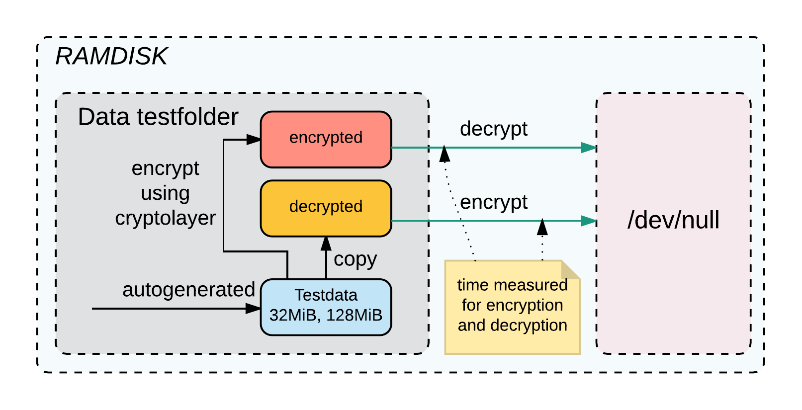

# Evaluation von »brig« {#sec:SEC07_EVALUATION_VON_BRIG}

Parallel zu dieser Arbeit wird der »brig«--Prototyp entwickelt. Das Ziel dieses
Kapitels ist es, die bisherige Arbeit aus Sicht der Sicherheit erneut zu
evaluieren und bisher gemachte Fehler zu identifizieren. Für weitere allgemeine
Details zur Architektur von »brig« siehe, die Arbeit von Herrn Pahl [@cpahl]. Für
die Evaluation wird die Softwareversion brig v0.1.0 verwendet:

~~~sh
$  brig --version
brig version v0.1.0-alpha+0d4b404 [buildtime: 2016-10-10T10:05:10+0000]
~~~

## Einleitung »brig« {#sec:SEC07_EINLEITUNG_BRIG}

Das Ziel ist es, mit »brig« ein dezentrales Dateisynchronisationswerkzeug zu
entwickeln welches eine gute Balance zwischen Sicherheit und Usability
bietet. Die Entwicklung eines gut funktionierenden dezentralen
Protokolls/Dateisystems ist nicht trivial.

In [@sec:SEC02_FUNKTIONSWEISE_DEZENTRALER_DIENSTE] wurden bereits verschiedene
dezentrale Protokolle genannt. Diese sind jedoch hauptsächlich für den
generellen Dateiaustausch ausgelegt. Um die in [@sec:SEC03_ANFORDERUNGEN]
aufgeführten Anforderungen zu realisieren, müssen die genannten Protokolle
beziehungsweise das Verhalten des Peer--to--Peer--Netzwerks an die gesetzten
Anforderungen angepasst werden. Als Basis für die Implementierung eines
Prototypen standen die beiden Protokolle BitTorrent und IPFS in der engeren
Auswahl. Aufgrund der unter [@sec:SEC06_ZUSAMMENFASSUNG_IPFS_EVALUATION]
genannten Funktionalitäten wurde IPFS als Basis bevorzugt.

{#fig:img-brig-overlay width=80%}

[@fig:img-brig-overlay] zeigt die Funktionsweise von »brig« als sogenanntes
Overlay--Netzwerk. »brig« wird verwendet, um die in
[@sec:SEC06_ZUSAMMENFASSUNG_IPFS_EVALUATION] fehlenden Eigenschaften des
IPFS--Protokolls zu ergänzen.

## Datenverschlüsselung {#sec:SEC07_DATENVERSCHLUESSELUNG}

Standardmäßig werden die Daten bei IPFS unverschlüsselt gespeichert.
Weiterhin basiert die aktuelle Transportverschlüsselung der Daten auf einem
nicht standardisierten Protokoll.

### Datenverschlüsselungsschicht {#sec:SEC07_DATENVERSCHLUESSELUNGSSCHICHT}

Um die gesetzten Anforderungen (Vertraulichkeit von Daten,
[@sec:SEC03_SICHERHEIT]) zu erreichen, muss »brig« die
Funktionalität von IPFS so erweitern, dass die Authentizität und
Vertraulichkeit der Daten bei lokaler Speicherung aber auch bei der Übertragung
gewährleistet ist. Für diesen Einsatzzweck wurde eine Verschlüsselungsschicht
vor dem IPFS--Backend [@fig:img-enclayer] eingeführt.

{#fig:img-enclayer width=40%}

Die Verschlüsselungsschicht ist so ausgelegt, dass die verwendete
Verschlüsselungstechnik austauschbar ist. Für den anfänglichen Prototypen
wurden zwei Verfahren (AES, ChaCha20) implementiert. Die Entscheidung bei der
Standardeinstellung ist neben dem weit etablierten AES--Standard auf Chacha20
gefallen. Dieses recht neue Verfahren bietet
Geschwindigkeitsvorteile[^FN_CHACHA20_PERF1][^FN_CHACHA20_PERF2] auf
schwächerer und mobiler Hardware, insbesondere bei Hardware ohne
kryptographischer Beschleunigung.

[^FN_CHACHA20_PERF1]:Do the ChaCha: better mobile performance with cryptography:

	<https://blog.cloudflare.com/do-the-chacha-better-mobile-performance-with-cryptography/>

[^FN_CHACHA20_PERF2]: AES-NI SSL Performance: <https://calomel.org/aesni_ssl_performance.html>

[@fig:img-aesgcm] zeigt das Container--Format, welches für »brig« entwickelt wurde,
um diese Anforderungen zu erreichen.

{#fig:img-aesgcm width=100%}

Das Container--Format wurde so angelegt, um wahlfreien Zugriff auf Daten zu
ermöglichen und den Verschlüsselungsalgorithmus austauschbar zu machen. Falls
Schwächen bei einem bestimmten Algorithmus auftauchen sollten, kann die
Vertraulichkeit der Daten durch den Wechsel auf einen weiterhin sicheren
Algorithmus gewährleistet werden.

### Verwendete Algorithmen {#sec:SEC07_VERWENDETE_ALGORITHMEN}

Die aktuelle Softwareversion[^FN_SYMALGO] beherrscht die AEAD--Betriebsmodi[^AEAD]:

* AES--GCM [@gcm] mit 256 Bit Schlüssellänge
* ChaCha20/Poly1305 mit 256 Bit Schlüssellänge (externe Bibliothek[^FN_CHACHA20])

[^FN_SYMALGO]: Aktuell von »brig« unterstützte symmetrische Verschlüsselungsverfahren:

	<https://github.com/disorganizer/brig/blob/fa9bb634b4b83aaabaa967ac523123ce67aa217d/store/encrypt/format.go>

[^FN_CHACHA20]: ChaCha20/Poly1305--Bibliothek: <https://github.com/codahale/chacha20poly1305>
[^AEAD]: Authenticated encryption: <https://en.wikipedia.org/w/index.php?title=Authenticated_encryption&oldid=760384391>

Der AEAD--Betriebsmodus wurde gewählt, weil er den Vorteil hat, dass er neben
der Vertraulichkeit auch die Authentizität und die Integrität sicherstellt.

### Geschwindigkeitsevaluation {#sec:SEC07_GESCHWINDIGKEITSEVALUATION}

Die bisherigen »brig«--Benchmarks unter [@cpahl], S. 96 ff. haben die Geschwindigkeit von
»brig« mit IPFS verglichen. Hierbei ist auffällig gewesen, dass die
Geschwindigkeit bei Verschlüsselung vergleichsweise stark eingebrochen ist.

Um Verschlüsselungsoperationen zu beschleunigen, gibt es neben der Wahl
verschiedener Blockcipher, auch die Möglichkeit einer hardwarebasierten
Beschleunigung. Moderne Prozessoren bieten eine Beschleunigung mit dem
sogenannten AES--NI--Befehlserweiterungssatz. Diese müssen jedoch vom
Betriebssystem und der jeweiligen Anwendung unterstützt werden.

Von CloudFlare gibt es einen Go--Fork[^FN_CLOUDFLARE], welcher
AES--NI--Erweiterungen unterstützt und somit eine erhöhte Performance auf
bestimmten Systemen bieten sollte.

[^FN_CLOUDFLARE]: CloudFlare Go--Crypto--Fork: <https://blog.cloudflare.com/go-crypto-bridging-the-performance-gap/>

Der AES--NI--Befehlserweiterungssatz war lange Zeit aufgrund von
Lizenzproblemen nicht in Go implementiert. Nach eingehender Recherche
scheinen jedoch bereits die Patches von CloudFlare mittlerweile in
Go Einzug[^FN_AESNI_MERGE][^FN_ECDSA_MERGE] gefunden zu haben.

[^FN_AESNI_MERGE]: Go AES--NI--Patch--Merge: <https://go-review.googlesource.com/#/c/10484/>
[^FN_ECDSA_MERGE]: Go ECDSA--P256--Patch--Merge: <https://go-review.googlesource.com/#/c/8968/>

### Testumgebung {#sec:SEC07_TESTUMGEBUNG}

Im Folgenden soll die Verschlüsselungsschicht separiert betrachtet werden, um
genauere Aussagen über die Ressourcennutzung machen zu können. Weiterhin soll
untersucht werden, wie sich die Verschlüsselungsschicht optimieren lässt
beziehungsweise ob die getroffenen Parameter bezüglich der Blockgröße weiterer
Optimierung bedürfen.

Weiterhin sollen verschiedene Architekturen in den Benchmark einbezogen werden,
damit die Nutzung der Algorithmen und Ressourcen besser klassifiziert werden
kann.

Um das Verhalten auf verschiedenen Klassen von Rechnern testen zu können,
wurden zwei »Systemklassen« in die Geschwindigkeitsanalyse mit einbezogen.
[@tbl:TAB_HIGH_SYS] zeigt die getesteten Prozessorarchitekturen, die
»schwächeren« Systeme sollen hierbei ersatzweise für mobile Plattformen als
Referenzwert dienen. Für genauere Informationen zur jeweiligen CPU siehe
@sec:APP_CPUARCH. Weiterhin wurde mit dem `dd`--Kommandozeilen--Werkzeug ein
Lese-- und Schreibtest durchgeführt, um die Geschwindigkeit der Festplatte (in
der Regel langsamste Komponente) zu identifizieren. Der `dd`--Benchmark dient
lediglich als grober Orientierungswert für die jeweiligen Systeme.

|                 	| Intel i5 3320M  	| AMD Phenom X4      | Intel Atom N270   | Raspberry Pi Zero    |
|-----------------	|------------------	|------------------- |-----------------	 |--------------------	|
| Architektur     	|      x86_64      	|       x86_64       | x86             	 | ARM                	|
| Betriebsmodus   	|      64-bit       |       64-bit       | 32-bit          	 | 32-bit             	|
| Arbeitsspeicher 	|       16 GB      	|        8 GB        | 1.5 GB          	 | 512 MB             	|
| Taktfrequenz    	|  3.30 GHz (max)  	|      3.2 GHz       | 1.6 GHz         	 | 1 GHz              	|
| AES--NI         	|        ja        	|        nein        | nein            	 | nein               	|
| Kernel          	|   4.8.12       	|   4.8.12           | 4.4.25            | 4.4.30             	|
| `dd`--Lesen       |   470.7 MB/s   	|   409.2 MB/s       | 55.6 MB/s       	 | 21.8 MB/s            |
| `dd`--Schreiben   |   181.7 MB/s   	|   146.4 MB/s       | 10.7 MB/s       	 | 10.1 MB/s            |

Table: Evaluierte Testsysteme mit und ohne AES--NI--Befehlserweiterungssatz. {#tbl:TAB_HIGH_SYS}

Der Benchmark soll die maximal mögliche Geschwindigkeit des jeweiligen Systems beim
Ver-- und Entschlüsseln evaluieren. Daher wird der Benchmark vollständig in
einer RAM--Disk durchgeführt. [@fig:img-ramdisk] zeigt grafisch den Aufbau
der Testumgebung.

{#fig:img-ramdisk width=80%}

Beim Erheben der Daten wurde wie folgt vorgegangen:

* Swap--Datei wurde mit `swapoff -a` deaktiviert, um ein Auslagern der Daten aus dem
  RAM auf die Festplatte zu verhindern.
* Eine RAM--Disk wurde mittels Skript angelegt.
* Verschlüsselte und entschlüsselte Daten werden mittels Skript erstellt.
* Daten werden verschlüsselt (Schreibvorgang) nach `/dev/null` geschrieben,
  Daten werden entschlüsselt (Lesevorgang) nach `/dev/null` geschrieben.
* Zeitmessung erfolgt jeweils beim Ver/Entschlüsseln nach `/dev/null`.
* Die Messpunkte bilden den Mittelwert aus mehreren Durchläufen, um statistische
  Ausreißer zu minimieren. Hier wurde bewusst der Mittelwert anstatt des
  maximal möglichen Werts genommen, um eine möglichst praxisnahe Abbildung zu
  erhalten.

Die Benchmark--Skripte sind unter @sec:APP_SCRIPTE zu finden.

In der Praxis wird in der Regel beim Ver-- und Entschlüsseln die Festplatte
oder die Netzwerkanbindung der limitierende Faktor sein. Ob dies bei der
Verschlüsselungsschicht jedoch pauschal, auch auf schwächeren Systemen der Fall
ist, ist unklar.

### Benchmarks {#sec:SEC07_BENCHMARKS}

#### Einfluss der Blockgröße beim Ver-- und Entschlüsseln {#sec:SEC07_EINFLUSS_DER_BLOCKGROESSE_BEIM_VER_UND_ENTSCHLUESSELN}

Die Verschlüsselungsschicht arbeitet aktuell mit einer Blockgröße von *64
KiByte*. Diese Blockgröße wurde mehr oder weniger für den ersten Prototypen
willkürlich festgelegt. Die Blockgröße entspricht hierbei dem internen
Verschlüsselungspuffer, welcher zum Ver-- und Entschlüsseln im Speicher
allokiert wird.

Die beiden Auswertungen [@fig:img-read-block] (Lesegeschwindigkeit) und
[@fig:img-write-block] (Schreibgeschwindigkeit) zeigen, welchen Einfluss die
Wahl der Blockgröße auf die Geschwindigkeit hat. Unter Tabelle
@tbl:TAB_READ_BLOCK_HIGH (Lesegeschwindigkeit) und Tabelle @tbl:TAB_WRITE_BLOCK_HIGH
(Schreibgeschwindigkeit) sind jeweils die effizientesten Blockgrößen der Systeme zu entnehmen.
Das Verschlüsselungsmodul wurde hierfür mit der aktuellen Go Version 1.7.1
kompiliert.

{#fig:img-read-block width=95%}

+-------------------+----------------------+----------------------+---------------------+
| Blockgröße        | 32.0 KiByte          | 64.0 KiByte          | 4.0 MiByte          |
+===================+======================+======================+=====================+
| AMD (ChaCha20)    | 1222; 104.7          | 1187; 107.8          | **1133; 113.0 **    |
+-------------------+----------------------+----------------------+---------------------+
| Intel (AES)       | 175; 731.4           | **158; 810.1 **      | 190; 673.7          |
+-------------------+----------------------+----------------------+---------------------+
| Intel (ChaCha20)  | **872; 146.8 **      | 991; 129.2           | 1055; 121.3         |
+-------------------+----------------------+----------------------+---------------------+
| AMD (AES)         | **3383; 37.8 **      | **3383; 37.8 **      | 3539; 36.2          |
+-------------------+----------------------+----------------------+---------------------+

Table: Zeigt die effizientesten Blockgrößen beim Entschlüsseln. Der erste Wert entspricht der Zeit in Millisekunden, der zweite Wert der Geschwindigkeit in MiByte/s beim Lesen einer 128 MiByte großen Datei. {#tbl:TAB_READ_BLOCK_HIGH}

Hierbei wurden die Systeme mit einer Datei der Größe von 128 MiByte getestet.
Diese Datei wurde jeweils komplett mehrmals in der RAM--DISK mit verschiedenen
Blockgrößen verschlüsselt und wieder entschlüsselt.

Beim Entschlüsseln [@fig:img-read-block] ist erkennbar, dass die
Geschwindigkeit bei beiden Algorithmen unterhalb 4 KiByte einbricht. Im
Mittelfeld ist die Geschwindigkeit stabil, ab einer Blockgröße von oberhalb
32 MiByte scheint die Geschwindigkeit wieder zu degenerieren.

Ähnlich wie beim Entschlüsseln, zeigt die Verschlüsselung einen vergleichbaren
Verlauf. Hier ist die Geschwindigkeit unterhalb 4 KiByte Blockgröße rückläufig.
Der obere Grenzwert für die Blockgröße ist beim Verschlüsseln weniger gut
erkennbar. Hier bricht die Geschwindigkeit verglichen mit dem Entschlüsseln nur
beim Intel--System mit AES--Algorithmus ab ungefähr 32 MiByte ein.

{#fig:img-write-block width=95%}

+------------------+----------------+----------------+----------------+-----------------+
| Blockgröße       | 32.0 KiByte    | 64.0 KiByte    | 256.0 KiByte   | 2.0 MiByte      |
+==================+================+================+================+=================+
| AMD (AES)        | 3381; 37.9     | **3378; 37.9** | 3397; 37.7     | 3464; 37.0      |
+------------------+----------------+----------------+----------------+-----------------+
| AMD (ChaCha20)   | 1422; 90.0     | 1397; 91.6     | 1559; 82.1     | **1200; 106.7** |
+------------------+----------------+----------------+----------------+-----------------+
| Intel (AES)      | **158; 810.1** | 168; 761.9     | 173; 739.9     | 178; 719.1      |
+------------------+----------------+----------------+----------------+-----------------+
| Intel (ChaCha20) | 838; 152.7     | 872; 146.8     | **818; 156.5** | 1027; 124.6     |
+------------------+----------------+----------------+----------------+-----------------+

Table: Zeigt die effizientesten Blockgrößen beim Verschlüsseln. Der erste Wert entspricht der Zeit in Millisekunden, der zweite Wert der Geschwindigkeit in MiByte/s beim Schreiben einer 128 MiByte großen Datei. {#tbl:TAB_WRITE_BLOCK_HIGH}

Über die Faktoren bei den großen Blockgrößen kann nur gemutmaßt werden, dass
hier der Geschwindigkeitseinbruch mit dem
Speichermanagement/Speicherallokierung zusammenhängen könnte.

#### Einfluss des AES--NI--Befehlserweiterungssatzes beim Ver-- und Entschlüsseln {#sec:SEC07_EINFLUSS_DES_AES_NI_BEFEHLSERWEITERUNGSSATZES_BEIM_VER_UND_ENTSCHLUESSELN}

[@fig:img-aesni] zeigt den Geschwindigkeitszuwachs, der durch die Nutzung des
AES--NI--Befehlserweiterungssatzes zustande kommt. Hier wurde die
Verschlüsselungsschicht mit verschiedenen Go--Versionen kompiliert, um zu sehen,
wie stark sich die Geschwindigkeit ab Go Version 1.6 (Merge des
Cloudflare--AES--NI--Patches [^FN_AESNI_MERGE]) verändert hat.

{#fig:img-aesni width=95%}

Weiterhin wurde das AMD--System, welches kein AES--NI unterstützt zum Vergleich
mit in die Auswertung aufgenommen. Hier zeigt sich ein großer Unterschied beim
AES/GCM--Verfahren zwischen den beiden Systemen wenn man die Go--Version 1.5.3 mit
der Version 1.7.1 vergleicht. Die Chacha20/Poly1305--Implementierungen weisen
einen Geschwindigkeitszuwachs von ~20--30% auf, die AES/GCM--Implementierung
hingegen hat beim AMD--System jedoch einen Geschwindigkeitszuwachs von nur ~15%,
das Intel--System hingegen kann seine Geschwindigkeit jedoch aufgrund der
funktionierenden AES--NI--Beschleunigung um ~750% (!) steigern. Weiterhin ist
auffällig, dass der ChaCha20/Poly1305--Algorithmus auf dem Intel--System mit
Go--Version 1.6 langsamer ist als die Go--Version 1.5.3 Variante. Diese
Regression ist reproduzierbar, die Ursache hierfür ist unklar.

#### Schwächere Systeme {#sec:SEC07_LOW_END_SYSTEME}

Neben leistungsfähigeren Systemen soll auch die Geschwindigkeit von schwächeren Systemen,
wie beispielsweise dem weit verbreiteten Raspberry Pi evaluiert werden.

Für das Erstellen der Benchmark--Binary für die schwächeren Systeme wurde die
Go--Cross--Compiler--Funktionalität verwendet. Hierbei wurden die Binaries für
die beiden Systeme mit folgenden Parametern kompiliert:

* Raspberry Pi: `GOARM=6 GOARCH=arm GOOS=linux  go build main.go`
* Intel Atom SSE2: `GOARCH=386 GO386=sse2 go build main.go`
* Intel Atom FPU-387: `GOARCH=386 GO386=387 go build main.go`

Ein kurzer Testdurchlauf vor dem eigentlichen Benchmark hat gezeigt, dass die
beiden Systeme (Intel Atom, Raspberry Pi) im Vergleich zum Intel i5/AMD
Phenom so langsam sind, dass eine Durchführung des Benchmarks mit den gleichen
Parametern in keiner akzeptablen Zeit durchgeführt werden kann. Aus diesem
Grund wurde die Anzahl der Durchläufe auf drei, und die zu verarbeitende
Dateigröße auf 32 MiByte reduziert.

@fig:img-readblock-low zeigt den Einfluss der Blockgröße beim
Lesen/Entschlüsseln auf den schwächeren Systemen. In der Tabelle
@tbl:TAB_READ_BLOCK_LOW sind jeweils die effizientesten Blockgrößen beim
Entschlüsseln zu entnehmen. Hier zeigt sich ein vergleichbares Verhalten wie
bei den stärkeren Systemen. Unterhalb 4 KiByte bricht die Lesegeschwindigkeit
stark ein. Verglichen zu den stärkeren Systemen bricht hier die
Lesegeschwindigkeit bereits ab einer Blockgröße von ungefähr 2 MiByte ein.

{#fig:img-readblock-low width=95%}

+------------------------+---------------+-----------------+---------------+
| Blockgröße             | 32.0 KiByte   | 128.0 KiByte    | 256.0 KiByte  |
+========================+===============+=================+===============+
| Intel Atom (AES)       | **9167; 3.5** | 9193; 3.5       | 9217; 3.5     |
+------------------------+---------------+-----------------+---------------+
| Intel Atom (ChaCha20)  | 7109; 4.5     | **7074; 4.5**   | 7089; 4.5     |
+------------------------+---------------+-----------------+---------------+
| RPi Zero (AES)         | 21183; 1.5    | **21155; 1.5**  | 21183; 1.5    |
+------------------------+---------------+-----------------+---------------+
| RPi Zero (ChaCha20)    | 6460; 5.0     | 6332; 5.1       | **6267; 5.1** |
+------------------------+---------------+-----------------+---------------+

Table: Zeigt die effizientesten Blockgrößen beim Entschlüsseln. Der erste Wert entspricht der Zeit in Millisekunden, der zweite Wert der Geschwindigkeit in MiByte/s beim Lesen einer 32 MiByte großen Datei. {#tbl:TAB_READ_BLOCK_LOW}

@fig:IMG_BLOCKSIZE_WRITE_LOW zeigt den Einfluss der Blockgröße beim
Schreiben/Verschlüsseln auf schwächeren Systemen. Unter Tabelle
@tbl:TAB_WRITE_BLOCK_LOW sind jeweils die effizientesten Blockgrößen beim
Verschlüsseln auf den schwächeren Systemen zu finden. Hier bricht die
Geschwindigkeit, wie bei den restlichen getesteten System, unterhab der *4
KiByte*  stark ein. Eine obere Blockgröße, bei der die Geschwindigkeit einbricht,  ist bei den schwächeren Systemen
weniger gut erkennbar.

{#fig:IMG_BLOCKSIZE_WRITE_LOW width=95%}

+-----------------------+-------------------+-------------------+-----------------+
| Blockgröße            | 256.0 KiByte      | 512.0 KiByte      | 1.0 MiByte      |
+=======================+===================+===================+=================+
| Intel Atom (AES)      | **9143; 3.5 **    | 9148; 3.5         | 9160; 3.5       |
+-----------------------+-------------------+-------------------+-----------------+
| Intel Atom (ChaCha20) | **5081; 6.3 **    | 5140; 6.2         | 5125; 6.2       |
+-----------------------+-------------------+-------------------+-----------------+
| RPi Zero (AES)        | 21029; 1.5        | **20969; 1.5 **   | 20978; 1.5      |
+-----------------------+-------------------+-------------------+-----------------+
| RPi Zero (ChaCha20)   | 6514; 4.9         | 6452; 5.0         | **6399; 5.0**   |
+-----------------------+-------------------+-------------------+-----------------+

Table: Zeigt die effizientesten Blockgrößen beim Verschlüsseln. Der erste Wert entspricht der Zeit in Millisekunden, der zweite Wert der Geschwindigkeit in MiByte/s beim Schreiben einer 32 MiByte großen Datei. {#tbl:TAB_WRITE_BLOCK_LOW}

Trotz des reduzierten Benchmarkaufwandes lagen die Zeiten für die Durchführung
des Benchmarks bei 1 Stunde 30 Minuten (Raspberry Pi) und 40 Minuten (Intel
Atom). [@fig:img-lowend] zeigt den Einbruch der Geschwindigkeit beim Ver-- und
Entschlüsseln auf den schwächeren Systemen. Der Wert Base zeigt hier die
Lese-- und Schreibgeschwindigkeit der Systeme ohne Verschlüsselungsschicht. Auf
beiden Systemen ist ein starker Geschwindigkeitseinbruch unter Verwendung von
Verschlüsselung zu verzeichnen. Betrachtet man die tatsächliche Geschwindigkeit
beim Lesen und Schreiben auf die Festplatte mit dem
`dd`--Kommandozeilen--Werkzeug ([@tbl:TAB_HIGH_SYS] ), so fällt weiterhin auf,
dass bei den beiden Systemen die Verschlüsselung und nicht die »langsame«
Festplatte der limitierende Faktor ist. Auffällig ist auch, dass das
Intel--Atom--System ohne SSE2--Optimierungen schneller ist.

{#fig:img-lowend width=100%}

Weiterhin ist in der Grafik ersichtlich, dass der
Chacha20/Poly1305--Algorithmus bei diesen schwachen Systemen, verglichen mit
AES/GCM, bessere Ver-- und Entschlüsselungsgeschwindigkeiten liefert.

#### Schlüsselgenerierung {#sec:SEC07_SCHLUESSELGENERIERUNG}

Aktuell wird für jede Datei ein Schlüssel zufällig generiert. Dieser wird in
den Metadaten abgelegt. Durch das zufällige Generieren eines Schlüssels wird
bei zwei unterschiedlichen Kommunikationspartnern für die gleiche Datei ein
unterschiedlicher Schlüssel erstellt. Ein großer Nachteil, der aktuell dadurch
zum Tragen kommt, ist, dass die IPFS--Deduplizierung nur noch stark
eingeschränkt funktioniert.

{#fig:img-dedupbroken width=95%}

[@fig:img-dedupbroken] zeigt den aktuellen Ansatz. Durch den zufällig
generierten Schlüssel haben die verschlüsselten Dateien und Datenblöcke ---
auch bei gleichem Input --- einen unterschiedlichen Output. Dies hat zur Folge,
dass IPFS die Daten nicht mehr sinnvoll deduplizieren kann, wie unter (siehe
@sec:SEC07_SCHLUESSELGENERIERUNG) abgebildet. Eine möglicher Ansatz dieses
Problem zu umgehen oder abzumildern ist Convergent Encryption, siehe
@sec:SEC08_DATENVERSCHLUESSELUNG. Der in der Abbildung gezeigte Fall, dass es
im geringen Maße trotzdem zu einer Deduplizierung kommen kann (Block O), ist
sehr unwahrscheinlich.

Beim Benchmark--Tool wurde beim Verschlüsseln eine Geschwindigkeits--Anomalie
bei der Verwendung verschiedener Dateigrößen festgestellt. Nach eingehender
Recherche wurde hierfür die Ableitung des Schlüssels mittels
scrypt[^FN_SCRYPT]  als Ursache identifiziert.

[^FN_SCRYPT]: Scrypt: <https://de.wikipedia.org/w/index.php?title=Scrypt&oldid=158788414>

[@fig:img-keyoverhead] zeigt den Verlauf des Overheads bei verschiedenen
Dateigrößen verglichen mit zwei weiteren Verfahren. Die
scrypt--Schlüsselableitungsfunktion fällt bei kleinen Dateien stark ins
Gewicht. »brig« verwendet aktuell einen zufällig generierten Schlüssel (in
@fig:img-keyoverhead Dev Random generated key).

{#fig:img-keyoverhead width=95%}

#### Zusammenfassung Geschwindigkeitsevaluation  {#sec:SEC07_ZUSAMMENFASSUNG_GESCHWINDIGKEITSEVALUATION}

Zusammengefasst kann gesagt werden, dass sich die Blockgröße beim Verschlüsseln und
Entschlüsseln im Bereich von 32 KiByte bis wenigen MiByte bewegen sollte.
Blockgrößen außerhalb dieses Bereiches haben laut den Benchmarkergebnissen
einen negativen Einfluss auf die Geschwindigkeit der Verschlüsselungsschicht.
Weiterhin scheint der ChaCha20/Poly1305--Algorithmus für schwächere Systeme
besser als AES/GCM geeignet zu sein.

## Metadatenverschlüsselung {#sec:SEC07_METADATENVERSCHLUESSELUNG}

Neben den Nutzdaten, die von IPFS verwaltet werden, werden weiterhin die
sogenannten »Stores« verschlüsselt. Diese beinhalten den Metadatenstand der
jeweiligen Synchronisationspartner.

Folgend ist die Struktur eines neu initialisierten »brig«--Repositories (vgl.
auch [@cpahl], S. 73 ff.) abgebildet:

~~~sh
$ tree -al alice
alice
|-- .brig
    |-- index # Stores der Synchronisationspartner
    |   |-- alice@ipfsnetwork.de.locked
    |-- config
    |-- ipfs
    |   |-- config
    |   |...|
    |   |-- version
    |-- master.key.locked
    |-- remotes.yml.locked # Bekannte Synchronisationspartner
    |-- shadow
~~~

Die Dateien mit der Endung `locked` sind durch »brig« verschlüsselt. Als
Einstiegspunkt für den Zugriff auf das Repository fungiert aktuell eine
Passwort--Abfrage. Das Passwort ist samt zufällig generiertem Salt als
SHA-3--Repräsentation in der `shadow`--Datei [^FN_BRIG_SHADOW] gespeichert.

[^FN_BRIG_SHADOW]: Quellcode: <https://github.com/disorganizer/brig/blob/fa9bb634b4b83aaabaa967ac523123ce67aa217d/repo/shadow.go>

Die verschlüsselte Remotes--Datei beinhaltet den Benutzernamen mit
dazugehöriger Peer--ID und einen Zeitstempel (letzter Onlinestatus) für die
jeweils bekannten (authentifizierten) Synchronisationspartner.

**Einschätzung:** Das IPFS--Repository, sowie das Schlüsselpaar von IPFS
ist aktuell unverschlüsselt. Dies würde diverse Modifikationen am Repository
erlauben wie beispielsweise die Manipulation der Peer--ID von IPFS. Der
`master.key` hat aktuell keine Verwendung.

## »brig«--Identifier {#sec:SEC07_BRIG_IDENTIFIER}

Da IPFS an sich keinen Authentifizierungsmechanismus bietet, muss dieser von
»brig« bereitgestellt werden. Im IPFS--Netzwerk haben die Peers durch die
Prüfsumme über den öffentlichen Schlüssel eine eindeutige Kennung. Diese
Prüfsumme ist aufgrund des Aufbaues und der Länge als menschenlesbare Kennung
nicht geeignet. Aus diesem Grund wurde ein »brig«--Identifier (»brig«--ID)
eingeführt.

Die »brig«--ID repräsentiert den Benutzer mit einem Benutzernamen im
»brig«--Netzwerk nach außen. Der Aufbau dieses Namens ist an die Semantik des
XMPP--Standard[^FN_XMPPID] angelehnt und mit dem Präfix `brig#user:` versehen.
Die eigentliche »brig«--ID entspricht hier der Anlehnung an den
XMPP--Standard, der Präfix wird intern von »brig« angehängt, um die Benutzer
des »brig«--Netzwerks identifizieren zu können.

Folgendes Beispiel mit dem Multihash--Tool vom IPFS--Projekt zeigt die
Generierung einer User--Hash aus dem Benutzernamen.

~~~sh
$ echo 'brig#user:alice@university.cc' | multihash -
QmYRofJVzXGsL4njv5BW7HNhCkpLCiCjQvrqesbm7TWUCe
~~~

Diese Definition ermöglicht es Organisationen ihre Mitarbeiter und deren
Ressourcen im »brig«--Netzwerk abzubilden. Weiterhin hat es den Vorteil, dass
eine E-Mail--Adresse auch einen korrekten Benutzernamen darstellen würde.

[^FN_XMPPID]: Jabber--ID: <https://de.wikipedia.org/w/index.php?title=Jabber_Identifier&oldid=147048396>

Um diese Funktionalität bereitzustellen, wird ein »Trick« angewendet, bei
welchem die Zeichenkette des Nutzernamens als Block dem IPFS--Netzwerk bekannt
gemacht wird (vgl. [@cpahl], S. 62). Dieser Block selbst ist nicht eindeutig und
könnte auch von einem Angreifer selbst erstellt worden sein. Um eine
Eindeutigkeit herzustellen, wird der Benutzername direkt an die eindeutige,
öffentliche ID (siehe [@sec:SEC06_IPFS_ID]) geknüpft.

Folgende Daten werden kombiniert, um einen Benutzer eindeutig zu identifizieren:

* **Peer--ID:** Prüfsumme über den öffentlichen IPFS--Schlüssel.
* **User--Hash:** Prüfsumme über die »brig«--ID, welche einen vom Benutzer gewählten
  Identifier darstellt.

[@fig:img-userlookup] zeigt das Auffinden von einem Benutzer im
IPFS--Netzwerk. Für weitere Details zur Softwarearchitektur und
Funktionsweise siehe auch [@cpahl].

{#fig:img-userlookup width=100%}

## Authentifizierung {#sec:SEC07_AUTHENTIFIZIERUNG}

Eine Schwierigkeit, die sich im Voraus stellt, ist die sichere
Authentifizierung. Mit der »brig«--ID ist es aufgrund des Multihash vom
öffentlichen IPFS--Schlüssel möglich, den Benutzer eindeutig zu
identifizieren. Bei der aktuellen »brig«--Version muss der Fingerabdruck beim
Hinzufügen des Synchronisationspartners manuell hinzugefügt werden. Dies setzt
voraus, dass die Synchronisationspartner ihre IPFS--Fingerabdrücke
vorab austauschen. Anschließend können beide Synchronisationspartner ihre
Repositories synchronisieren.

~~~sh
# *Alice* fügt *Bob* (Bob's brig-ID:bob@jabber.nullcat.de/desktop,
# Bob's IPFS-Fingerabdruck: QmbR6tDXRCgpRwWZhGG3qLfJMKrLcrgk2q)
# als Synchronisationspartner hinzu
brig remote add bob@jabber.nullcat.de/desktop QmbR6tDXRCgpRwWZhGG3qLfJMKrLcrgk2q
~~~

Analog dazu muss auch *Alice* von *Bob* als Synchronisationspartner hinzugefügt
werden.

## Repository--Zugriff {#sec:SEC07_REPOSITORY_ZUGRIFF}

Um Zugriff auf das »brig«--Repository zu erhalten, muss sich der Benutzer »brig«
gegenüber mit einem Passwort authentifizieren. Schlechte Passwörter sind ein
großes Problem im Informationszeitalter, da von ihnen die Sicherheit eines
gesamten Systems abhängen kann. Menschen sind schlecht darin, die
Entropie[^FN_ENTROPY] von Passwörtern richtig einzuschätzen. »brig« verwendet
für die Bestimmung der Passwort--Entropie die zxcvbn--Bibliothek, welche von
Dropbox entwickelt wurde. Laut einer Studie [@Carnavalet], S. 11 wird die
Bibliothek, im Vergleich zu den getesteten Konkurrenten, in ihrer
Funktionsweise als akkurater bezeichnet. Eine Schwäche, welche bei den
Entropie--Schätzungswerkzeugen auftritt, ist, dass diese ohne Basis eines
Wörterbuchs arbeiten und somit bei Zeichenketten Brute--Force als schnellsten
Angriff annehmen. Weiterhin ist die Schätzung einer »sicheren Entropie«
schwierig, da diese stark vom Angriffsszenario abhängt. Die Schätzspanne für
ein sicheres Passwort liegt zwischen 29 Bit (Online--Passwörter) -- 128 Bit
oder mehr (Sicherung kryptographischer
Schlüssel)[^FN_RANDOM_REQUIREMENTS_FOR_SECURITY].

[^FN_RANDOM_REQUIREMENTS_FOR_SECURITY]:Randomness Requirements for Security: <https://tools.ietf.org/html/rfc4086#section-8.2>

Wie bereits unter Punkt Passwortmanagement,
@sec:SEC05_BEURTEILUNG_VON_SICHERHEIT erwähnt, ist der Einsatz von Passwörtern
problematisch. In dem Berichten von *Bruce Schneier* und *Dan Goodin* wird
erwähnt, dass heutzutage mit modernen Methoden und moderner Hardware auch
Passwörter, die bisher von vielen Benutzern als »hinreichend sicher« angesehen
waren, nicht mehr verwendet werden sollten. Dazu gehören insbesondere
Passwörter, bei welchen Buchstaben durch Sonderzeichen oder Zahlen ausgetauscht
wurden. Tabelle @tbl:TAB_PASSWD listet einen Teil der Passwörter, die laut *Bruce
Schneier* während der sogenannten cracking session »gecrackt« wurden. Diese
Passwörter sind definitiv als unsicher anzusehen. Die Tabelle zeigt die
geschätzte Entropie und Crackzeit (hier ist leider die genaue Hardware nicht
bekannt) der genannten Passwörter. In die
Cygnius--Schätzungen[^FN_PASSWORD_STRENGHTH_CHECKER_2] fließen neben der
zxcvbn--Bibiothek noch weitere Prüfungen (Länge, Kleinbuchstaben,
Großbuchstaben, Zahlen, Sonderzeichen), welche eine zusätzliche
Passwortakzeptanz--Aussage machen, ein. Die
bennish--Plattform[^FN_PASSWORD_STRENGHTH_CHECKER] arbeitet ebenso mit der
zxcvbn--Bibliothek.

+-------------------+------------------------+--------------------------------+
| Passwort          | bennish(Entropie/Zeit) | Cygnius(Entropie/Zeit/Akzept.) |
+===================+========================+================================+
| k1araj0hns0n,     | 19.868/instant         | 21.372/4 minutes/no            |
+-------------------+------------------------+--------------------------------+
| Sh1a+labe0uf,     | 63.847/centuries       | 53.613/centuries/yes           |
+-------------------+------------------------+--------------------------------+
| Apr!l221973,      | 31.154/3 days          | 27.835/5 hours/no              |
+-------------------+------------------------+--------------------------------+
| Qbesancon321,     | 45.326/70 years        | 41.625/7 years/yes             |
+-------------------+------------------------+--------------------------------+
| DG091101%,        | 44.116/31 years        | 34.936/21 days/no              |
+-------------------+------------------------+--------------------------------+
| \@Yourmom69,      | 35.049/22 days         | 35.904/3 months/no             |
+-------------------+------------------------+--------------------------------+
| tmdmmj17,         | 43.413/20 years        | 41.921/8 years/no              |
+-------------------+------------------------+--------------------------------+
| iloveyousomuch,   | 24.256/18 minutes      | 27.902/5 hours                 |
+-------------------+------------------------+--------------------------------+
| Philippians4:6+7, | 60.662/centuries       | 39.915/3 years/no              |
+-------------------+------------------------+--------------------------------+
| qeadzcwrsfxv1331. | 83.148/centuries       | 78.795/centuries/no            |
+-------------------+------------------------+--------------------------------+

Table: Geschätzte Passwort--Entropie und »Crackdauer« von *unsicheren* Passwörtern. {#tbl:TAB_PASSWD}

[^FN_PASSWORD_STRENGHTH_CHECKER]:Password Strength Checker: <https://www.bennish.net/password-strength-checker/>
[^FN_PASSWORD_STRENGHTH_CHECKER_2]:Cygnius Password Strength Test: <https://apps.cygnius.net/passtest/>

Betrachtet man die Tabelle, so würde sie dem Benutzer nach Aussagen der
Entropie--Schätzwerkzeuge ein falsches Sicherheitsgefühl vermitteln. Eine
Empfehlung an dieser Stelle wäre ein zufällig generiertes Passwort wie
beispielsweise *iyLGBu\<tmr\"6!w-s.1fT* und die Verwendung eines
Passwort--Manager[^FN_SECURE_PASSWORD].

[^FN_SECURE_PASSWORD]:The secret to online safety - Lies, random characters, and a password manager: <http://arstechnica.com/information-technology/2013/06/the-secret-to-online-safety-lies-random-characters-and-a-password-manager/>

[^FN_ENTROPY]: Password--Entropy: <https://en.wikipedia.org/w/index.php?title=Password_strength&oldid=761771461#Entropy_as_a_measure_of_password_strength>

**Einschätzung**: Bei der aktuellen Authentifikation gegenüber dem Repository
ist ein (schlechtes) Passwort oder die erzwungene Komplexität (Benutzer
schreiben komplexe Passwörter auf Post--it's auf) eine Schwachstelle. Weiterhin
ist auch problematisch, dass das der geheime Schlüssel von IPFS nicht
verschlüsselt abgelegt ist. Dieser Umstand ermöglicht beispielsweise
einen Identitätsdiebstahl.

## Aufbau einer verschlüsselten Verbindung {#sec:SEC07_AUFBAU_EINER_VERSCHLUESSELTEN_VERBINDUNG}

[@fig:img-keyexchange] zeigt den Ablauf beim Aufbau einer verschlüsselten
Verbindung zwischen zwei Synchronisationspartnern.

{#fig:img-keyexchange width=90%}

**Ablauf aus der Sicht von Alice**:

1. *Alice* generiert  eine zufällige Nonce $nA$.
2. *Alice* verschlüsselt $nA$ mit dem öffentlichen Schlüssel von *Bob*.
3. *Alice* schickt verschlüsselte Nonce $nA$ an *Bob* (bob_pub_key($nA$)).
4. *Bob* entschlüsselt die Nonce $nA$ von *Alice* mit seinem privaten Schlüssel.
5. *Bob* generiert eine Prüfsumme der Nonce $nA$ und schickt diese an *Alice*.
6. *Alice* vergleicht die von *Bob* erhaltene Prüfsumme SHA3($nA$) mit ihrer
   eigenen. Stimmt diese überein, so kann der Vorgang fortgesetzt werden,
   ansonsten wird dieser abgebrochen.
7. Analog zu *Alice* hat *Bob* auf die gleiche Art und Weise seine
   Nonce $nB$ mit *Alice* ausgetauscht.
8. *Alice* entschlüsselt die Nonce $nB$ von *Bob* und lässt diese in die
   Schlüsselgenerierung einfließen.
9. Der gemeinsame Schlüssel ist nun eine XOR--Verknüpfung der beiden Noncen
   $nA$ und $nB$. Um den Schlüssel zu verstärken wird zusätzlich die
   Schlüsselableitungsfunktion scrypt (vgl. [@scrypt]) angewendet.

**Einschätzung**: Der Aufbau der verschlüsselten Verbindung setzt eine
vorherige Authentifizierung des jeweiligen Synchronisationspartner voraus. Wäre
dieser nicht authentifiziert, so wäre in diesem Fall ein
Man--in--the--Middle--Angriff denkbar. Weiterhin wäre bei der aktuellen
Implementierung ein Replay--Angriff wahrscheinlich möglich, da die freshness
der Nonce nicht gegeben ist (vgl. [@martin2012everyday], S. 259 ff.).

Die aktuelle Softwareversion bietet hier keinen Automatismus und auch keinen
Authentifizierungsmechanismus wie er beispielsweise beim Pidgin--Messenger mit
OTR--Verschlüsselung vorhanden ist.

## Entwicklung und Entwicklungsumgebung {#sec:SEC07_EINTWICKLUNG_UND_ENTWICKLUNGSUMGEBUNG}

### Sichere Softwareentwicklung {#sec:SEC07_SICHERE_SOFTWAREENTWICKLUNG}

Bei Software, welche das Augenmerk auf einen gewissen Sicherheitsstandard
legt, sollte neben dem korrekten Einsatz von kryptographischen Elementen bereits
der Entwicklungsprozess gewissen Mindestanforderungen genügen. Welche dies im
konkreten Fall sind, hängt stark vom Projekt, dem Aufwand und dem Einsatzzweck ab.

Da ein Hauptaugenmerk von »brig« der sichere und dezentrale Austausch von Daten
ist und es zusätzlich als Open--Source--Projekt angelegt ist, ist ein
detaillierter Überblick zur Entwicklung beziehungsweise der Projektbeteiligten
wichtig.

### »brig«--Quellcode--Repository {#sec:SEC07_BRIG_QUELLCODE_REPOSITORY}

Aktuell wird »brig« mit der Quelltext--Versionsverwaltungssoftware `git`
verwaltet. Da es sich um ein Open--Souce--Projekt handelt, ist das Repository
öffentlich auf der GitHub--Plattform zu finden.

**Einschätzung:** Quelltexte/Releases sind bisher nicht signiert. Updates am
Repository werden aktuell über den von den Entwicklern hinterlegten
SSH--Schlüssel gepusht beziehungsweise gepullt. Der Zugriff auf die
GitHub--Plattform erfolgt aktuell zum Teil über eine Kombination aus
Benutzername und Passwort. Hier würde sich die Aktivierung der von GitHub
angebotenen Zwei--Faktor--Authentifizierung aus Gründen der Sicherheit
anbieten.

Problematisch ist aktuell der Umstand, dass die Urheber des Quelltextes nicht
direkt authentifiziert werden können. Durch diesem Umstand wird es Personen
(Angreifern) einfacher gemacht, sich als Entwickler unter einer falschen Identität
auszugeben.

### Update--Mechanismus {#sec:SEC07_UPDATE_MECHANISMUS}

Im aktuellen Stadium kann »brig« über das Beziehen des Quelltextes von GitHub
installiert werden. Ein Update--Mechanismus existiert nicht, die Validierung
der Integrität des Quelltextes ist aktuell nur auf Basis der `git`
SHA--1--Integrität möglich.

**Einschätzung:** Aktuell ist es für den Benutzer nicht möglich, den Ursprung
der heruntergeladenen Software zu validieren.
