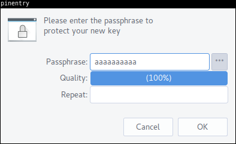
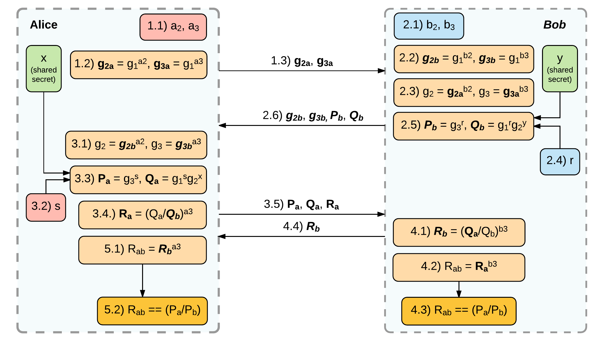
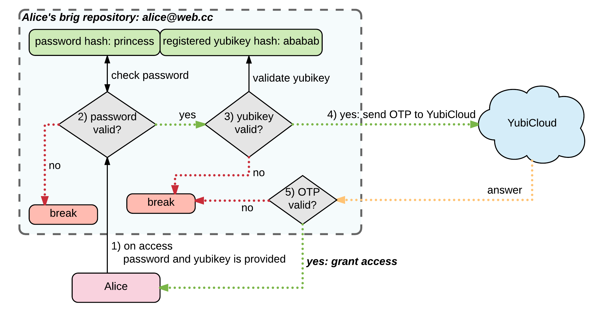
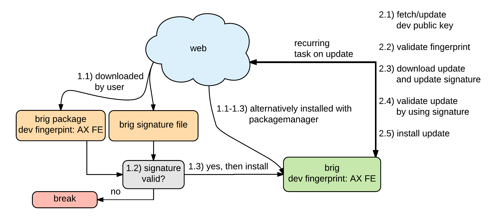
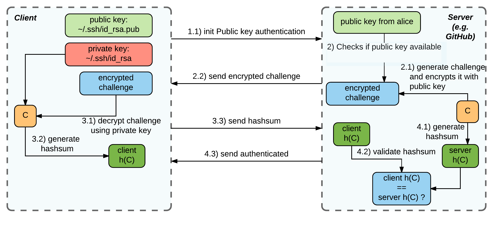

# Verbesserungen und Erweiterungen {#sec:SEC08_VERBESSERUNGEN_UND_ERWEITERUNGEN}

Auf Basis der Evaluation von »brig« sollen nun mögliche Konzepte vorgestellt
werden, um die in der Evaluation identifizierten Schwächen abzumildern
beziehungsweise zu beheben.

## Datenverschlüsselung {#sec:SEC08_DATENVERSCHLUESSELUNG}

Aktuell verwendet die Implementierung der Datenverschlüsselungsschicht 8 Bytes
große *Noncen*. Die *MAC* ist inklusive *Padding* 16 Bytes groß (siehe
@sec:SEC07_DATENVERSCHLUESSELUNGSSCHICHT). Hier muss laut BSI--Richtlinie
nachgebessert werden. Die empfohlene *Noncen*--Größe ist mit 96 Bit angegeben
(vgl. [@bsi], S. 24).

Wie unter @sec:SEC06_IPFS_ID zu sehen, sind die *IPFS*--Schlüssel aktuell in der
`config`--Datei von *IPFS* im Klartext hinterlegt. »brig« verschlüsselt diese
Datei zum aktuellen Zeitpunkt nicht. Hier wäre eine Verschlüsselung mit einem
*Repository*--Key möglich, welcher wiederrum durch einen Hautpschlüssel
geschützt werden sollte (siehe [@sec:SEC08_KEYMANAGEMENT]). Eine weitere
Überlegung wäre, das gesamte *Repository* mittels eines externen Hauptschlüssels
zu verschlüsseln.

Wie unter [@sec:SEC07_SCHLUESSELGENERIERUNG] erläutert, wird aktuell für jede
Datei ein zufälliger Schlüssel generiert. Mit diesem Ansatz wird die
Deduplizierungsfunktionalität von *IPFS* weitestgehend nutzlos gemacht.

Ein Ansatz dieses Problem zu umgehen, ist die sogenannte »Convergent
Encryption«. Diese Technik wird beispielsweise von *Cloud--Storage*--Anbietern
verwendet, um verschlüsselte Daten deduplizieren zu können, ohne dabei auf den
eigentlichen Inhalt zugreifen zu müssen (vgl. [@convergent-encryption]).

{#fig:img-convergent-encryption width=80%}

Wie in [@fig:img-convergent-encryption] zu sehen, wird hierbei beispielsweise
der Schlüssel zum Verschlüsseln einer Datei von dieser selbst mittels einer
kryptographischen Hashfunktion abgeleitet.

Diese Verfahren lässt sich jedoch bei der aktuellen Architektur (separate
Verschlüsselungsschicht) nur eingeschränkt realisieren, da die Prüfsumme der
Daten erst nach dem Hinzufügen zum *IPFS* bekannt ist. Um die Daten zu
verschlüsseln, müssten diese vor dem Hinzufügen komplett *gehasht* werden. Dies
würde bedeuten, dass man die Daten insgesamt zweimal einlesen müsste (1.
Prüfsumme generieren, 2. `brig stage`), was bei vielen und/oder großen Dateien
ineffizient wäre.

Ein Kompromiss wäre beispielsweise anstatt der kompletten Prüfsumme über die
ganze Datei, nur die Prüfsumme über einen Teil (beispielsweise 1024 Bytes vom
Anfang der Datei) der Datei zu bilden und zusätzlich die Dateigröße mit in die
Berechnung des Schlüssels einfließen zu lassen. Dies hätte den Nachteil, dass
man auch viele unterschiedliche Dateien mit dem gleichen Schlüssel
verschlüsseln würde, da mehrere unterschiedliche Dateien mit einer gewissen
Wahrscheinlichkeit fälschlicherweise die gleiche Prüfsumme generieren würden.

Ein weiteres Problem der *Convergent Encryption* ist, dass dieses Verfahren für
den »confirmation of a file«--Angriff anfällig ist. Das heißt, dass es einem
Angreifer möglich ist, durch das Verschlüsseln eigener Dateien darauf zu
schließen, was beispielsweise ein anderer Benutzer in seinem Repository
gespeichert hat.

## Keymanagement {#sec:SEC08_KEYMANAGEMENT}

### Sicherung und Bindung der kryptographischen Schlüssel an eine Identität {#sec:SEC08_SICHERUNG_UND_BINDUNG_DER_KRYPTOGRAPHISCHEN_SCHLUESSEL_AN_EINE_IDENTITAET}

Das asymmetrische Schlüsselpaar von *IPFS* ist standardmäßig in keinster Weise
gesichert und muss daher besonders geschützt werden, da diese die Identität
eines Individuums oder einer Institution darstellt. Beim Diebstahl des Schlüssels
(Malware, Laptop--Verlust/Diebstahl) kann die jeweilige Identität nicht mehr
als vertrauenswürdig betrachtet werden.

Die *IPFS*--Identität ist eng mit dem *IPFS*--Netzwerk verwoben. Da das
Softwaredesign und auch die Sicherheitskomponenten sich aktuell in keinem
finalen Stadium befinden, ist es für »brig« sinnvoll eine eigene
Schlüsselhierarchie umzusetzen, welche die Komponenten von *IPFS* schützt. So
haben auch zukünftige Änderungen an *IPFS* selbst keinen oder nur wenig
Einfluss auf das Sicherheitskonzept von »brig«.

[@fig:img-externalkey] zeigt ein Konzept, bei welchem ein externes und vom
Benutzer kontrolliertes Schlüsselpaar als Hauptschlüssel für die
Absicherung des *IPFS*--Repository dient.

{#fig:img-externalkey width=70%}

Diese externe Identität muss dabei besonders vor Diebstahl geschützt werden, um
einen Missbrauch zu vermeiden. Auf üblichen Endverbrauchergeräten ist der
Passwortschutz dieses Schlüsselpaars ein absolutes Minimalkriterium. Weiterhin
könnte »brig« den Ansatz fahren und die kryptographischen Schlüssel
(`config`--Datei von *IPFS*) selbst nur »on demand« im Speicher beispielsweise
über ein *VFS* (Virtual Filesystem)[^FN_VFS] *IPFS* bereitstellen.
[@fig:img-vfs] zeigt ein Konzept bei welchem »brig« über einen *VFS*--Adapter
die Konfigurationsdateien und somit auch die kryptographischen Schlüssel *IPFS*
bereitstellt. 

[^FN_VFS]: Virtual file system Wikipedia: <https://en.wikipedia.org/wiki/Virtual_file_system>

{#fig:img-vfs width=60%}

Dabei wird beim Starten des »brig«--Daemon die verschlüsselte
Datei im Arbeitsspeicher entschlüsselt und anschließend *IPFS* über einen
Zugriffsadapter bereitgestellt. Dabei wird der komplette Zugriff über das *VFS*
von »brig« verwaltet. 

### GnuPG als Basis für »externe Identität« {#sec:SEC08_GNUPG_ALS_BASIS_FUER_EXTERNE_IDENTITAET}

#### Einleitung {#sec:SEC08_EINLEITUNG_GNUPG}

Für die Erstellung einer externen Identität
([@sec:SEC08_SICHERUNG_UND_BINDUNG_DER_KRYPTOGRAPHISCHEN_SCHLUESSEL_AN_EINE_IDENTITAET])
kann beispielsweise *GnuPG* verwendet werden. *GnuPG* ist eine freie
Implementierung des OpenPGP--Standards (RFC4880[^FN_RFC4880]). Die
Implementierung ist heutzutage auf den gängigen Plattformen (Windows, MacOS,
Linux, BSD) vorhanden. Die Implementierung für Windows
(*Gpg4win*[^FN_GPG4WIN]) wurde vom Bundesamt für Sicherheit in der
Informationstechnik in Auftrag gegeben. Neben dem Einsatz der sicheren
E--Mail--Kommunikation, wird *GnuPG* heute unter vielen unixoiden
Betriebssystemen zur vertrauenswürdigen Paketverwaltung verwendet.
Distributionen wie beispielsweise *Debian*[^FN_DEBIAN_GPG],
*OpenSuse*[^FN_OPENSUSE_GPG], *Arch Linux*[^FN_ARCH_GPG] und weitere verwenden
*GnuPG* zum Signieren von Paketen.

[^FN_GPG4WIN]: Gpg4win: <https://de.wikipedia.org/wiki/Gpg4win>
[^FN_ARCH_GPG]: Pacman/Package Signing: <https://wiki.archlinux.org/index.php/Pacman/Package_signing>
[^FN_DEBIAN_GPG]: Archive Signing Keys: <https://ftp-master.debian.org/keys.html>
[^FN_OPENSUSE_GPG]: RPM -- der Paket--Manager: <http://www.mpipks-dresden.mpg.de/~mueller/docs/suse10.3/opensuse-manual_de/manual/cha.rpm.html>
[^FN_GNUPG]: Internetpräsentation GnuPG: <www.gnupg.org>
[^FN_RFC4880]: RFC4880: <https://www.ietf.org/rfc/rfc4880.txt>

#### Grundlagen {#sec:SEC08_GRUNDLAGEN}

Das theoretische Prinzip der asymmetrischen Verschlüsselung ist unter
[@sec:SEC04_ASYMMETRISCHE_VERSCHLUESSELUNGSVERFAHREN] anschaulich erläutert. In
der Praxis ergeben sich jedoch nennenswerte Unterschiede, welche direkten
Einfluss auf die Sicherheit des Verfahrens haben können.

Von *GnuPG* werden aktuell die folgenden drei Versionen gepflegt:

* *GnuPG* modern 2.1 -- neuer Entwicklungzweig mit erweiterten Funktionalitäten
  und neuen kryptographischen Algorithmen beispielsweise für elliptische Kurven.
* *GnuPG* stable 2.0 -- modularisierte Version von *GnuPG* (Support bis 2017-12-31).
* *GnuPG* classic -- obsolete nicht modulare Version, diese wird aus Kompatibilitätsgründen zu alten Systemen gepflegt.

Für die hier vorgestellten Konzepte wird *GnuPG* modern in der version 2.1 als
Kommandozeilen--Werkzeug verwendet, dieses ist unter Linux über die
Kommandozeile mit `gpg/gpg2` verwendbar:

~~~sh
$ gpg2 --version
gpg (GnuPG) 2.1.16
libgcrypt 1.7.3
Copyright (C) 2016 Free Software Foundation, Inc.
License GPLv3+: GNU GPL version 3 or later <https://gnu.org/licenses/gpl.html>
This is free software: you are free to change and redistribute it.
There is NO WARRANTY, to the extent permitted by law.

Home: /home/qitta/.gnupg
Supported algorithms:
Pubkey: RSA, ELG, DSA, ECDH, ECDSA, EDDSA
Cipher: IDEA, 3DES, CAST5, BLOWFISH, AES, AES192, AES256, TWOFISH,
        CAMELLIA128, CAMELLIA192, CAMELLIA256
Hash: SHA1, RIPEMD160, SHA256, SHA384, SHA512, SHA224
Compression: Uncompressed, ZIP, ZLIB, BZIP2
~~~

Für den *GnuPG*--Neuling gibt es verschiedene Frontends[^FN_GNUPG_FRONTENDS]
und Anwendungen, welche als *GnuPG*--Aufsatz verwendet werden können.

[^FN_GNUPG_FRONTENDS]:*GnuPG*--Frontends: <https://www.gnupg.org/related_software/frontends.html>

Beim Erstellen eines Schlüsselpaars wird bei *GnuPG* standardmäßig ein
Hauptschlüssel- und ein Unterschlüsselpaar angelegt. Dies hat einerseits
historische Gründe (auf Grund von Patenten konnten frühere Versionen von GnuPG
kein RSA/RSA Schlüsselpaar zum Signieren und Ver-- und Entschlüsseln anlegen,
es wurde standardmäßig ein *DSA* Schlüssel zum Signieren und ein *ElGamal*
Schlüssel zum Ver-- und Entschlüsseln angelegt), andererseits ermöglicht es
*GnuPG*, Schlüssel mit unterschiedlichem »Schutzbedarf« anders zu behandeln.

{#fig:IMG_GNUPG_KEYPAIR width=90%}

Der »Schlüsselbund« besteht bei Anlage eines neuen Schlüssels mit `gpg
--gen-key` aus einem Hauptschlüssel- und einem Unterschlüsselpaar. Beide
Schlüsselpaare bestehen jeweils aus einem öffentlichen und einem privaten
Schlüssel (siehe [@fig:IMG_GNUPG_KEYPAIR]). Der folgende Kommandozeilenauszug
zeigt beispielhaft einen mit dem oben genannten Befehl angelegten Schlüssel,
welcher mit den Daten der Abbildung übereinstimmt.

~~~sh
$ gpg --list-keys --fingerprint --fingerprint christoph@nullcat.de
pub   rsa2048 2013-02-09 [SC] [expires: 2017-01-31]
      E9CD 5AB4 0755 51F6 F1D6  AE91 8219 B30B 103F B091
uid           [ultimate] Christoph Piechula <christoph@nullcat.de>
sub   rsa2048 2013-02-09 [E] [expires: 2017-01-31]
      6258 6E4C D843 F566 0488  0EB0 0B81 E5BF 8582 1570
~~~

Hier ist in der ersten Zeile der öffentliche Teil des Hauptschlüssels (pub =
public key) zu sehen. Es handelt sich um einen RSA--Schlüssel mit 2048 Bit. Im
unteren Bereich ist der Unterschlüssel (sub = public subkey) zu sehen, hierbei
handelt es sich ebenso wie beim Hauptschlüssel um einen RSA--Schlüssel mit 2048
Bit. Die Fähigkeit eines Schlüssel wird durch die Flags in eckigen Klammern
angezeigt (Hauptschlüssel `[SC]`, Unterschlüssel `[E]`). 

Schlüssel können unter *GnuPG* folgende Fähigkeiten besitzen:

* `C` (certify): Dieser Schlüssel ist zum *Signieren von anderen/neuen
  Schlüsseln* fähig.
* `S` (sign): Dieser Schlüssel ist zum *Signieren von Daten* fähig.
* `E` (encrypt): Dieser Schlüssel ist zum *Ver-- und Entschlüsseln* fähig. 
* `A` (auth): Dieser Schlüssel ist zum *Authentifizieren* fähig.

Einen besonderen Schutzbedarf hat an dieser Stelle der Hauptschlüssel, da
dieser in der Lage ist, neu erstellte Schlüssel und Unterschlüssel zu signieren
(`[C]`). Fällt einem Angreifer dieser Schlüssel in die Hände, so wäre er in der
Lage im Namen des Benutzers neue Schlüssel zu erstellen und Schlüssel von
anderen Teilnehmern zu signieren.

#### Offline Hauptschlüssel {#sec:SEC08_OFFLINE_HAUPTSCHLUESSEL}

Die privaten Schlüssel sind bei *GnuPG*  mit einer Passphrase geschützt.
Zusätzlich bietet *GnuPG* für den Schutz dieses Schlüssels eine Funktionalität
namens *Offline Master Key*. Diese Funktionalität ermöglicht dem Benutzer den
privaten Teil des Hauptschlüssels zu exportieren und beispielsweise auf einem
sicheren externen Datenträger zu speichern. Dieser Schlüssel wird zum
Zertifizieren/Signieren anderer Schlüssel verwendet und wird nicht für den
täglichen Gebrauch benötigt. Für die sichere externe Speicherung kann
beispielsweise ein Verfahren wie *Shamir's Secret Sharing* (vgl.
[@martin2012everyday], S. 337f. und [@BIB_SHAMIR_SECRET]) verwendet werden. Bei
diesem Verfahren wird ein Geheimnis auf mehrere Instanzen aufgeteilt, zur
Rekonstruktion des Geheimnisses ist jedoch nur eine gewisse Teilmenge nötig.
Das *Shamir's Secret Sharing*--Verfahren wird von
*libgfshare*[^FN_GITHUB_LIBGFSHARE] implementiert. Diese bietet mit dem beiden
Kommandozeilenwerkzeugen `gfsplit` und `gfcombine` eine einfache Möglichkeit,
den privaten Schlüssel auf mehrere Instanzen aufzuteilen. Im Standardfall wird
der Schlüssel auf fünf Dateien aufgeteilt, von welchen mindestens drei benötigt
werden, um den Schlüssel wieder zu rekonstruieren.

Die folgende Kommandozeilenauszüge zeigen die Funktionsweise im Erfolgs-- und
Fehlerfall.

Gezeigt wird die Prüfsumme des zu sichernden privaten Schlüssels und die
Aufteilung mittels `gfsplit`:

~~~sh
$ sha256sum private.key 
d90dc1dbb96387ef25995ada677c59f909a9249eafcb32fc7a4f5eae91c82b42  private.key

$ gfsplit private.key && ls
private.key  private.key.022  private.key.064  \
private.key.076  private.key.153  private.key.250
~~~

Das Zusammensetzen mit genügend (recovered1.key) und ungenügend (recovered2.key)
vielen Teilgeheimnissen und die anschließende Validierung über die Prüfsumme:

~~~sh
$ gfcombine -o recovered1.key private.key.022 private.key.064
$ gfcombine -o recovered2.key private.key.022 private.key.064 private.key.153
$ sha256sum recovered* private.key
6ea5094f26ae1b02067c5b96755313650da78ded64496634c3cc49777df79de6  recovered1.key
d90dc1dbb96387ef25995ada677c59f909a9249eafcb32fc7a4f5eae91c82b42  recovered2.key
d90dc1dbb96387ef25995ada677c59f909a9249eafcb32fc7a4f5eae91c82b42  private.key
~~~

Eine Möglichkeit, den privaten Schlüssel analog zu sichern, bietet die
Applikation *Paperkey*[^FN_PAPERKEY]. *Paperkey* »extrahiert« nur die
benötigten Daten zur Sicherung des privaten Schlüssels und bringt diese in eine
gut druckbare Form.

[^FN_GITHUB_LIBGFSHARE]: GitHub libgfshare: <https://github.com/jcushman/libgfshare>
[^FN_PAPERKEY]: Paperkey Homepage: <http://www.jabberwocky.com/software/paperkey/>

Die *Offline Hauptschlüssel*--Funktionalität ist eine zusätzliche
Funktionalität von *GnuPG* und *nicht* Teil des RFC4880--Standards.

#### Unterschlüssel und Key Separation {#sec:SEC08_UNTERSCHLUESSEL_UND_KEYSEPERATION}

Eine weitere Maßnahme und »Best Practise« im Bereich der Kryptographie ist die
sogenannte »Key Separation«. Das heißt, dass kryptographische Schlüssel an
einen bestimmten Zweck gebunden sein sollen. Einen Schlüssel für mehrere
verschiedene Zwecke zu verwenden, ist sicherheitstechnisch bedenklich.

Obwohl es mit *GnuPG* möglich, ist ein Schlüsselpaar zu erstellen, welches zum
Signieren, Zertifizieren und Ver-- und Entschlüsseln verwendet werden kann
(Flags `[SCE]`), ist dies aus Gründen der Sicherheit nicht empfehlenswert. Beim
Anlegen eines neuen Schlüssels wird standardmäßig bereits ein Schlüsselpaar
bestehend aus Haupt- und Unterschlüssel angelegt. In der Standardkonfiguration
würde der Hauptschlüssel auf Grund seiner Flags neben dem Signieren von
Schlüsseln `[C]` auch für das Signieren von Daten `[S]` Verwendung finden.
Dieser Umstand würde auch verhindern, dass der Benutzer beim Einsatz der
*Offline Hauptschlüssel*--Funktionalität Daten signieren kann.

Die Umsetzung einer »Key Separation« kann mit *GnuPG* beim Anlegen (`gpg2
--full-gen-key --expert`) oder nachträglich (`gpg2 --edit-key <keyid>`)
realisiert werden. [@fig:IMG_KEYSEPERATION] zeigt das Möglichkeit der Anlage
von Unterschlüsseln für den regulären Gebrauch.

{#fig:IMG_KEYSEPERATION width=100%}

#### GPG--Agent {#sec:SEC08_GPG_AGENT}

*GnuPG* hat einen `gpg-agent`. Dieser übernimmt das Management der vom Benutzer
eingegebenen Passphrasen und kann diese für eine gewisse Zeit speichern und bei
Bedarf abfragen. Weiterhin bietet der Agent seit Version 2.0.x die Möglichkeit,
auf Smartcards zuzugreifen. Zusätzlich ist es seit Version 2 möglich,
GPG--Schlüssel für die SSH--Authentifizierung zu verwenden.

Beim Erstellen eines Schlüsselpaars mit *GPG* wird standardmäßig ein
Hauptschlüssel zum Signieren von Daten und Zertifizieren von Schlüsseln und ein
Unterschlüssel für das Verschlüsseln von Daten erstellt[^FN_DEBIAN_SUBKEY].

Der Vorteil von Unterschlüsseln ist, dass diese an einen bestimmten
Einsatzzweck gebunden werden können und auch unabhängig vom eigentlichen
Hauptschlüssel widerrufen werden können --- was eine sehr wichtige Eigenschaft
bei der Verwaltung von Schlüsseln darstellt.

*GnuPG* bietet neben dem RFC4880--Standard die Möglichkeit, den privaten
Hauptschlüssel offline zu speichern. Dieser sollte in der Regel so
konfiguriert sein, dass er lediglich zum Signieren/Zertifizieren und Anlegen
neuer Unterschlüssel verwendet wird.

Eine weitere Empfehlung an dieser Stelle wäre es, die Unterschlüssel zusätzlich
auf eine *Smartcard* auszulagern (siehe
[@sec:SEC08_KRYPTOGRAPHISCHE_SCHLUESSEL_AUF_YUBIKEY_UEBERTRAGEN]).

[^FN_DEBIAN_SUBKEY]: Debian Wiki Subkeys: <https://wiki.debian.org/Subkeys>

#### Weiteres

Bei der Evaluation einer sinnvollen Schlüsselverwaltung ist aufgefallen, dass die Passwortabfrage beim Generieren des *GnuPG*--Schlüssls eine für den Benutzer fragliche Rückmeldung bezüglich der Passwortqualität liefert. 

{#fig:IMG_GNUPG_PWMETER width=50%}

Hier wird in der aktuellen *GnuPG*--Version 2.1.16 unter *Arch Linux*
anscheinend jedes Passwort mit einer Zeichenlänge von 10 Zeichen als *Qualität
100%* definiert (siehe beispielhaft @fig:IMG_GNUPG_PWMETER). Dieser Ansatz ist
bei einer Sicherheitssoftware wie *GnuPG*, welche wichtige kryptographische
Schlüssel schützen muss fragwürdig, da ein Passwort dieser Komplexität als
definitiv unsicher angesehen werden sollte (siehe auch
@sec:SEC07_REPOSITORY_ZUGRIFF). Weiterhin vermittelt dieser Dialog dem Benutzer
ein Gefühl von falscher Sicherheit und »erzieht« ihn zu schlechten
Gewohnheiten.

## Authentifizierungskonzept {#sec:SEC08_AUTHENTIFIZIERUNGSKONZEPT}

### Authentifizierungskonzept mit IPFS--Bordmitteln {#sec:SEC08_AUTHENTIFIZIERUNGSKONZEPT_MIT_IPFS_BOARDMITTELN}

Unter @sec:SEC07_AUTHENTIFIZIERUNG wurde die aktuelle Situation evaluiert. Zum
aktuellen Zeitpunkt hat »brig« keinen Authentifizierungsmechanismus. Die
kommunizierenden Parteien müssen ihre »brig«--Fingerabdrücke gegenseitig
validieren und auf dieser Basis manuell ihrer Liste aus
Synchronisationspartnern hinzufügen. Neben der Möglichkeit, den Fingerabdruck
über einen Seitenkanal (Telefonat, E--Mail) auszutauschen, sollen nun
benutzerfreundlichere Konzepte vorgestellt werden.

#### Manuelle Authentifizierung über QR--Code

Eine sinnvolle Erweiterung an dieser Stelle wäre die Einführung eines QR--Codes
welcher die Identität eines Synchronisationspartners eindeutig bestimmt.
Auf Visitenkaten gedruckte QR--Codes lassen den Benutzer beispielsweise seinen
Synchronisationspartner mit wenig Aufwand über eine Smartphone--Applikation
verifizieren. Bei Anwendung einer externen Identität welche für das Signieren
der »brig«--ID verwendet werden kann --- wie unter [@sec:SEC08_KEYMANAGEMENT]
vorgeschlagen --- würde der Datensatz zur Verifikation wie folgt aussehen

* IPFS--ID: `QmbR6tDXRCgpRwWZhGG3qLfJMKrLcrgk2qv5BW7HNhCkpL`
* GPG--Key--ID (16 Byte): `D3B2 790F BAC0 7EAC`, falls keine GPG--Key--ID
  existiert: `0000 0000 0000 0000`

und könnte beispielsweise in folgender Form realisiert werden:

* `QmbR6tDXRCgpRwWZhGG3qLfJMKrLcrgk2qv5BW7HNhCkpL | D3B2790FBAC07EAC`

[@fig:img-qrcode] zeigt den definierten Datensatz als QR--Code. Es sollte bei
der GPG--Key--ID darauf geachtet werden, dass hier mindestens 16 Byte des
Fingerprints verwendet werden, da die 8 Byte Repräsentation
Angriffsfläche[^FN_EVIL32] bietet.

{#fig:img-qrcode width=30%}

[^FN_EVIL32]: Evil32--Schwachstelle: <https://evil32.com/>

#### Authentifizierung über Frage--Antwort--Dialog

Da *IPFS* bereits ein *Public/Private*--Schlüsselpaar mitbringt, würde sich im
einfachsten Falle nach dem ersten Verbindungsaufbau die Möglichkeit bieten,
seinen Synchronisationspartner anhand eines *gemeinsamen Geheimnises* oder anhand eines
*Frage--Antwort--Dialogs* zu verifizieren. [@fig:img-question-answer] zeigt den
Ablauf einer Authentifizierung des Synchronisationspartners mittels Frage--Antwort--Dialog, welcher in folgenden Schritten abläuft:

{#fig:img-question-answer width=100%}

1. Alice generiert eine zufällige Nonce, Frage und Antwort.
2. Alice verschlüsselt Nonce + Antwort, signiert diese mit ihrem privaten Schlüssel
   und schickt diese an Bob.
3. Bob prüft die Signatur, ist diese ungültig, wird abgebrochen, bei
   Gültigkeit entschlüsselt Bob die Nachricht.
4. Bob inkrementiert die Nonce von Alice um eins und erstellt ein Antwortpaket
   bestehend aus Nonce, Frage und Antwort und schickt dieses an Alice.
5. Alice prüft die Signatur, ist diese ungültig wird abgebrochen, bei
   Gültigkeit entschlüsselt Alice die Nachricht.
6. Alice prüft ob Nonce um eins inkrementiert wurde, ob die Frage zur
   gestellten Frage passt und ob die Antwort die erwartete Antwort ist.
7. Stimmen alle drei Parameter überein, dann wird Bob von Alice als
   vertrauenswürdig eingestuft und Alice kann somit Bob's ID als vertrauenswürdig
   hinterlegen.

Um Alice gegenüber Bob zu verifizieren, muss das Protokoll von Bob aus
initialisiert werden.

Die Anforderungen des Protokolls richten sich hierbei nach den Prinzipien (vgl. [@martin2012everyday], S. 295 ff):

* Nachrichtenauthentifizierung, durch Signatur bereitgestellt.
* Gültigkeit (engl. *freshness*), durch Nonce bereit gestellt.
* Bezug zur korrekten Anfrage. Frage wird in der Antwort mitgesendet.

Weiterhin wäre diese Art der Authentifizierung auch unter Verwendung des *Socialist Millionaire*--Protokolls möglich, siehe folgendes Kapitel.

#### Authentifizierung über gemeinsames Geheimnis (Socialist Millionaire--Protokoll)

Eine weitere Möglichkeit der Authentifizierung des Synchronisationspartners
wäre, wie beim OTR--Plugin des *Pidgin*--Messengers, das Teilen eines
gemeinsamen Geheimnisses. Das Off--the--Record--Messaging--Protokoll
verwendet hierbei das *Socialist Millionaire*--Protokoll. Das Protokoll
erlaubt es Alice und Bob ein gemeinsam geglaubtes Geheimnis $x$ (Alice) und $y$
(Bob) auf Gleichheit zu prüfen ohne es austauschen zu müssen. Weiterhin ist
das Protokoll nicht für einen Man--in--the--Middle--Angriff anfällig. Beim
Off--the--Record--Messaging--Protokoll[^FN_PIDGIN_SMP] werden alle Operationen
modulo einer bestimmten 1536 Bit Primzahl genommen, $g_{1}$ ist hier das
erzeugende Element dieser Gruppe. [@fig:img-shared-secret] zeigt den
grundlegenden Ablauf des *Socialist Millionaire*--Protokoll.

{#fig:img-shared-secret width=90%}

[^FN_PIDGIN_SMP]: Socialist Millionaire Protocol (SMP): <https://otr.cypherpunks.ca/Protocol-v3-4.0.0.html>

1. Alice generiert zwei zufällige Exponenten $a_{2}$ und $a_{3}$. Anschließend
   berechnet sie $g_{2a}$ und $g_{3a}$ und sendet diese an Bob.
2. Bob generiert zwei zufällige Exponenten $b_{2}$ und $b_{3}$. Anschließend berechnet
   Bob $g_{2b}$, $g_{3b}$, $g_{2}$ und $g_{3}$. Bob wählt einen zufälligen Exponenten $r$. Bob berechnet
   $P_{b}$ und $Q_{b}$ (hier fließt das gemeinsame Geheimnis $y$ von Bob ein) und sendet
   $g_{2b}$, $g_{3b}$, $P_{b}$ und $Q_{b}$ an Alice.
3. Alice berechnet $g_{2}$, $g_{3}$, wählt einen zufälligen Exponenten $s$,
   berechnet $P_{a}$,
   $Q_{a}$ (hier fließt das gemeinsame Geheimnis $x$ von Alice ein), $R_{a}$ und sendet $P_{a}$, $Q_{a}$ und $R_{a}$ an Bob.
4. Bob berechnet $R_{b}$, $R_{ab}$ und prüft ob $R_{ab} == (P_{a}/P_{b})$. Anschließend sendet er $R_{b}$
   an Alice.
5. Alice berechnet $R_{ab}$ und prüft ob $R_{ab} == (P_{a}/P_{b})$.

Konnten Alice und Bob jeweils $R_{ab} = (P_{a}/P_{b})$ als korrekt validieren,
so haben sie sich gegenseitig authentifiziert (vgl. [@SMP1], [@SMP2]).

Für eine Implementierung in »brig« kann hier beispielsweise die
Go--Standardbibliothek[^FN_SMP1] oder andere Implementierungen[^FN_SMP2] als
Referenz hergenommen werden.

[^FN_SMP1]: Go--Standardbibliothek Off--The--Record--Protokoll: <https://godoc.org/golang.org/x/crypto/otr>
[^FN_SMP2]: Socialist Millionaire--Implementierung auf GitHub: <https://github.com/cowlicks/socialist-millionaire-go>

### Authentifizierungskonzept auf Basis des Web of Trust {#sec:SEC08_AUTHENTIFIZIERUNGSKONZEPT_AUF_BASIS_DES_WEB_OF_TRUST}

{#fig:img-web-of-trust width=100%}

Eine weitere Möglichkeit einer Authentifizierung ist auf Basis des
*Web of Trust*.  Dieses beschreibt einen typischen dezentralen PKI--Ansatz,
welcher aktuell mittels der GnuPG--Software umgesetzt wird.
Die *IPFS--ID* kann hierbei mit dem privaten Schlüssel signiert werden und über das 
»Web of Trust--Overlay--Network« von den jeweiligen Benutzer validiert
werden. [@fig:img-web-of-trust] stellt das Konzept grafisch dar. 

Die Authentifizierung von Kommunikationspartnern ist für den Benutzer keine
triviale Aufgabe. Die in [@fig:img-web-of-trust] dargestellte Situation stellt
jedoch eine ideale Sichtweise des *Web of Trust*--Vertrauensmodells dar. Das
Vertrauen zwischen den verschiedenen Parteien des *Web of Trust* ist nicht
generell übertragbar, da es lediglich auf Empfehlungen einzelner Individuen
basiert (vgl. [@pgp-trust-model]). »A Probabilistic Trust Model for GnuPG«
stellt eine interessante wahrscheinlichkeitstheoretische Erweiterung des
klassischen Vertrauensmodells dar (vgl. [@gpg-probabilistic]).

**Kurze Erläuterung:**

1. Alice und Bob sind Teilnehmer des *Web of Trust*, ihre öffentlichen Schlüssel
   sind von weiteren Personen (Freunden) signiert.
2. Alice und Bob signieren ihre *IPFS--ID* vor dem Austausch mit dem jeweiligen
   Synchronisationspartner.
3. Alice und Bob beschaffen sich den öffentlichen Schlüssel des
   Synchronisationspartners aus dem *Web of Trust*, um damit die Signatur der *IPFS--ID* damit zu prüfen.
4. Da die öffentlichen Schlüssel der jeweiligen Parteien bereits von anderen
   vertrauenswürdigen Parteien unterschrieben sind, akzeptieren beide
   Synchronisationspartner die Signatur und somit die *IPFS--ID*.

Dieses Konzept ist um so vertrauenswürdiger, je mehr vertrauenswürdige Parteien
einen öffentlichen Schlüssel unterschreiben. Durch zusätzliche Instanzen, wie
beispielsweise die Zertifizierungsstelle CAcert[^FN_CACERT] und die *c't*
Krypto--Kampagne[^FN_CTCRYPTO], kann das Vertrauen in die Identität einer Partei
weiter erhöht werden.

Wissenschaftliche Untersuchungen haben weiterhin ergeben, dass ein Großteil der
*Web of Trust*--Teilnehmer zum sogenanntem *Strong Set* gehören. Diese Teilmenge
repräsentiert Benutzer/Schlüssel welche durch gegenseitige Bestätigung
vollständig miteinander verbunden sind. Projekte wie die c't Krypto--Kampagne
oder auch das *Debian*--Projekt sollen hierzu einen deutlichen Beitrag
geleistet haben (vgl. [@wot1], [@wot2]).

[^FN_CACERT]: CAcert: <https://de.wikipedia.org/wiki/CAcert>
[^FN_CTCRYPTO]: Krypto-Kampagne: <https://www.heise.de/security/dienste/Krypto-Kampagne-2111.html>

## Smartcards und RSA--Token als 2F--Authentifizierung {#sec:SEC08_SMARTCARDS_UND_RSA_TOKEN_ALS_ZWEI_FAKTOR_AUTHENTIFIZIERUNG}

### Allgemein {#sec:SEC08_ALLGEMEIN_SMARTCARD}

Wie bereits erwähnt, ist die Authentifizierung über ein Passwort oft der
Schwachpunkt eines zu sichernden Systems. Ist das Passwort oder die  
Passwort--Richtlinien zu komplex, so neigen Benutzer oft dazu die Passwörter
aufzuschreiben. Ist die Komplexität beziehungsweise Entropie zu niedrig, so ist
es mit modernen Methoden vergleichsweise einfach, das Passwort zu berechnen (siehe @sec:SEC05_ANGRIFFSFLAECHE_BEI_BRIG).

Ein weiterer Schwachpunkt, der oft ausgenutzt wird, ist die unsichere
Speicherung von kryptographischen Schlüsseln. Passwörter sowie kryptographische
Schlüssel können bei handelsüblichen Endanwendersystemen, wie beispielsweise PC
oder Smartphone relativ einfach mitgeloggt beziehungswiese entwendet werden.
Neben dem *FreeBSD*--Projekt, welches dem Diebstahl von
kryptographischen Schlüsseln zum Opfer fiel, gibt es laut Berichten zunehmend
Schadsoftware welche explizit für diesen Einsatzzweck konzipiert wurde (siehe @sec:SEC05_ANGRIFFSFLAECHE_BEI_BRIG).

Um hier die Sicherheit zu steigern, wird von Sicherheitsexperten oft zur
Zwei--Faktor--Authentifizierung beziehungsweise zur hardwarebasierten
Speicherung kryptographischer Schlüssel (persönliche Identität,
RSA--Schlüsselpaar) geraten (vgl. [@martin2012everyday]).

### OpenPGP Smartcard {#sec:SEC08_OPENPGP_SMARTCARD}

Für die Speicherung von kryptographischen Schlüsseln eignen sich beispielsweise
Chipkarten, welche die Speicherung kryptographischer Schlüssel ermöglichen.

{#fig:IMG_G10_SMARTCARD width=50%}

[@fig:IMG_G10_SMARTCARD] zeigt die *OpenPGP--Card* Chipkarte[^FN_OPENPGP_CARD]
von *ZeitControl*, welche über *g10 code* vertrieben wird. Der Anbieter der
Smartcard ist gleichzeitig der Entwickler hinter dem *GnuPG*--Projekt. Auf der
OpenPGP--Chipkarte Version 2.0 lassen sich drei RSA--Schlüssel (Signieren,
Ver--/Entschlüsseln, Authentifizieren) mit jeweils 2048 Bit speichern. Der
Vorteil bei der Smartcard ist, dass die kryptographischen Schlüssel die Karte
selbst nie verlassen. Alle kryptographischen Operationen werden auf der Karte
selbst durchgeführt. Dieser Ansatz schafft eine sichere Aufbewahrung der
kryptographischen Schlüssel.

[^FN_OPENPGP_CARD]: Homepage g10 code: <https://g10code.com/p-card.html>

Die Problematik bei Smartcards ist jedoch, dass man zusätzlich ein Lesegerät
benötigt. Dieser Umstand schränkt die Benutzung stark ein und ist deswegen
weniger für den privaten Einsatzzweck geeignet.

### Zwei--Faktor--Authentifizierung  {#sec:SEC08_ZWEI_FAKTOR_AUTHENTIFIZIERUNG}

Bei der Zwei--Faktor--Authentifizierung gibt es verschiedene Varianten, welche
in der Regel ein Passwort mit einem weiteren Element wie einer Bankkarte oder
einem Hardware--Token wie beispielsweise der RSA SecureID[^FN_SECUREID] verknüpfen.

[^FN_SECUREID]: RSA--SecureID: <https://de.wikipedia.org/wiki/SecurID>

Ein Problem hierbei ist wieder die Umsetzung im privaten Bereich.

Eine relativ »neue« Möglichkeit bieten die Hardware--Token von
*Yubico*[^FN_YUBICO] (siehe [@fig:img-yubikey]) und *Nitrokey*[^FN_NITROKEY].
Diese Hardware--Token haben zudem den Vorteil, dass sie die Funktionalität
einer Smartcard und eines Hardware--Token für Zwei--Faktor--Authentifizierung
vereinen.

{#fig:img-yubikey width=35%}

Das Besondere bei diesen Hardware--Komponenten ist, dass sie sich über die
USB--Schnittstelle als HID (Human--Interface--Device[^FN_HID]) ausgeben und
somit keine weitere Zusatzhardware wie beispielsweise ein Lesegerät benötigt
wird. Weiterhin müssen keine zusätzlichen Treiber, beispielsweise für ein Lesegerät, installiert werden.

[^FN_HID]: Human Interface Device Wikipedia: <https://en.wikipedia.org/wiki/Human_interface_device>
[^FN_NITROKEY]: Nitrokey: <https://www.nitrokey.com/>
[^FN_YUBICO]: Yubico: <https://www.yubico.com>

Bei beiden Herstellern gibt es die Hardware--Token in verschiedenen
Ausführungen. Bekannte Institutionen, welche den *YubiKey* verwenden sind
beispielsweise die Universität von Auckland[^FN_YK_UNIVERSITY_AUCKLAND], das
*CERN*[^FN_YK_CERN] oder auch das Massachusetts Institute of Technology[^FN_YK_MIT].

[^FN_YK_UNIVERSITY_AUCKLAND]: Auckland University YubiKey--Benutzeranweisung: <https://www.auckland.ac.nz/en/about/the-university/how-university-works/policy-and-administration/computing/use/twostepverification.html>
[^FN_YK_MIT]: Massachusetts Institute of Technology YubiKey--Benutzeranweisung: <https://security.web.cern.ch/security/recommendations/en/2FA.shtml>
[^FN_YK_CERN]: CERN YubiKey--Benutzeranweisung: <http://kb.mit.edu/confluence/pages/viewpage.action?pageId=151109106>

Für die Entwicklung von »brig« wurden *Yubico Neo*--Hardware--Token ---
aufgrund der umfangreichen Programmier--API --- des Herstellers *Yubico*
beschafft. Alle weiteren Ausführungen und Demonstrationen beziehen sich auf
dieses Modell.

### Yubikey--NEO Einleitung {#sec:SEC08_YUBIKEY_NEO_EINLEITUNG}

[^FN_YUBIKEY_PNG]: Bild--Quelle: <https://hao0uteruy2io8071pzyqz13-wpengine.netdna-ssl.com/wp-content/uploads/2015/04/YubiKey-NEO-1000-2016-444x444.png>

Der *Yubikey Neo* hat folgende Funktionalitäten beziehungsweise Eigenschaften:

* Yubico OTP, One--Time--Password--Verfahren des Herstellers. Standardmäßig
  kann jeder YubiKey gegen den YubiCloud--Authentifizierungdienst mittels One--Time--Passwort authentifiziert werden.
* OATH–Kompatibilität (HMAC--Based--OTP-- und Time--Based--OTP--Verfahren, für
  weitere Details vgl. [@oath])
* Challange--Response--Verfahren (HMAC-SHA1, Yubico OTP)
* FIDO U2F (Universal Second Factor)
* Statische Passwörter

Smartcard--Funktionalität:

* PIV (Personal Identity Verification) Standard[^FN_NISTPIV]
* OpenPGP--Smartcard--Standard

Weitere Eigenschaften sind im Datenblatt[^FN_YUBIKEY_NEO] des YubiKey--Neo zu finden.

[^FN_HOTP]: HOTP: <https://en.wikipedia.org/wiki/HMAC-based_One-time_Password_Algorithm>
[^FN_TOTP]: TOTP: <https://en.wikipedia.org/wiki/Time-based_One-time_Password_Algorithm>
[^FN_NISTPIV]: PIV--Standard: <http://nvlpubs.nist.gov/nistpubs/FIPS/NIST.FIPS.201-2.pdf>
[^FN_YUBIKEY_NEO]: YubiKey--Neo: <https://www.yubico.com/wp-content/uploads/2016/02/Yubico_YubiKeyNEO_ProductSheet.pdf>

Der *YubiKey--NEO* bietet mit zwei Konfigurationsslots (siehe GUI--Screenshot
[@fig:img-ykgui]) die Möglichkeit, mehrere Verfahren gleichzeitig nutzen zu
können. Eine beispielhafte Konfiguration wäre den ersten Konfigurationsslot mit
einem statischen Passwort und den zweiten mit einem One--Time--Passwort zu
belegen. Slot 1 lässt sich mit einem kurzen Drücken (0,3--1,5 Sekunden)
ansprechen, Slot 2 mit einem längeren Drücken (2,5--5 Sekunden). Für weitere Details siehe »The YubiKey Manual«[^FN_YK_MANUAL].

[^FN_YK_MANUAL]: The YubiKey Manual <https://www.yubico.com/wp-content/uploads/2015/03/YubiKeyManual_v3.4.pdf>
[^FN_YUBICO_PERSON_TOOL]: Yubico Personalization Tool: <https://www.yubico.com/products/services-software/personalization-tools/use/>

Die grundlegende Konfiguration des *YubiKey* ist mit dem *YubiKey
Personalization Tool* möglich.  

{#fig:img-ykgui width=75%}

### Yubico OTP Zwei--Faktor--Authentifizierung {#sec:SEC08_YUBICO_OTP_ZWEI_FAKTOR_AUTHENTIFIZIERUNG}

Der YubiKey ist im Auslieferungszustand so konfiguriert, dass er sich gegenüber
der YubiCloud mittels Yubico OTP authentifizieren kann. [@fig:img-otp-details]
zeigt den Ablauf des Authentifizierungsprozesses. Das One--Time--Passwort ist
insgesamt 44 Zeichen lang und besteht dabei aus zwei Teilkomponenten. Die
ersten 12 Zeichen repräsentieren eine statische öffentliche *ID* mit welcher
sich die YubiKey Hardware identifizieren lässt. Die verbleibenden Zeichen
repräsentieren den dynamisch generierten Teil des One--Time--Passworts.
[@fig:IMG_OTP_STRING] zeigt ein vollständiges valides One--Time--Password.

{#fig:IMG_OTP_STRING width=100%}

1. Öffentliche ID (6 Bytes), statischer Teil des One--Time--Password.
2. Geheime ID (6 Bytes), dynamisch erzeugt, wird von der validierenden Instanz
   geprüft.
3. Interner Zähler (2 Bytes), ein nichtflüchtiger Zähler, der beim »power up/reset« um eins inkrementiert wird.
4. Zeitstempel (3 Bytes)
5. Sitzungszähler (1 Byte), beim »power up« wird dieser Zähler auf null gesetzt und bei jedem *One--Time--Password* inkrementiert.
6. Zufällig generierte Nonce (2 Bytes), wird vom internen Random--Number--Generator erstellt, um weitere Entropie hinzuzufügen.
7. CRC16 Prüfsumme (2 Bytes).

Der dynamische Teil besteht aus mehreren verschiedenen Einzelkomponenten die
beispielsweise eine zufällige Nonce, Sitzungsschlüssel und Zähler beinhalten.
Weiterhin fließt ein AES--Schlüssel in die Generierung des One--Time--Password
ein, es ist für einen Angreifer somit nicht möglich die eigentlichen Daten
auszuwerten.

![Yubico OTP--Authentifizierungsprozess an der *YubiCloud*[^FN_YUBICO_OTP].](images/otp-details.png){#fig:img-otp-details width=75%}

Das One--Time--Password ist nur einmal gültig. Zur Validierung werden am
Server Sitzung und Zähler jeweils mit den zuvor gespeicherten Daten überprüft.
Stimmen diese nicht --- da beispielsweise der aktuelle Zähler kleiner ist, als
der zuletzt gespeicherte --- so wird das One--Time--Password nicht akzeptiert.

[^FN_YUBICO_OTP]: Bildquelle OTPs Explained: <https://developers.yubico.com/OTP/OTPs_Explained.html>

Für das Testen der korrekten Funktionalität stellt *Yubico* eine Demoseite für
*OTP*[^FN_YUBICO_DEMO_OTP] und *U2F*[^FN_YUBICO_DEMO_U2F] bereit. Über diese
lässt sich ein One--Time--Password an die YubiCloud schicken und somit die
korrekte Funktionsweise eines *YubiKey* validieren. [@fig:img-otp-response]
zeigt die Authentifizierungsantwort der *YubiCloud*.

{#fig:img-otp-response width=65%}

Die Demoseite bietet hier neben dem einfachen Authentifizierungstest, bei
welchem nur das One--Time--Passwort validiert wird, auch noch die Möglichkeit,
einen einfachen Zwei--Faktor--Authentifizierungstest und einen
Zwei--Faktor--Authentifizierungstest mit Passwort durchzuführen.

[^FN_YUBICO_DEMO_OTP]: Yubico OTP--Demopage: <https://demo.yubico.com>
[^FN_YUBICO_DEMO_U2F]: Yubico U2F--Demopage: <https://demo.yubico.com/u2f>

### Konzept zur Zwei--Faktor--Authentifizierung von »brig« mit der YubiCloud {#sec:SEC08_KONZEPT_ZWEI_FAKTOR_AUTHENTIFIZIERUNG_VON_BRIG_MIT_YUBICLOUD}

Für die Proof--of--concept--Implementierung der Zwei--Faktor--Authentifizierung
wird die *yubigo*--Bibliothek[^FN_YUBIGO] verwendet.

[^FN_YUBIGO]: Yubigo Dokumentation: <https://godoc.org/github.com/GeertJohan/yubigo>

Für den Einsatz unter »brig« wird ein *API*--Key und ein *Secret--Key* von
*Yubico* benötigt. Dieser wird für die Authentifizierung der Bibliothek
gegenüber dem Yubico--Dienst verwendet. Die Beantragung erfolgt
online[^FN_APIKEY] und erfordert einen YubiKey. Die minimale Implementierung in
@sec:APP_YUBICLOUD_AUTHENTIFIZIERUNG zeigt einen voll funktionsfähigen
Authentifizierungs--Client,  welcher einen *YubiKey* am *YubiCloud*--Dienst
authentifiziert. [@fig:img-poc-brig-2fa] zeigt schematisch den
Zwei--Faktor--Authentifizierung--Vorgang mit einem *YubiKey* über die
*YubiCloud*. Um auf das »brig«--Repository Zugriff zu erhalten, müssen folgende
Informationen validiert werden:

[^FN_APIKEY]: Yubico API--Key beantragen: <https://upgrade.yubico.com/getapikey/>

{#fig:img-poc-brig-2fa width=85%}

1. Alice startet mit ihrem Passwort und YubiKey einen Loginvorgang.
2. »brig« prüft das Passwort von Alice.
3. »brig« prüft anhand der *Public--ID*, ob der *YubiKey* von Alice dem
   Repository bekannt ist.
4. »brig« lässt das One--Time--Passwort des *YubiKey* von der *YubiCloud* validieren.
5. Ist das One--Time--Passwort korrekt, so bekommt Alice Zugriff auf das Repository.

Eine essentiell wichtige Komponente an dieser Stelle ist der Zusammenhang
zwischen dem Repository und dem *YubiKey*. Der *YubiKey* muss beim
Initialisieren dem System genauso wie das Passwort bekannt gemacht werden.
Passiert dies nicht, so könnte sich jeder Benutzer mit einem gültigen *YubiKey*
gegenüber »brig« authentifizieren. Der *YubiKey* kann bei der Initialisierung
durch ein One--Time--Password gegenüber »brig« bekannt gemacht werden.

Beim Ausführen des Code--Snippets (@sec:APP_YUBICLOUD_AUTHENTIFIZIERUNG) wird
das Passwort als erster Parameter übergeben. Der *Yubikey*--OTP--Schlüssel  ist
der zweite übergebene Parameter. Die *Proof--of--concept*--Implementierung hat
aktuell einen *YubiKey* registriert und das Passwort *Katzenbaum* als valide
anerkannt.

Authentifizierung mit korrektem Passwort und *YubiKey*:

~~~sh
$ ./twofac katzenbaum cccccceleflifuccbfruutuudkntjhbkfjevbhndbcrk
[yubico: OK, brig? : OK, password: OK]
~~~

Authentifizierung mit falschem Passwort und korrektem *YubiKey*:

~~~sh
$ ./twofac elchwald ccccccelefliujnnnjbllkhrfeklifntfknicfbilced  
[yubico: OK, brig : OK, password: X]
~~~

Authentifizierung mit falschem Passwort und falschem *YubiKey*:

~~~sh
$ ./twofac elchwald ccccccejjegnjrvnbbthinvbvrbjerljknbeteluugut
[yubico: OK, brig : X, password: X]
~~~

Authentifizierung mit falschem Passwort und dem zuletzt wiederholten
One--Time--Passwort des falschen *YubiKey*:

~~~sh
$ ./twofac elchwald ccccccejjegnjrvnbbthinvbvrbjerljknbeteluugut
2016/12/12 22:41:30 The OTP is valid, but has been used before. \ 
If you receive this error, you might be the victim of a man-in-the-middle attack.
[yubico: X, brig : X, password: X]
~~~

### Konzept mit eigener Serverinfrastruktur {#sec:SEC08_KONZEPT_MIT_EIGENER_SERVERINFRASTRUKTUR}

#### Allgemein {#sec:SEC08_ALLGEMEIN_SERVERINFRASTRUKTUR}

Neben der Möglichkeit, das *YubiKey* One--Time--Password gegen die *YubiCloud*
validieren zu lassen, gibt es auch die Möglichkeit, eine eigene Infrastruktur für
die Validierung bereitzustellen[^FN_YUBICO_VAL_SERVER].

[^FN_YUBICO_VAL_SERVER]:YubiCloud Validation Servers: <https://developers.yubico.com/Software_Projects/Yubico_OTP/YubiCloud_Validation_Servers/>

Dies ist in erster Linie für Unternehmen interessant, da keine Abhängigkeit zu
einem externen Dienst besteht. Weiterhin bekommt das Unternehmen dadurch mehr
Kontrolle über den Verwendungszweck und Einsatz und kann den *YubiKey*
feingranularer als Sicherheitstoken nicht nur für »brig«, sondern die gesamte
Unternehmensinfrastruktur nutzen.

#### Einrichtung  {#sec:SEC08_EINRICHTUNG}

Als Vorbereitung muss der *YubiKey* mit einer neuen »Identität« programmiert
werden. Für die Programmierung wird das YubiKey--Personalization--Tool
verwendet. Hier kann unter dem Menüpunkt *Yubico OTP/Quick* eine neue Identität
autogeneriert werden. Die hier erstellte *Public--ID*, sowie der
*AES*--Schlüssel müssen anschließend dem Validierungsserver bekannt gemacht
werden. Zum Testen wird folgend ein in *Go* geschriebener Validierungsserver
verwendet.

[^FN_YKVS_GITHUB]:YubiKey Validation Server GitHub: <https://github.com/stumpyfr/yubikey-server>

Für die Registrierung einer neuen »Identität« für die *YubiCloud* stellt
*Yubico* eine Seite[^FN_AESKEY_UPLOAD] bereit, über welche der *AES*--Schlüssel
an die *Yubico* Validierungsserver geschickt werden kann.

[^FN_AESKEY_UPLOAD]: Yubico AES--Key--Upload: <https://upload.yubico.com/>

Registrierung einer neuen Applikation am eigenen Validierungsserver:

~~~sh
$ ./yubikey-server -app "brig"
app created, id: 1 key: Q0w7RkvWxL/lvCynBh+TYiuhZKg=
~~~

Registrierung eines *YubiKey* unter dem Benutzernamen `Christoph` und Übergabe der
Public-- und Secret--ID des *YubiKeys*:

~~~sh
$ ./yubikey-server -name "Christoph" -pub "vvrfglutrrgk" \
  -secret "619d71e138697797f7af68924e8ecd68"
creation of the key: OK
~~~

Server auf `localhost` starten:

~~~sh

$ ./yubikey-server -s
2016/12/08 19:28:20 Listening on: 127.0.0.1:4242...

~~~

#### Testen des Validierungsservers {#sec:SEC08_VALIDIERUNG_DES_VALIDIERUNGSSERVERS}

Der folgende Konsolenauszug zeigt die Validierung am lokalen Server. Für den
Zugriff wird das Kommandozeilen--Tool *cURL*[^FN_CURL] verwendet. Die URL für
die Anfrage ist wie folgt aufgebaut:

[^FN_CURL]: cURL Homepage: <https://curl.haxx.se/>

~~~sh
http://<ip>:<port>/wsapi/2.0/verify?otp=<otp>&id=<app id>&nonce=<nonce>
~~~

Auf der Kommandozeile werden die Platzhalter durch ein valides
One--Time--Passwort, eine valide Applikations--ID und eine zufällige Nonce
ersetzt. Der Server läuft standardmäßig auf *localhost*, Port *4242*:

~~~sh
# Validierung des YubiKey OTP
$ curl "http://localhost:4242/wsapi/2.0/verify \ 
  ?otp=vvrfglutrrgkkddjfnkjlitiuvfglnbkfghlnjvnkflj&id=1&nonce=test42"
nonce=test42 otp=vvrfglutrrgkkddjfnkjlitiuvfglnbkfghlnjvnkflj
name=Christoph
status=OK
t=2016-12-08T19:29:20+01:00
h=7DJyK6NZOIeCcs9lHcH+K8RFaYY=
~~~

Beim wiederholten Einspielen des gleichen OTP verhält sich der eigene
Validierungsserver genauso wie die YubiCloud und gibt die erwartete 
Fehlermeldung `REPLAYED_OTP` aus. 

~~~sh
# Widerholtes OTP
$ curl "http://localhost:4242/wsapi/2.0/verify \ 
  ?otp=vvrfglutrrgkkddjfnkjlitiuvfglnbkfghlnjvnkflj&id=1&nonce=test42"
nonce=test42
otp=vvrfglutrrgkkddjfnkjlitiuvfglnbkfghlnjvnkflj
name=
status=REPLAYED_OTP
t=2016-12-08T19:35:18+01:00
h=JqO407mZWS4Us/J/n2jCtbSnRFk=
~~~

#### Sicherheit {#sec:SEC08_SICHERHEIT}

Beim Betreiben eines eigenen Validierungsservers muss besonderer Wert auf die
Sicherheit gelegt werden, da der Server die *AES*--Schlüssel der registrierten
*YubiKeys* enthält.

Es ist für Unternehmen empfehlenswert, den Validierungsserver nicht direkt am
Netz, sondern über einen Reverse--Proxy zu betreiben. Neben der
*GO*--Implementierung haben andere Validierungsserver auf
Python--[^FN_YUBICO_YUBISERVE_VULNERABILITY] und
C--Basis[^FN_YUBISERVER_DEBIAN_VULNERABILITY_1][^FN_YUBISERVER_DEBIAN_VULNERABILITY_2]
in der Vergangenheit kritische Sicherheitslücken aufgewiesen.

[^FN_YUBICO_YUBISERVE_VULNERABILITY]:Yubico-YubiServe SQL Injection Vulnerability: <https://code.google.com/archive/p/yubico-yubiserve/issues/38>
[^FN_YUBISERVER_DEBIAN_VULNERABILITY_1]:Yubico-YubiServer CVE-2015-0842 SQL Injection Vulnerability: <https://security-tracker.debian.org/tracker/CVE-2015-0842>
[^FN_YUBISERVER_DEBIAN_VULNERABILITY_2]:Yubico-YubiServer CVE-2015-0842 Buffer Overflow Vulnerability: <https://security-tracker.debian.org/tracker/CVE-2015-0843>

[@fig:IMG_REVERSE_PROXY] zeigt einen Ansatz bei welchem der
Validierungsserver hinter einem »Reverse--Proxy« betrieben wird. Alle
One--Time--Passwöter werden über einen »normalen Webserver« entgegengenommen
und an den *YubiKey*--Validierungsserver weitergeleitet.

{#fig:IMG_REVERSE_PROXY width=95%}

Der Vorteil an dieser Stelle ist, dass je nach Organisation und
Unternehmensgröße ein anderer Validierungsserver im Hintergrund eingesetzt
werden kann. Es ist zusätzlich weiterhin davon auszugehen, dass kritische
Sicherheitslücken in weit verbreiteten Webservern wie *NGINX*[^FN_NGINX] oder
*Apache*[^FN_APACHE] schneller gefunden und behoben werden, wie bei einem
spezifischen Server--Produkt. Weiterhin kann der Webserver feingranularer
konfiguriert werden und Sicherheitsfeatures, wie beispielsweise
*X-XSS-Protection* oder *HTTP Strict Transport Security (HSTS)*[^FN_XXSS_FSTS]
aktiviert werden. Wichtig an dieser Stelle ist auch der ausschließliche Einsatz
von *HTTPS* mit einem validen Zertifikat als Transportprotokoll, um mögliche
*Man--in--the--Middle*--Angriffe zu verhindern.

[^FN_XXSS_FSTS]:Hardening Your HTTP Security Headers: <https://www.keycdn.com/blog/http-security-headers/>

Da der Webserver besonders gut gesichert sein muss, würde sich an dieser Stelle
neben der architektonischen Trennung auch die Umsetzung einer internen
sicherheitsorientierten Systemarchitektur anbieten, um das Risiko bestimmter
Exploit--Arten zu minimieren. Unter Linux, beispielsweise mittels
grsecurity(vgl [@BIB_GRSECURITY]), SELinux oder mittels Jails bei einem
*BSD*--Derivat wie *FreeBSD*.

[^FN_NGINX]: NGINX--Webserver Homepage: <https://nginx.org/en/>
[^FN_APACHE]: Apache--Webserver Homepage: <https://httpd.apache.org/>

Für den Einsatz bei gemeinnützigen Organisationen oder auch öffentlichen
Institutionen wie einer Hochschule, würde sich zusätzlich der Einsatz von
*Letsencrypt*[^FN_LETSECNRYPT_HP] für die Bereitstellung kostenfreier valider
Websserver--Zertifikate eignen.

[^FN_LETSECNRYPT_HP]: Let's Encrypt--Homepage: <https://letsencrypt.org/about/>

### Einsatz des YubiKey zur Passworthärtung {#sec:SEC08_YUBIKEY_FUER_PASSWORTHAERTUNG}

Unter @sec:SEC08_YUBIKEY_NEO_EINLEITUNG wird die Funktionalität »Statische
Passwörter« erwähnt. Diese Funktionalität ermöglicht es, auf dem *YubiKey Neo*
ein bis zu 32--Zeichen langes Passwort zu hinterlegen. Der *YubiKey* arbeitet
aus Kompatibilitätsgründen mit einem *Modhex*--Alphabet[^FN_MODHEX_YUBICO]. Die
Konfiguration kann entweder bequem vom Benutzer mit der
*yubikey-personalization-gui* erfolgen oder unter Linux beispielsweise auch mit
mit dem `ykpersonalize`--Werkzeug (dieses ist Teil des YubiKey Personalization
Tool) mit Hilfe des *ModHex*--Converters[^FN_GITHUB_MOD_HEX] von Michael
Stapelberg:

[^FN_GITHUB_MOD_HEX]: GitHub pw-to-yubi.pl: <https://github.com/stapelberg/pw-to-yubi/blob/master/pw-to-yubi.pl>
[^FN_MODHEX_YUBICO]: YubiKey Static Password Function :<https://www.yubico.com/wp-content/uploads/2015/11/Yubico_WhitePaper_Static_Password_Function.pdf>

~~~sh
$ $(perl pw-to-yubi.pl MyVeryLongPasswordYouWontGuessToday)
Firmware version 3.4.1 Touch level 1551 Program sequence 6

Configuration data to be written to key configuration 2:

fixed: m:kcbrkkcjbgbrjvbdbbclkecfbhbhblbd
uid: 15079c12189a
key: h:1211178a18081616971207041c000000
acc_code: h:000000000000
ticket_flags:
config_flags: SHORT_TICKET
extended_flags:

Commit? (y/n) [n]: y
~~~

Im Beispiel wurde der zweite Slot des *YubiKey Neo* mit dem Passwort
*MyVeryLongPasswordYouWontGuessToday* konfiguriert. Beim anschließenden
zweimaligem Aktivieren des zweiten Slots, liefert der *YubiKey* immer das
gleiche Passwort: Beim längeren Drücken (Aktivierung von Slot 2) wird das
Passwort emittiert:

~~~sh
MyVeryLongPasswordYouWontGuessTodayMyVeryLongPasswordYouWontGuessToday
~~~

Dieses Feature erlaubt es dem Benutzer beim Merken eines »einfachen« Passwortes,
trotzdem ein sicheres Passwort generieren zu können. Je nach Anwendung kann so
das vom *YubiKey* generierte Passwort mit einem *Prefix* und/oder *Suffix*
erweitert werden. Beispiel mit Prefix = »YEAH« und Suffix = »GehtDoch!?«
(Benutzereingabe + YubiKey + Benutzereingabe):

~~~sh
$ YEAHMyVeryLongPasswordYouWontGuessTodayGehtDoch!?
~~~

Auch wenn dieses Feature dem Benutzer das Merken von langen Passwörtern
erspart, so sollte es trotzdem mit Vorsicht eingesetzt werden, da
Standard--Passwörter jederzeit beispielsweise mittels eines Keyloggers
aufgezeichnet werden können. Die bessere Alternative ist an dieser Stelle
trotzdem eine »echte« Zwei--Faktor--Authentifizierung, sofern diese von der
jeweiligen Applikation beziehungsweise vom Service--Anbieter angeboten wird.

### YubiKey als Smartcard {#sec:SEC08_YUBIKEY_ALS_SMARTCARD}

#### Einleitung {#sec:SEC08_EINLEITUNG_SMARTCARD}

Wie unter [@sec:SEC08_YUBIKEY_NEO_EINLEITUNG] erwähnt, hat der *YubiKey* die
Möglichkeit als Smartcard zu fungieren. Die *Chip Card Interface Device
(CCID)*[^FN_CCID]--Funktionalität ist beim *YubiKey Neo* ab Werk deaktiviert.
Für die Aktivierung kann das Kommandozeilen--Werkzeug `ykpersonalize`
verwendet werden. Standardmäßig ist beim *YubiKey Neo* nur die
*OTP*--Funktionalität aktiviert. In welchem Betriebsmodus sich der *YubiKey*
befindet, kann man beispielsweise nach dem Anstecken über das
System/Kernel--Logging mittels `dmesg` herausfinden (gekürzte Ausgabe):

[^FN_CCID]:CCID (protocol): <https://en.wikipedia.org/wiki/CCID_(protocol)>

~~~sh
$ dmesg | tail -n 2
[324606.823079] input: Yubico Yubikey NEO OTP as /devices/pci[...]
[324606.877786] hid-generic 0003:1050:0110.023F: input,hidraw5: \ 
USB HID v1.10 Keyboard [Yubico Yubikey NEO OTP] on usb-0000:00:1d.0-1.8.1.3/input0
~~~

Beim Aktivieren kann man beim *YubiKey Neo* zwischen insgesamt sieben verschiedenen
Modi --- Einzelmodi und Kombinations--Modi --- wählen[^FN_YUBIKEY_MODES]:

* Einzelmodi: `OTP`, `CCID`, `U2F`
* Kombinations--Modi: `OTP/CCID`, `OTP/U2F`, `U2F/CCID`,  `OTP/U2F/CCID`

[^FN_YUBIKEY_MODES]: YubiKey Neo Modes: <https://developers.yubico.com/libu2f-host/Mode_switch_YubiKey.html>

#### Aktivierung des OpenPGP--Applets {#sec:SEC08_AKTIVIERUNG_DES_OPENGPG_APPLETS}

Da der *YubiKey* im Falle von »brig« auch als Authentifizierungs--
und Signiertoken für die Entwickler dienen soll (siehe
@sec:SEC08_SIGNIEREN_VON_QUELLCODE), bietet sich der `OTP/CCID` Kombimodus an.
Dieser kann mit dem Kommandozeilenprogramm `ykpersonalize` wie folgt aktiviert
werden:

~~~sh
$ ykpersonalize -m2
Firmware version 3.4.1 Touch level 1551 Program sequence 3

The USB mode will be set to: 0x2

Commit? (y/n) [n]: y
~~~

Nach dem erneuten Anstecken des *YubiKeys* meldet sich dieser am System als
*Human--Interface--Device (HID)* mit *OTP+CCID*--Funktionalität an (gekürzte
Ausgabe):

~~~sh
dmesg | tail -n 2
[324620.832438] input: Yubico Yubikey NEO OTP+CCID as /devices/pci[...]
[324620.888719] hid-generic 0003:1050:0111.0240: input,hidraw5: \ 
USB HID v1.10 Keyboard [Yubico Yubikey NEO OTP+CCID] on usb-0000:00:1d.0[...]
~~~

#### Übertragung kryptographischer Schlüssel auf den YubiKey {#sec:SEC08_KRYPTOGRAPHISCHE_SCHLUESSEL_AUF_YUBIKEY_UEBERTRAGEN}

Nach der Aktivierung des *OpenPGP*--Applets kann der *YubiKey* wie eine
Standard--OpenPGP--Smartcard mit *GnuPG* verwendet werden. 

`gpg2 --card-status` zeigt den aktuellen Inhalt des *YubiKey OpenPGP--Applets*:

~~~sh
$ gpg --card-status
Reader ...........: 0000:0000:0:0
Application ID ...: 00000000000000000000000000000000
Version ..........: 2.0
Manufacturer .....: Yubico
Serial number ....: 00000000
Name of cardholder: [not set]
Language prefs ...: [not set]
Sex ..............: unspecified
URL of public key : [not set]
Login data .......: [not set]
Signature PIN ....: forced
Key attributes ...: rsa2048 rsa2048 rsa2048
Max. PIN lengths .: 127 127 127
PIN retry counter : 3 3 3
Signature counter : 0
Signature key ....: [none]
Encryption key....: [none]
Authentication key: [none]
General key info..: [none]
~~~

Wie die Ausgabe zeigt, gibt es die Möglichkeit, drei verschiedene
*RSA*--Schlüssel (2048 Bit) zum Signieren, Ver--/Entschlüsseln und
Authentifizieren zu speichern. Der Authentifizierungsschlüssel, der hier gesetzt
werden kann, wird nicht von `gpg` genutzt, jedoch von anderen `PAM`--basierten
Anwendungen. Für weitere Informationen zum Aufbau des Applets und zu den
Funktionalitäten (*Pin-Counter* et cetera) siehe die
*GnuPG*--Administrationsdokumentation zur Smartcard[^FN_GNUPG_SMARTCARD_DOC].

[^FN_GNUPG_SMARTCARD_DOC]: Chapter 3. Administrating the Card: <https://www.gnupg.org/howtos/card-howto/en/ch03.html>

Es gibt zwei Möglichkeiten die Smartcard mit kryptographischen Schlüsseln zu befüllen. 

1. Schlüssel direkt auf Smartcard generieren lassen.
2. Schlüssel extern auf PC generieren und auf Smartcard verschieben.

**Variante 1:**

Die Schlüssel lassen sich direkt mit `gpg2 --card-edit` auf der Smartcard
generieren. Hier muss man in den `admin`--Modus wechseln und kann anschließend
mit dem Befehl `generate` die Schlüssel generieren lassen.
@sec:APP_SCHLUESSELGENERIERUNG_AUF_DER_KARTE zeigt den kompletten Vorgang. Beim Generieren der
Schlüssel wird man von der Anwendung gefragt, ob ein Schlüssel
»off--card«--Backup gemacht werden soll. Weiterhin werden
Revocation--Zertifikate generiert. Früher mussten diese manuell erstellt
werden, aktuelle gpg Versionen erstellen diese automatisch.

Auszug aus @sec:APP_SCHLUESSELGENERIERUNG_AUF_DER_KARTE:

~~~sh
gpg: Note: backup of card key saved to '/home/qitta/.gnupg/sk_E5A1965037A8E37C.gpg'
gpg: key 932AEBFDD72FE59C marked as ultimately trusted
gpg: revocation certificate stored as '/home/qitta/.gnupg/openpgp-revocs.d/ \ 
D61CEE19369B9C330A4A482D932AEBFDD72FE59C.rev'
~~~

Der Hinweis, dass der Schlüssel `sk_E5A1965037A8E37C.gpg` (sk == secret key)
gespeichert wurde, ist an dieser Stelle irreführend. Es wurde hier lediglich
ein sogenannter *Stub*[^FN_STUB] erstellt, welcher den eigentlichen
privaten Schlüssel *nicht* enthält. Bei Schlüsseln, die auf der Smartcard
generiert wurden, gibt es *keine* Möglichkeit des Backups der privaten
Schlüssel. Dies hat zur Folge, dass man bei einem Defekt oder Verlust auch die
auf der Smartcard erstellte Identität verliert.

[^FN_STUB]:gpg(1) - Linux man page: <https://linux.die.net/man/1/gpg>

**Variante 2:**

Die zweite Variante ermöglicht es dem Benutzer ein »echtes« Backup der privaten
Schlüssel anzulegen. Ein Schlüsselpaar kann hier mit den Standardbefehlen `gpg2
--gen-key` angelegt werden.  Wird der Expertenmodus nicht verwendet, so legt *GnuPG*
standardmäßig einen Haupt-- und einen Unterschlüssel an (siehe @sec:SEC08_GRUNDLAGEN).

Wie unter @sec:SEC08_OFFLINE_HAUPTSCHLUESSEL erwähnt, ist es sinnvoll für den
täglichen Einsatz Unterschlüssel zu generieren, da diese das Keymanagement
erheblich erleichtern. Für die Evaluation der Authentifizierung über die
Smartcard wird der bereits in @sec:SEC08_GRUNDLAGEN gezeigte
Entwicklerschlüssel erweitert:

~~~sh
$ gpg2 --list-keys --fingerprint --fingerprint \
  E9CD5AB4075551F6F1D6AE918219B30B103FB091
pub   rsa2048 2013-02-09 [SC] [expires: 2017-01-31]
      E9CD 5AB4 0755 51F6 F1D6  AE91 8219 B30B 103F B091
uid           [ultimate] Christoph Piechula <christoph@nullcat.de>
sub   rsa2048 2013-02-09 [E] [expires: 2017-01-31]
      6258 6E4C D843 F566 0488  0EB0 0B81 E5BF 8582 1570
~~~

Die Erweiterung des Schlüssels um einen Unterschlüssel zum Signieren und
Unterschlüssel zum Authentifizieren wird in @sec:APP_UNTERSCHLUESSEL_ERSTELLEN
gezeigt. Weiterhin wurde der Hauptschlüssel um 10 Jahre Laufzeit erweitert. Der
Ver--/Entschlüsselungs--Unterschlüssel wurde um 2 Jahre erweitert (siehe
@sec:APP_ABLAUFDATUM_AENDERN). Nach dem Anpassen schaut der für die Smartcard
vorbereitete Schlüssel wie folgt aus:

~~~sh
$ gpg2 --list-keys --fingerprint --fingerprint \
  E9CD5AB4075551F6F1D6AE918219B30B103FB091
pub   rsa2048 2013-02-09 [SC] [expires: 2026-12-09]
      E9CD 5AB4 0755 51F6 F1D6  AE91 8219 B30B 103F B091
uid           [ultimate] Christoph Piechula <christoph@nullcat.de>
sub   rsa2048 2013-02-09 [E] [expires: 2018-12-11]
      6258 6E4C D843 F566 0488  0EB0 0B81 E5BF 8582 1570
sub   rsa2048 2016-12-11 [S] [expires: 2018-12-11]
      7CD8 DB88 FBF8 22E1 3005  66D1 2CC4 F84B E43F 54ED
sub   rsa2048 2016-12-11 [A] [expires: 2018-12-11]
      2BC3 8804 4699 B83F DEA0  A323 74B0 50CC 5ED6 4D18
~~~

Beim Verschieben der Schlüssel auf die Smartcard werden von *GnuPG* sogenannte
*Stubs* für die privaten Schlüssel erstellt. Deshalb sollte spätestens jetzt
ein Backup von den privaten Haupt-- und Unterschlüsseln erfolgen. Dies kann am
einfachsten über das Kopieren des `.gnupg`--Konfigurationsordners
bewerkstelligt werden. Dieser enthält die `pubring.gpg` und `secring.gpg`
Dateien, welche die öffentlichen und privaten Schlüssel enthalten. Eine
alternative Methode einen bestimmten Schlüssel zu sicheren, zeigt
@sec:APP_EXPORTIEREN_DER_PRIVATEN_UND_OEFFENTLICHEN_SCHLUESSEL. Verfahren zur
Offline--Speicherung von Schlüsseln wurden bereits unter
@sec:SEC08_OFFLINE_HAUPTSCHLUESSEL behandelt.

Nach dem Verschieben schaut die Ausgabe der privaten Schlüssel im
Schlüsselbund wie folgt aus:

~~~sh
$ gpg --list-secret-keys --fingerprint --fingerprint \
  E9CD5AB4075551F6F1D6AE918219B30B103FB091
sec   rsa2048 2013-02-09 [SC] [expires: 2026-12-09]
      E9CD 5AB4 0755 51F6 F1D6  AE91 8219 B30B 103F B091
uid           [ultimate] Christoph Piechula <christoph@nullcat.de>
ssb>  rsa2048 2013-02-09 [E] [expires: 2018-12-11]
      6258 6E4C D843 F566 0488  0EB0 0B81 E5BF 8582 1570
      Card serial no. = 0006 00000000
ssb>  rsa2048 2016-12-11 [S] [expires: 2018-12-11]
      7CD8 DB88 FBF8 22E1 3005  66D1 2CC4 F84B E43F 54ED
      Card serial no. = 0006 00000000
ssb>  rsa2048 2016-12-11 [A] [expires: 2018-12-11]
      2BC3 8804 4699 B83F DEA0  A323 74B0 50CC 5ED6 4D18
      Card serial no. = 0006 00000000
~~~

*GnuPG* teilt mit `Card serial no. = 0006 00000000` dem Benutzer mit, auf
welcher Smartcard sich die Schlüssel befinden. Am »$>$«--Symbol erkennt der
Benutzer, dass für die mit diesem Zeichen gekennzeichneten Schlüssel nur ein
*Stub* existiert. Der auffällige Teil an dieser Stelle ist, dass der
Hauptschlüssel weiterhin existiert. Dies hängt damit zusammen, dass nur die
Unterschlüssel auf den *YubiKey* übertragen wurden. Die gekürzte Variante von
`gpg2 --card-status` zeigt die Schlüssel auf der Smartcard.

~~~sh
 $ gpg2 --expert --card-status | head -n 21 | tail -n 6 

Signature key ....: 7CD8 DB88 FBF8 22E1 3005  66D1 2CC4 F84B E43F 54ED
      created ....: 2016-12-11 16:32:58
Encryption key....: 6258 6E4C D843 F566 0488  0EB0 0B81 E5BF 8582 1570
      created ....: 2013-02-09 23:18:50
Authentication key: 2BC3 8804 4699 B83F DEA0  A323 74B0 50CC 5ED6 4D18
      created ....: 2016-12-11 16:34:21
~~~

Um den in @sec:SEC08_OFFLINE_HAUPTSCHLUESSEL vorgeschlagenen Weg zu gehen und den Hauptschlüssel nur zum
Signieren neuer Schlüssel zu verwenden, sollte dieser am Schluss aus dem
Schlüsselbund gelöscht werden. Dies kann mit ` gpg --delete-secret-keys
E9CD5AB4075551F6F1D6AE918219B30B103FB091` erledigt werden. Wird der
Hauptschlüssel gelöscht, so erscheint beim Hauptschlüssel das »**#**«--Symbol, um
anzuzeigen, dass es sich nur um einen *Stub* handelt. Anschließend können die
neuen öffentlichen Unterschlüssel dem *Web of Trust* mit `gpg2 --send-keys
E9CD5AB4075551F6F1D6AE918219B30B103FB091` bekannt gemacht werden.

Anschließend sollte noch die Standard--Pin `123456` und die
Standard--Admin--Pin `12345678` geändert werden. Diese Einstellung kann
ebenso mit `gpg2 --card-edit` im Untermenü `admin/passwd` getätigt werden.

@sec:SEC08_ERSTELLEN_UND_VALIDIEREN_VON_SIGNATUREN zeigt das Signieren von
Daten mit und ohne Smartcard.

## Sichere Entwicklung und Entwicklungsumgebung {#sec:SEC08_SICHERE_ENTWICKLUNG_UND_ENTWICKLUNGSUMGEBUNG}

### Bereitstellung der Software {#sec:SEC08_BEREITSTELLUNG_DER_SOFTWARE}

#### Erstellen und Validieren von Signaturen {#sec:SEC08_ERSTELLEN_UND_VALIDIEREN_VON_SIGNATUREN}

Um die Applikation sicher an den Benutzer ausliefern zu können, gibt es
verschiedene Möglichkeiten. Die für den Benutzer einfachste Möglichkeit ist es,
im Falle einer Linux--Distribution, sich die signierten Pakete mittels
Paketmanager zu beschaffen. In diesem Fall muss sich der Paketierer der
Applikation um die Auslieferung einer korrekt signierten Version kümmern.

Eine weitere Möglichkeit, die dem Benutzer mehr Kontrolle gibt ist das direkte
Herunterladen auf der Entwickler/Anbieter--Webseite. Diese Art der
Bereitstellung von Software bietet beispielsweise auch das *GnuPG* und das
*Tor--Projekt* an.

Hier gibt es die Möglichkeit, die Daten direkt zu signieren oder eine separate
Signatur zu erstellen. Für die Bereitstellung von Binärdaten ist die
Bereitstellung einer separaten Signatur empfehlenswert, da die eigentlichen
Daten dabei nicht modifiziert werden.

Folgendes Kommandozeilen--Snippet zeigt das Signieren der Daten ohne
Entwickler--*YubiKey*:

~~~sh
$ gpg2 --armor --output brig-version-1.0.tar.gz.asc \
  --detach-sign brig-version-1.0.tar.gz
gpg: signing failed: Card error
gpg: signing failed: Card error
~~~

Unter Einsatz des *YubiKey* und der korrekten Pin können die Daten wie folgt
signiert werden. Die `--armor`--Option bewirkt, dass eine Signatur im
*ASCII*--Format anstatt des Binär--Formates erstellt wird. Diese lässt sich
beispielsweise auf der Download- beziehungsweise Entwicklerseite neben dem
Fingerprint der Signierschlüssel publizieren.

~~~sh
$ gpg2 -v --armor --output brig-v1.0.tar.gz.asc --detach-sign brig-v1.0.tar.gz
gpg: using pgp trust model
gpg: using subkey 2CC4F84BE43F54ED instead of primary key 8219B30B103FB091
gpg: writing to 'brig-v1.0.tar.gz.asc'
gpg: pinentry launched (pid 26215, flavor gtk2, version 1.0.0)
gpg: RSA/SHA256 signature from: "2CC4F84BE43F54ED \
Christoph Piechula <christoph@nullcat.de>"
~~~

Die `-v`--Option visualisiert den Signiervorgang detaillierter. Zusätzlich zu
sehen ist beispielsweise, dass als Schlüssel zum Signieren ein Unterschlüssel
mit der `ID 2CC4F84BE43F54ED` anstelle des Hauptschlüssels mit der `ID
8219B30B103FB091` verwendet wird.

Nach dem Signiervorgang entsteht folgende Signaturdatei:

~~~sh
$ cat brig-v1.0.tar.gz.asc 
-----BEGIN PGP SIGNATURE-----

iQEzBAABCAAdFiEEfNjbiPv4IuEwBWbRLMT4S+Q/VO0FAlhNuggACgkQLMT4S+Q/
VO1DDQgAkAlF3yl6rvwQjRgkWyAL1ujeWrecxdplNjde44zToBuFNutP66wUKnqr
ZohLP3TEdCuEJtvxzv7ahEw8ICOv4375IvyediKjXV+f8t8Kau64bqCoZOHijYWy
tbMwuOrG+rgP38crZSEfRjLSc2ZgUntvmQRI103Id9K8XZtLPx8NK8qUvfyI8D5c
27oLmGrfGcgniywr+2dqUWhdCRa7J176vmRl25631PBU8O7k5mew1L7hXMRFnwBZ
mNgj91cAGJETaKJIMjnxl+GI4u0BNAszKXzmQfYE3sm+VBvJ89vkNvc1C8wx+eva
VOotfneAcQoRgHOpouNpHew+uJO/eg==
=N0vn
-----END PGP SIGNATURE-----
~~~

Der Benutzer kann durch diesen Ansatz die heruntergeladenen Daten auf einfache
Art und Weise verifizieren. Bei Angabe des Verbose--Flags sieht dieser auch,
dass die Datei mit einem Unterschlüssel signiert wurde und zu welchem
Hauptschlüssel dieser gehört.

~~~sh
$ gpg2 -v --verify brig-v1.0.tar.gz.asc
gpg: assuming signed data in 'brig-v1.0.tar.gz'
gpg: Signature made Do 15 Dez 2016 16:55:28 CET
gpg:                using RSA key 7CD8DB88FBF822E1300566D12CC4F84BE43F54ED
gpg: using subkey 2CC4F84BE43F54ED instead of primary key 8219B30B103FB091
gpg: using pgp trust model
gpg: Good signature from "Christoph Piechula <christoph@nullcat.de>" [ultimate]
gpg: binary signature, digest algorithm SHA256, key algorithm rsa2048
~~~

Wurde eine Manipulation an den Daten oder an der Signatur --- beispielsweise
durch einen Angreifer oder Malware --- durchgeführt, so schlägt die
Verifizierung fehl:

~~~sh
$ gpg2 --verify brig-v1.0.tar.gz.asc
gpg: assuming signed data in 'brig-v1.0.tar.gz'
gpg: Signature made So 11 Dez 2016 21:41:44 CET
gpg:                using RSA key 7CD8DB88FBF822E1300566D12CC4F84BE43F54ED
gpg: BAD signature from "Christoph Piechula <christoph@nullcat.de>" [ultimate]
~~~

### Updatemanagement {#sec:SEC08_UPDATEMANAGEMENT}

Auch bei Updates wäre in erster Linie die Bereitstellung über den Paketmanager
die sinnvollste Variante der Auslieferung von »brig«. Um auch Betriebssysteme
ohne Paketmanager unterstützen zu können, würde sich eine integrierte
Updatefunktion besser eignen.

Diese könnte innerhalb von »brig« das oben genannte Verfahren mit der manuellen
Überprüfung einer Signatur aufgreifen und automatisieren.
[@fig:IMG_UPDATEPROCESS] visualisiert den Updateprozess. Bei erfolgreicher
initialer Validierung der Signatur nach dem ersten Herunterladen der Software
(Schritt 1.1--1.3) kann davon ausgegangen werden, dass die Integrität
gewährleistet ist und Softwareinternas nicht verändert wurden.

{#fig:IMG_UPDATEPROCESS width=95%}

Auf dieser Basis könnte die Software intern ein Schlüsselmanagement (revoked
keys, valid keys) verwalten, anhand welchem sie Updates von der
Entwicklerquelle lädt und automatisiert validiert (Schritt 2.1--2.5). Bei
erfolgreicher Ausführung/Validierung aller Teilschritte kann die Software ein
Update durchführen, ansonsten wird der Benutzer gewarnt und ein Update
verweigert. Dies sollte sich beispielsweise mit einer High--Level
Bibliothek wie *openpgp*[^FN_OPENPGP_GO] realisieren lassen.

[^FN_OPENPGP_GO]: Go OpenPGP--Bibliothek: <https://godoc.org/golang.org/x/crypto/openpgp>

### Signieren von Quellcode {#sec:SEC08_SIGNIEREN_VON_QUELLCODE}

Um die Verantwortlichkeit, sowie den Urheber bestimmter Quellcodeteile besser
identifizieren zu können und dadurch die Entwickler auch vor Manipulationen am
Quelltext--Repository besser zu schützen, bietet sich das Signieren von
Quellcode (auch *code signing* genannt) an. Zwar bietet beispielsweise `git`
bereits mit kryptographischen Prüfsummen (*SHA--1*) eine gewisse
Manipulationssicherheit, jedoch ermöglicht *SHA--1* keine Authentifizierung der
Quelle.

Die Authentifikation einer Quelle ist keine einfache Aufgabe. Gerade bei
Open--Source--Projekten, bei welchen jeder der Zugriffsrechte besitzt, Quellcode zum Projekt beitragen kann, ist eine Authentifizierung um so wichtiger.

Eine weit verbreitete Möglichkeit zur Authentifizierung, ist hierbei die
*Digitale Signatur*. Quelltext, beziehungsweise *Commits* (Beitrag u. Änderungen
an einem Projekt), können auf eine ähnliche Art wie Binärdateien signiert werden.

Im Fall von »brig«, welches `git` verwendet und über *GitHub* entwickelt wird,
bietet sich das Signieren und Verifizieren von *Commits* und *Tags* an. Hierzu
kann beispielsweise mit `git config` global die *Schlüssel--ID* des Schlüssels
hinzugefügt werden, mit welchem der Quelltext in Zukunft signiert werden soll.
Anschließend kann mit dem zusätzlichen Parameter (`-S[<keyid>],
--gpg-sign[=<keyid>]`) ein digital unterschriebener *Commit* abgesetzt werden.

Für signierte *Commits* unter `git` sollte die Key--ID beziehungsweise der
Fingerprint in der git--Konfigurationsdatei hinterlegt werden:

~~~sh
$ git config --global user.signingkey  8219B30B103FB091
~~~

Anschließend kann mit der `--gpg-sign`--Option ein signierter *Commit* abgesetzt
werden:

~~~sh
$ git commit -S -m 'Brig evaluation update. Signed.'
~~~

Möchte man das Signieren dauerhaft aktivieren, so muss noch die `gpgsign`--Option gesetzt werden:

~~~sh
 $ git config --global commit.gpgsign true
~~~

Durch das Signieren von *Commits* wird auf *GitHub* über ein Label ein
erweiterter Status zum jeweiligen *Commit* beziehungsweise *Tag* angezeigt,
siehe [@fig:img-signunveri].

{#fig:img-signunveri width=65%}

Pflegen die Entwickler zusätzlich ihren öffentlichen Schlüssel im *GitHub*--Account
ein, so signalisiert das Label eine verifizierte Signatur des jeweiligen
*Commits* beziehungsweise *Tags*, siehe [@fig:img-signed].

{#fig:img-signed width=70%}

Auf der Kommandozeile kann eine *Signatur* einfach mit der
`--show-signature`--Option von *git* angezeigt werden (gekürzte Ausgabe):

~~~sh
# git log --show-signature
[...]
commit 9fefd0e69791dfacade4bb1c9930776dcf73b8bc
gpg: Signature made Do 15 Dez 2016 16:23:02 CET
gpg:                using RSA key 7CD8DB88FBF822E1300566D12CC4F84BE43F54ED
gpg: Good signature from "Christoph Piechula <christoph@nullcat.de>" [ultimate]
Author: qitta <christoph@nullcat.de>
Date:   Thu Dec 15 16:23:02 2016 +0100

    Bibliography updated.

[...]

~~~

### Sichere Authentifizierung für Entwickler {#sec:SEC08_SICHERE_AUTHENTIFIZIERUNG_FUER_ENTWICKLER}

#### GitHub--Plattform

Um sich als Entwickler, beispielsweise sicher gegenüber der *GitHub*--Plattform
zu authentifizieren, bietet die *GitHub*--Plattform Universal--2--Faktor an,
welches auch mit dem *YubiKey* genutzt werden kann[^FN_GITHUB_U2F].
[^FN_GITHUB_U2F]: GitHub U2F:

[^FN_GITHUB_U2F]: GitHub U2F: <https://github.com/blog/2071-github-supports-universal-2nd-factor-authentication>

Für diesen Einsatzzweck muss *Universal--2--Faktor* auf dem *YubiKey* aktiviert
sein, dies kann nach dem Anstecken des *YubiKey* mit `dmesg` validiert werden:

~~~sh
$ dmesg | tail -n 2
[448904.638703] input: Yubico Yubikey NEO OTP+U2F+CCID as /devices/pci[...]
[448904.694278] hid-generic 0003:1050:0116.0364: input,hidraw4: USB HID[...]
~~~

Falls nötig kann der korrekte Modus analog zu  @sec:SEC08_EINLEITUNG_SMARTCARD
aktiviert werden.

Anschließend muss die Zwei--Faktor--Authentifizierung im persönlichen Account
unter dem Menüpunkt »Setting« aktiviert und der *YubiKey* auf der
*GitHub*--Plattform registriert werden. Nach erfolgreicher Registrierung  wird
man nach der Eingabe seines persönlichen Passworts um den zweiten Faktor
(beispielsweise *YubiKey*) gebeten, siehe @fig:IMG_YUBIKEY_GITHUB.

{#fig:IMG_YUBIKEY_GITHUB width=60%}

#### Arbeiten über Secure--Shell (SSH)

Grundsätzlich gibt es, wie bei anderen Plattformen die Möglichkeit, sich mit
dem Benutzernamen und dem Passwort gegenüber einer Plattform wie beispielsweise
*GitHub* zu authentifizieren. 

**Public--Key--Authentifizierung:**

Eine erweiterte Möglichkeit ist es, sich über
einen *SSH*-Schlüssel zu authentifizieren. [@fig:img-sshauth] zeigt schematisch
den Ablauf einer Authentifizierung mittels Public--Key--Verfahren (vgl.
[@BIB_SSH_SECURE_SHELL], S. 58 ff.).

[^FN_GITHUB_SSHLOGIN]: GitHub--SSH--Login: <https://help.github.com/articles/generating-a-new-ssh-key-and-adding-it-to-the-ssh-agent/>

{#fig:img-sshauth width=100%}

1. Der Client sendet eine Authentifizierungsanfrage und sendet dabei seinen öffentlichen Schlüssel an den Server.
2. Der Server validiert ob der öffentliche Schlüssel in der Authorisierungsdatei des Accounts
   zu finden ist. Ist dies der Fall, so wird eine zufällige Challenge generiert,
   mit dem öffentlichen Schlüssel des Clients verschlüsselt und an diesen
   gesendet.
3. Der Client entschlüsselt die Challenge, bildet eine Prüfsumme von dieser und
   sendet diese an den Server zurück.
4. Der Server generiert auch eine Prüfsumme der Challenge, prüft ob seine
   generierte Prüfsumme mit der vom Client generierten Prüfsumme übereinstimmt.
   Ist dies der Fall, so erfolgt die Authentifizierung.

Der Client sendet an dieser Stelle nur die Prüfsumme der Challenge als Antwort
zurück. Somit wird sichergestellt, dass ein kompromittierter Server nicht
beliebig Daten wie beispielsweise verschlüsselte E-Mails an den Client schicken
kann, damit dieser die Daten entschlüsselt. Bei der Authentifizierung über
Public--Key--Verfahren liegen die Schlüssel in der Regel auf der Festplatte des
Client--PC. Es besteht so die Gefahr, dass diese entwendet werden.

**Public--Key--Authentifizierung mit Smartcard und GnuPG:**

Das genannte Konzept lässt sich durch die Nutzung einer Smartcard erweitern. Die
Vorteile liegen hier in erster Linie beim Schutz der kryptographischen
Schlüssel.

Für die SSH--Authentifizierung mit einer Smartcard/*GnuPG* gegenüber *GitHub* --- oder auch
anderen Entwicklerplattformen --- gibt es in dieser Kombination die folgenden zwei
Varianten:

1. OpenPGP--Schlüssel als SSH--Schlüssel verwenden (Schlüssel liegen auf Smartcard).
2. GnuPG--Agent als SSH--Agent laufen lassen und sich mit den bisherigen
   SSH--Schlüsseln authentifizieren. Hierbei werden die SSH--Schlüssel vom
   `gpg-agent` geschützt verwaltet.

Bei der ersten Variante kann der `gpg-agent` so konfiguriert werden, dass er
die *SSH*--Anwendung direkt unterstützt. Dazu muss die *SSH*--Unterstützung in der
Konfigurationsdatei vom *gpg--agent* aktiviert werden:

~~~sh
echo "enable-ssh-support" >> ~/.gnupg/gpg-agent.conf
~~~

Weiterhin muss die Kommunikationsschnittstelle zwischen `gpg-agent` und
*SSH*--Anwendung bekannt gemacht werden (Auszug aus `man gpg-agent`):

~~~sh
unset SSH_AGENT_PID
if [ "${gnupg_SSH_AUTH_SOCK_by:-0}" -ne $$ ]; then
  export SSH_AUTH_SOCK="$(gpgconf --list-dirs agent-ssh-socket)"
fi
~~~

Der öffentliche Schlüssel kann mit dem `ssh-add`--Befehl extrahiert werden.
Dieser muss anschließend wahlweise auf der *GitHub*--Plattform oder einem
eigenen Entwicklungssystem, welches einen SSH--Zugang bereitstellt, hinterlegt werden.

~~~sh
$ ssh-add -L
ssh-rsa AAAAB3NzaC1yc2EAAAADAQABAAABAQDKLhnN7pTVB6YHn
7H5swJcJ+gABK6AtpPQlHqMBQHi9byXTPmtyrKBVo0yUfHkMphkyV
tFo6a892NfPSHDXxv0Ks3rZ36LdJ88K8VgT3FO8NlnRlVh1gIQzfr
MaaHPhC7m1cLjPdcXgTXPE6Bui3AP78xc/z5zGeUrlN5DLygTkqy8
BnZTB0UX8xMXUKtGSunPbHdjn7rStXX9LDX6BP32XvTHeseI0BYa/
2A1KRzxXhH9rHmpKLmMXVp9fRYmZ/51cVVR+XIBR23WBIJrmOvj3a
/Uh54ylZ3zKIql7E8PH8rpljQ9Uw/5dLSltotFOlw2zjF1t5lEQrj
fViXwnf9l cardno:000600000011
~~~

Betreibt man einen eigenen Server, so muss bei einem typischen unixoiden
System mit *OpenSSH* der Public--Key auf dem Server in der
`~/.ssh/authorized_keys`--Datei hinterlegt werden und das Public--Key--Verfahren
in der sshd--Konfigurationsdatei aktiviert werden.

Ob die Authentifizierung über die Smartcard funktioniert, kann beim *SSH*--Login
mittels Verbose--Flag validiert werden. Dieses ist auch für Debuggingzwecke
empfehlenswert. Folgender gekürzter Auszug, zeigt eine erfolgreich konfigurierte
GitHub--SSH--Smartcard--Authentifizierung, cardno:000600000011 zeigt hierbei die
erfolgreich verwendete Smartcard--ID:

~~~sh
#GIT_SSH_COMMAND wird benötigt um die Verbose Option von SSH zu aktivieren
$ GIT_SSH_COMMAND="ssh -vv" git push
[...]
debug1: Authentications that can continue: publickey,password
        # vom gpg-agent verwalteter Schlüssel auf Smartcard
debug1: Offering RSA public key: cardno:000600000011 
debug2: we sent a publickey packet, wait for reply
debug1: Server accepts key: pkalg ssh-rsa blen 279
debug2: input_userauth_pk_ok: fp SHA256:eoOgD/8ri0RCblmJgTbPx/Ci6pBBssLtjMulpX4brlY
debug1: Authentication succeeded (publickey).
Authenticated to github.com ([192.30.253.113]:22).
[...]
~~~

Ohne Smartcard/Pin schlägt der Loginversuch fehl. Bei der Verwendung eines
eigenen Servers ist es empfehlenswert, eine Fallback--Loginmethode in der
sshd--Konfigurationsdatei des Servers zu aktivieren, mehr hierzu siehe `man
sshd_config` unter `AuthenticationMethods`. Für weitere Details zum Thema
*OpenSSH*--Authentifizierung siehe [@BIB_OPENSSH]. 

Für die Einrichtung der zweiten Variante (`gpg--agent` fungiert als
`ssh-agent`) muss lediglich ergänzend ein generierter *SSH*--Schlüssel mit
`ssh-add <identity>` dem `gpg-agent` bekannt gemacht werden. Der `gpg-agent`
schützt den Schlüssel anschließend mit einer vom Nutzer vergebenen Passphrase und
ersetzt somit einen separat laufenden `ssh-agent`. Mit `ssh-add -l` können die
aktuell verwalteten Schlüssel--Fingerprints überprüft werden:

~~~sh
2048 SHA256:eoOgD/8ri0RCblmJgTbPx/Ci6pBBssLtjMulpX4brlY cardno:000600000011 (RSA)
2048 SHA256:V00F8adokJZljo1WD+XPjSP51rTl/GVS3bh5YfJOLtk /home/qitta/.ssh/id_rsa (RSA)
~~~

Lädt man anschließend seine Änderungen bei GitHub über *SSH* hoch, so wird
primär der vom `gpg--agent` verwaltete Schlüssel mittels Passwortabfrage
freigegeben. Würde man diese abbrechen, so verwendet der Agent den öffentlichen
Schlüssel auf der Smartcard. Im Folgenden wird die
*SSH*--Public--Key--Authentifizierung über den vom `gpg-agent` verwalteten
*SSH*--Schlüssel gezeigt:

~~~sh
$ GIT_SSH_COMMAND="ssh -vv" git push
[...]
debug1: Authentications that can continue: publickey
debug1: Next authentication method: publickey
        # vom gpg-agent verwalteter Schlüssel
debug1: Offering RSA public key: /home/qitta/.ssh/id_rsa 
debug2: we sent a publickey packet, wait for reply
debug1: Server accepts key: pkalg ssh-rsa blen 279
debug2: input_userauth_pk_ok: fp SHA256:V00F8adokJZljo1WD+XPjSP51rTl/GVS3bh5YfJOLtk
debug1: Authentication succeeded (publickey).
Authenticated to github.com ([192.30.253.112]:22).
[...]
~~~

TODO: Noch OpenSSH mit 2FA hinzufügen?
