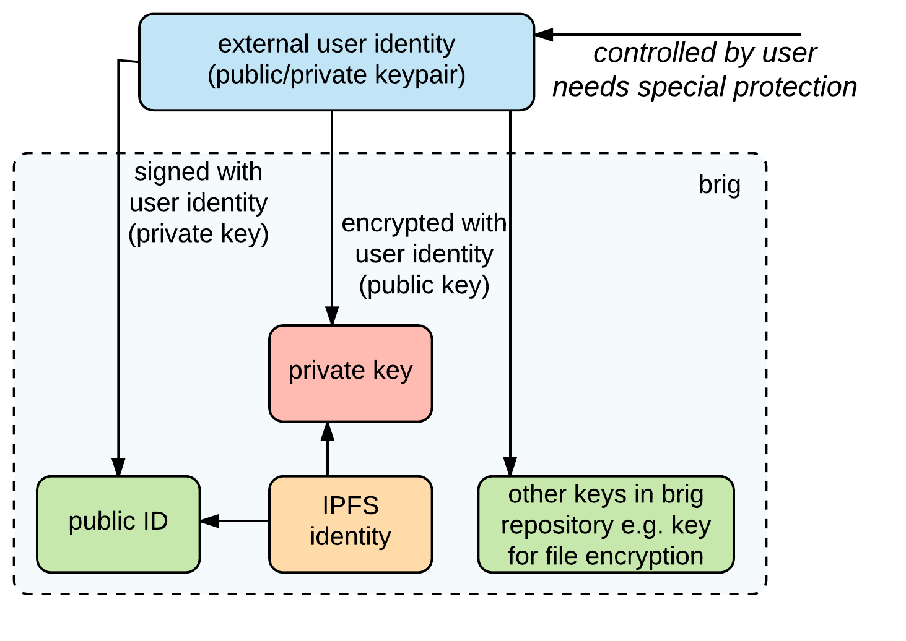

# Verbesserungen und Erweiterungen

Auf Basis der Evaluation von »brig« sollen nun mögliche Konzepte vorgestellt
werden um die in der Evaluation identifizierten Schwächen abzumildern
beziehungsweise zu beheben.

## Sicherheitstechnische Anpassungen

### Datenverschlüsselung

Aktuell verwendet der Datenverschlüsselungsschicht bei der Generierung der
*MAC* xy bit. Laut *BSI* werden hierfür zz bit empfohlen. BSI--Richtlinie für GCM.

Wie unter yy zu sehen sind aktuell die *IPFS*--Schlüssel in der `config`--Datei
von *IPFS* im Klartext hinterlegt. »brig« verschlüsselt diese Datei zum
aktuellen Zeitpunkt nicht. Hier wäre eine Verschlüsselung mit einem
*Repository*--Key möglich, welcher wiederrum durch einen Masterschlüssel
geschützt werden sollte (siehe [@sec:keymanagement]). Eine weitere Überlegung
wäre das gesamte *Repository* mittels eines externen Masterschlüssel zu
verschlüsseln.

Wie unter [@sec:schluesselgenerierung] erläutert, wird aktuell für jede Datei
ein zufälliger Schlüssel generiert. Mit diesem Ansatz wird die
Deduplizierungsfunktinalität von *IPFS* weitgehend nutzlos gemacht.

Ein Ansatz dieses »Problem« zum Umgehen ist die sogenannte »Convergent
Encryption«. Diese Technik wird beispielsweise von *Cloud--Storage*--Anbietern
verwendet um verschlüsselte Daten deduplizieren zu können, ohne dabei auf den
eigentlichen Inhalt zugreifen zu müssen (vgl. [@convergent-encryption]). 

{#fig:img-convergent-encryption width=80%}

Wie in [@fig:img-convergent-encryption] zu sehen, wird hierbei beispielsweise
der Schlüssel zum verschlüsseln einer Datei von dieser selbst mittels einer
kryptographischen Hashfunktion abgeleitet.

Diese Verfahren lässt sich jedoch bei der aktuellen Architektur (separate
Verschlüsselungsschicht) nur eingeschränkt realisieren, da die Prüfsumme der
Daten erst nach dem Hinzufügen zum *IPFS* bekannt ist. Um die Daten zu
verschlüsseln müssten diese vor dem Hinzufügen komplett *gehasht* werden. Dies
würde bedeuten dass man die Daten insgesamt zwei mal einlesen müsste (1.
Prüfsumme generieren, 2. `brig add`), was bei vielen und/oder großen Dateien
sehr ineffizient wäre.

Ein Kompromiss beispielsweise wäre anstatt der kompletten Prüfsumme über die
ganze Datei, nur die Prüfsumme über einen Teil (beispielsweise 1024Bytes vom
Anfang der Datei) der Datei zu machen und zusätzlich die Dateigröße mit in die
Berechnung des »Schlüssels« einfließen zu lassen. Dies hätte den Nachteil, dass
man auch viele Unterschiedliche Dateien mit dem gleichen Schlüssel
verschlüsseln würde, da mehrere unterschiedliche Dateien mit einer gewissen
Wahrscheinlichkeit fälschlicherweise die gleiche »Prüfsumme« generieren würden.

Ein weiteres Problem der *Convergent Encryption* ist, dass dieses Verfahren für
den »confirmation of a file«--Angriff anfällig ist. Das heißt, dass es einem
Angreifer möglich ist durch das Verschlüsseln eigener Dateien darauf zu
schließen was beispielsweise ein anderer Benutzer in seinem Repository
gespeichert hat.

## Keymanagement {#sec:keymanagement}

Das asymmetrische Schlüsselpaar von *IPFS* ist standardmäßig in keinster Weise
gesichert und muss daher besonders geschützt werden, da dieses die Identität
eines Individuums oder eine Institution darstellt. Bei Diebstahl des Schlüssels
(Malware, Laptop--Verlust/Diebstahl) kann die jeweilige Identität nicht mehr
als vertrauenswürdig betrachtet werden.

Die *IPFS*--Identität ist eng mit dem *IPFS*--Netzwerk und verwoben. Da das
Softwaredesign und auch die Sicherheitskomponenten sich aktuell in keinem
finalen Stadium befinden, ist für »brig« sinnvoll eine eigene
Schlüsselhierarchie umzusetzen, welche die Komponenten von *IPFS* schützt. So
haben auch zukünftige Änderungen an *IPFS* selbst keinen oder nur wenig
Einfluss auf das Sicherheitskonzept von »brig«.

[@fig:img-externalkey] zeigt ein Konzept, bei welchem ein »externes« und vom
Benutzer kontrolliertes Schlüsselpaar als Master--Schlüsseln für die
Absicherung des *IPFS*--Repository dient.

{#fig:img-externalkey width=70%}

Diese »externe« Identität muss dabei besonders vor Diebstahl geschützt werden
um Missbrauch zu vermeiden. Auf üblichen »Endverbrauchergeräten« ist der
Passwortschutz dieses Schlüsselpaars ein absolutes Minimalkriterium.

Eine weitere Maßnahme und »Best Practise« ist die sogenannte »Key Seperation«.
Obwohl es möglich ist das selbe Schlüsselpaar zum Signieren und Verschlüsseln
zu nehmen ist dies aus sicherheitstechnischen Gründen nicht empfehlenswert. Im
Klartext heißt das, dass für unterschiedliche Einsatzzwecke unterschiedliche
Schlüssel verwendet werden sollen. Um dies zu realisieren bietet *GnuPG* die
Möglichkeit von sogenannten *Subkeys*.

Beim erstellen eines Schlüsselpaars mit *GPG* wird standardmäßig ein
Masterschlüssel (zum Signieren von Daten und Zertifizieren Subkeys) und ein
*Subkey* für das Verschlüsseln von Daten erstellt[^FN_DEBIAN_SUBKEY].

Der Vorteil von *Subkeys* ist, dass diese an einen bestimmten Einsatzzweck
gebunden sind und auch unabhängig vom eigentlich Master--Schlüsselpaar
widerrufen werden können --- was eine sehr wichtige Eigenschaft bei der
Verwaltung von Schlüsseln darstellt.

Eine weitere Empfehlung an dieser Stelle wäre es den *privaten Schlüssel*
zusätzlich auf eine *Smartcard* auszulagern (siehe [@sec:smartcard]).

[^FN_DEBIAN_SUBKEY]: Debian Wiki Subkeys: <https://wiki.debian.org/Subkeys>

## Authentifizierungskonzept

### Authentifizierungkonzept mit IPFS--Bordmitteln

Unter [birg-Auth] wurde die aktuelle Situation evaluiert. Zum aktuellen
Zeitpunkt hat »brig« keine Authentifizierungsmechanismus, der kommunizierenden
Parteien müssen im Grunde ihre »brig«--Fingerabdrücke gegenseitig validieren
und auf dieser Basis manuell Ihrer Liste mit Kommunikationspartnern hinzufügen.
Neben der Möglichkeit den Fingerabdruck über einen Seitenkanal (Telefonat,
E--Mail) auszutauschen, sollen nun benutzerfreundlichere Konzepte vorgestellt
werden.

Eine sinnvolle Erweiterung an dieser Stelle wäre die Einführung eines QR--Codes
welcher die Identität eines Kommunikationspartners eindeutig klassifiziert.
Beispielsweise auf Visitenkaten gedurckte QR--Codes lassen den Benutzer seinen
Synchronisationspartner mit wenig Aufwand über ein Smartphone--App
verifizieren. Bei Anwendung eines »Masterschlüssels«, welcher für das Signieren
der »brig«--ID verwendet werden kann --- wie unter [@sec:keymanagement]
vorgeschlagen --- würde der Datensatz zur Verifikation wie folgt aussehen:

* IPFS--ID: `QmbR6tDXRCgpRwWZhGG3qLfJMKrLcrgk2qv5BW7HNhCkpL`
* GPG--Key--ID (16Byte[^FN_EVIL32]): `D3B2 790F BAC0 7EAC`, wenn keine GPG--Key--ID
  existiert: `0000 0000 0000 0000`

und könnte beispielsweise in folgender Form auf untergebracht werden:

* `QmbR6tDXRCgpRwWZhGG3qLfJMKrLcrgk2qv5BW7HNhCkpL | D3B2790FBAC07EAC`

[@fig:img-qrcode] zeigt den definieren Datensatz als QR--Code.

{#fig:img-qrcode width=30%}

[^FN_EVIL32]: Evil32. Check Your GPG Fingerprints: <https://evil32.com/>

Da *IPFS* bereits ein *Public/Private*--Schlüsselpaar mitbringt würde sich im
einfachste Falle nach dem ersten Verbindungsaufbau die Möglichkeit bieten den
sein Gegenüber anhand eines *Gemeinsamen Geheimnis* oder anhand eines
*Frage--Antwort--Dialogs* zu verifizieren. [@fig:img-question-answer] zeigt den
Ablauf einer Authentifizierung des Synchronisationspartners, welcher in Folgenden Schritten abläuft:

{#fig:img-question-answer width=95%}

1. Alice generiert eine zufällige Nonce, Frage und Antwort
2. Alice verschlüsselt Nonce + Antwort, signiert mit ihrem privaten Schlüssel
   und schickt sie an Bob
3. Bob prüft die Signatur, ist diese ungültig, wird abgebrochen, bei
   Gültigkeit entschlüsselt Bob die Nachricht
4. Bob inkrementiert die Nonce von Alice um eins und erstellt ein Antwortpaket
   bestehend aus Nonce, Frage und Antwort und schickt dieses an Alice
5. Alice prüft die Signatur, ist diese ungültig wird abgebrochen, bei
   Gültigkeit entschlüsselt Alice die Nachricht
6. Alice prüft ob Nonce um eins inkrementiert wurde, ob die Frage zur
   gestellten Frage passt und ob die Antwort die erwartete Antwort ist
7. Stimmen alle drei Parameter überein, dann wird Bob von Alice als
   vertrauenswürdig eingestuft und kann somit Bobs ID als vertrauenswürdig
   hinterlegen
8. Um Alice gegenüber Bob zu verifizieren, muss das Protokoll von Bob aus
   initialisiert werden

Eine weitere Möglichkeit wäre auch wie beim OTR--Plugin des
*Pidgin*--Messengers das Teilen eines gemeinsamen Geheimnisses.
[@fig:img-shared-secret] zeigt den Ablauf der Authentifizierungsphase bei der
Nutzung eines gemeinsamen Geheimnisses.

{#fig:img-shared-secret width=95%}

1. Alice und Bob generieren jeweils eine zufälligen Nonce (NA und NB)
2. NA und NB werden mit dem Public Key des Gegenübers verschlüsselt,
   signiert und an den Kommunikationspartner versendet
3. Die Kommunikationspartner validieren die Signatur und entschlüsseln jeweils die erhaltene Nonce N(A|B)
4. Die Kommunikationspartner inkrementieren die erhaltene Nonce fügen eine
   Prüfsumme ihres gemeinsamen geglaubten Geheimnisses hinzu, verschlüsseln,
   signieren und versenden diese an den Kommunikationspartner
5. Alice und Bob erhalten die inkrementierte Nonce und Prüfsumme (in
   verschlüsselter Form) des gemeinsam geglaubten Geheimnisses des Gegenübers
   Beide prüfen wieder die Signatur, entschlüsseln das Paket und Prüfen ob die
   Nonce inkrementiert wurde und ob die Prüfsumme ihres Geheimnisses mit dem des
   Gegenübers übereinstimmt
6. Bei gültiger Nonce und Prüfsumme sind beide Kommunikationspartner
   Gegenseitig authentifiziert und können Ihren Kommunikationspartner jeweils als
   vertrauenswürdig einstufen

Bei beiden Abläufen wurde jeweils ein zufällige Nonce verschlüsselt und
signiert versendet. Dies soll in beiden Fällen das Abgreifen der Nonce
verhindern und die bisherige Quelle Authentifizieren. Würde man an dieser
stelle die Nonce weglassen, so wäre ein *Replay*--Angriff möglich.

TODO: Anforderungen an Authentifizierung validieren. 

### Authentifizierungkonzept auf Basis des Web--of--Trust

* IPFS--ID mit privaten Schlüssel signieren und über »Web--of--Trust--Overlay--Network«

## Smartcards und RSA--Token als 2F--Authentifizierung {#sec:smartcard}

Wie bereits erwähnt, ist die Authentifizierung über ein Passwort oft der
Schwachpunkt eines zu sichernden Systems. Ist das Passwort oder die
Passwort--Richtlinien zu komplex, so neigen Benutzer oft dazu dieses
aufzuschreiben. Ist die Komplexität beziehungsweise Entropie zu niedrig so ist
es mit modernen Methoden vergleichsweise einfach das Passwort »berechnen«.

Ein weiterer Schwachpunkt der oft ausgenutzt wird ist die »unsichere«
Speicherung von kryptographischen Schlüsseln. Passwörter sowie kryptographische
Schlüssel können bei handelsüblichen Endanwendersystemen wie beispielsweise PC
oder Smartphone relativ einfach mitgeloggt beziehungswiese entwendet werden
können. Neben dem *FreeBSD*--Projekt welches dem Diebstahl von
kryptographischen Schlüsseln zum Opfer fiel[^FN_FREEBSD_SSH_MALWARE] gibt es
laut Berichten[^FN_SSH_MALWARE][^FN_PRIV_KEY_MALWARE] zunehmend Schadsoftware
welcher explizit für diesen Einsatzzweck konzipiert wurde.

[^FN_FREEBSD_SSH_MALWARE]:Hackers break into FreeBSD with stolen SSH key: <http://www.theregister.co.uk/2012/11/20/freebsd_breach/>
[^FN_SSH_MALWARE]:Malware & Hackers Collect SSH Keys to Spread Attacks: <https://www.ssh.com/malware/>
[^FN_PRIV_KEY_MALWARE]:Are Your Private Keys and Digital Certificates a Risk to You?: <https://www.venafi.com/blog/are-your-private-keys-and-digital-certificates-a-risk-to-you>

Um hier die Sicherheit zu steigern wird von Sicherheitsexperten oft zur
zwei--Faktor--Authentifizierung beziehungsweise zur hardwarebasierten
Speicherung kryptographischer Schlüssel (persönliche Identität beziehungswiese
RSA--Schlüsselpaar) geraten (vgl. [@martin2012everyday]).

Für die Speicherung von kryptographischen Schlüsseln eignen sich beispielsweise
Chipkarten, welche die Speicherung kryptographischer Schlüssel ermöglichen. Die
Problematik bei Smartcards ist, dass man zusätzlich ein Lesegerät benötigt.
Dieser Umstand schränkt die Benutzung stark ein und ist deswegen weniger für
den privaten Einsatzzweck geeignet.

Bei der Zwei--Faktor--Authentifizierung gibt es verschiedene Varianten, welche
in der Regel ein Passwort mit einem weiterem Element wie einer Bankkarte oder
einem Hardware--Token wie beispielsweise der RSA SecureID[^FN_SECUREID] verknüpfen.

[^FN_SECUREID]: RSA--SecureID: <https://de.wikipedia.org/wiki/SecurID>

Ein Problem hierbei ist wieder die Umsetzung im privaten Bereich.

Eine relativ »neue« Möglichkeit bieten beispielsweise die Hardware--Token von
*Yubico*[^FN_YUBICO] (siehe [@fig:img-yubikey]) und *Nitrokey*[^FN_NITROKEY]. Diese Hardware--Token haben
zudem den Vorteil, dass sie die Funktionalität einer Smartcard und eines
Hardware--Token für Zwei--Faktor--Authentifizierung vereinen.

{#fig:img-yubikey width=35%}

Der besondere bei diesen Hardware--Komponenten ist, dass sie sich über die
USB--Schnittstelle als HID (Human--Interface--Device) ausgeben und somit keine
weitere Zusatzhardware wie beispielsweise ein Lesegerät benötigt wird.

[^FN_NITROKEY]: Nitrokey: <https://www.nitrokey.com/>
[^FN_YUBICO]: Yubico: <https://www.yubico.com>

Bei beiden Herstellern gibt es die Hardware--Token in verschiedenen
Ausführungen. Bekannte Institutionen welche den *YubiKey* verwenden ist
beispielsweise die Universität von Auckland[^FN_YK_UNIVERSITY_AUCKLAND], das
*CERN*[^FN_YK_CERN] oder auch das [^FN_YK_MIT].

[^FN_YK_UNIVERSITY_AUCKLAND]: Auckland University YubiKey--Benutzeranweisung: <https://www.auckland.ac.nz/en/about/the-university/how-university-works/policy-and-administration/computing/use/twostepverification.html>
[^FN_YK_MIT]: Massachusetts Institute of Technology YubiKey--Benutzeranweisung: <https://security.web.cern.ch/security/recommendations/en/2FA.shtml>
[^FN_YK_CERN]: CERN YubiKey--Benutzeranweisung: <http://kb.mit.edu/confluence/pages/viewpage.action?pageId=151109106>

Für die Entwicklung von »brig« wurden *Yubico Neo*--Hardware--Token ---
aufgrund der Umfangreichen Programmier--API --- des Herstellers *Yubico*
beschafft. Alle weiteren Ausführungen und Demonstrationen beziehen sich auf
dieses Modell.

### Yubikey--NEO Einleitung

[^FN_YUBIKEY_PNG]: Bild--Quelle: <https://hao0uteruy2io8071pzyqz13-wpengine.netdna-ssl.com/wp-content/uploads/2015/04/YubiKey-NEO-1000-2016-444x444.png>

Der *Yubikey Neo* hat folgende Funktionalitäten beziehugnsweise Eigenschaften:

* Yubico OTP, One--Time--Password--Verfahren des Herstellers. Standardmäßig
  kann jeder YubiKey gegen die YubiCloud--Authentifizierungdienst mittels OTP
  authentifiziert werden
* OATH–Kompitabilität (HMAC--Based--OTP-- und Time--Based--OTP--Verfahren, für weitere Details vgl. [@oath])
* Challange--Response--Verfahren (HMAC-SHA1, Yubico OTP)
* FIDO U2F (Universal Second Factor)
* Statische Passwörter

Smartcard--Funktionalität:

* PIV (Personal Identity Verification) Standard[^FN_NISTPIV]
* OpenPGP--Smartcard--Standard

Weitere Eigenschaften sind im Datenblatt[^FN_YUBIKEY_NEO] des YubiKey--Neo zu finden.

[^FN_HOTP]: HOTP: <https://en.wikipedia.org/wiki/HMAC-based_One-time_Password_Algorithm>
[^FN_TOTP]: TOTP: <https://en.wikipedia.org/wiki/Time-based_One-time_Password_Algorithm>
[^FN_NISTPIV]: PIV--Standard: <http://nvlpubs.nist.gov/nistpubs/FIPS/NIST.FIPS.201-2.pdf>
[^FN_YUBIKEY_NEO]: YubiKey--Neo: <https://www.yubico.com/wp-content/uploads/2016/02/Yubico_YubiKeyNEO_ProductSheet.pdf>

Der *YubiKey--NEO* bietet mit zwei Konfigurationsslots (siehe GUI--Screenshot
[@fig:img-ykgui]) die Möglichkeit an mehrere Verfahren gleichzeitig nutzen zu
können. Ein beispielhafte Konfiguration wäre den ersten Konfigurationsslot mit
einem statischen Passwort und den zweiten mit einem One--Time--Passwort zu
belegen. 

[^FN_YUBICO_PERSON_TOOL]: Yubico Personalization Tool: <https://www.yubico.com/products/services-software/personalization-tools/use/>

Die grundlegende Konfiguration des *YubiKey* ist mit dem *YubiKey
Personalisation Tool* möglich.  

{#fig:img-ykgui width=75%}

##### Proof of concept 2FA von »brig« mit Yubico--Cloud

Für die Proof--of--concept Implementierung der Zwei--Faktor--Authentifizierung
wird die *yubigo*--Bibliothek[^FN_YUBIGO] verwendet.

[^FN_YUBIGO]: Yubigo Dokumentation: <https://godoc.org/github.com/GeertJohan/yubigo>

Das folgende minimale Implementierung zeigt eine voll funktionsfähigen
Authentifizierung eine *Yubikey* am *Yubico*--Cloud--Service. Bei der
Implementierung des Hardwaretokens als zweiten Faktor, ist es wichtig darauf zu
achten, dass die *Yubikey ID* gesichert wird. Passiert dies nicht, so könnte
sich jeder Benutzer mit einem gültigen *Yubikey* gegenüber »brig«
authentifizieren.

~~~go
const (
	// Passwort und Yubikeu (zweites Token) welches gegenüber
	// »brig« registriert ist
	RegistredYubikeyID = "ccccccababab"
	UserPassword       = "katzenbaum"
)

func answer(flag bool) string {
	if flag {
		return "Yes"
	}
	return "No"
}

func main() {
	// Passwort und OTP einlesen
	password, otp := os.Args[1], os.Args[2]
	yubiAuth, err := yubigo.NewYubiAuth("00042", "78AJl49l2924j2393jl29dsjlp9=")

	if err != nil {
		log.Fatalln(err)
	}

	// Validierung an der Yubico Cloud
	_, ok, err := yubiAuth.Verify(otp)
	if err != nil {
		log.Fatalln(err)
	}

	// Validierung welche Authentifizierungs-Parameter korrekt sind
	fmt.Printf("Yubico Auth valid? :\t %s\n", answer(ok))
	fmt.Printf("YubiKey known by brig? : %s\n", answer(otp[0:12] == RegistredYubikeyID))
	fmt.Printf("Password valid? :\t %s\n", answer(password == UserPassword))
}
~~~

Beim Ausführen des Code--Snippets wird der *Yubikey*--OTP--Schlüssel als erster
Parameter übergeben. Folgende Ausgabe zeigt den Test mit zwei verschiedenen
*Yubikey*--Token.

~~~sh
# Korrektes Passwort, korrekter Yubikey und OTP
$ ./twofac katzenbaum ccccccabababkdnkekdfvltennnlulrngvujviikcerg
[Yubico Auth valid? : Yes] ++++ [YubiKey known by brig? : Yes] ++++ [Password valid? : Yes]

# Korrektes Passwort, anderer Yubikey und OTP
$ ./twofac katzenbaum cccccccdcdcdfjckvrnckvfufkglckrdrgjlrntbcgbn
[Yubico Auth valid? : Yes] ++++ [YubiKey known by brig? : No] ++++ [Password valid? : Yes]

# Falsches Passwort, korrekter Yubikey und OTP
$ ./twofac elchwald ccccccabababgfbtejutvddbvdrfcrdrtbvlkktrdknl
[Yubico Auth valid? : Yes] ++++ [YubiKey known by brig? : Yes] ++++ [Password valid? : No]

# Korrektes Passwort, korrekter Yubikey und vorheriges OTP (replay)
$ ./twofac elchwald ccccccabababgfbtejutvddbvdrfcrdrtbvlkktrdknl
2016/11/28 12:20:43 The OTP is valid, but has been used before. If you receive
this error, you might be the victim of a man-in-the-middle attack.
[Yubico Auth valid? : No] ++++ [YubiKey known by brig? : Yes] ++++ [Password valid? : No]
~~~

TODO: Lieber Tabelle?

##### Proof of concept 2FA von »brig« mit Eigener Serverinfrastruktur

~~~go

import ...

~~~

### Yubikey als Smartcard

* Speicherung von Schlüsseln auf YubiKey möglich? Wie?

## Schlüsselhierarchie-- und Authentifizierungskonzept

* Master--Key auf Yubikey
* Subkeys für Daten, Sitzung, Repo?
* Backup--Keys für Hierarchie?
* Dateiverschlüsselung mittels Ableitung?

Mit einem Ansatz wie »Convergent encryption« würde es die Möglichkeit geben die
kryptographischen Schlüsseln von den zu verschlüsselten Dateien abzuleiten.
Diese Verfahren bringt Vor-- und Nachteile mit sich, welche weiter unter XY
beleuchtet werden.

## Signieren von Quellcode

Um die Verantwortlichkeit sowie den Urheber bestimmter Quellcodeteile besser
identifizieren zu können und dadurch die Entwickler auch vor Manipulationen am
Quelltext--Repository besser zu schützen bietet sich das Signieren von
Quellcode (auch *code signing* genannt) an. Zwar bietet beispielsweise `git`
bereits mit kryptographischen Prüfsummen (*SHA--1*) eine gewissen
Manipulationssicherheit, jedoch ermöglicht *SHA--1* keine Authentifizierung der
Quelle.

Eine Quelle zu Authentifizieren ist keine einfache Aufgabe. Gerade bei
Open--Source--Projekten, bei welchen im Grunde jeder (auch Angreifer) Quellcode
zum Projekt beitragen können, ist eine Authentifizierung um so wichtiger. 

Eine weit verbreitete Möglichkeit zur Authentifizierung, ist hierbei die
*Digitale Signatur*. Quelltext beziehungsweise *Commits* (Beitrag u. Änderungen
an einem Projekt) können auf eine ähnliche Art signiert werden. 

`git` bietet im Fall von »brig«, welches über *GitHub* entwickelt wird, das
Signieren und Verifizieren von *Commits* und *Tags*. Hierzu kann beispielsweise
mit `git config` global die *Schlüssel--ID* des Schlüssels hinzugefügt werden, mit welchem
der Quelltext in Zukunft signiert werden soll:
Anschließend kann mit dem zusätzlichen Parameter (`-S[<keyid>],
--gpg-sign[=<keyid>]`) ein digital unterschriebener *Commit* abgesetzt werden:

~~~sh
# Schlüssel-ID des Entwicklers über Fingerprint ausfindig machen
$ gpg --list-keys christoph@nullcat.de
	pub   rsa2048 2013-02-09 [SC] [expires: 2017-01-31]
		  E9CD5AB4075551F6F1D6AE918219B30B103FB091
	uid           [ultimate] Christoph Piechula <christoph@nullcat.de>
	sub   rsa2048 2013-02-09 [E] [expires: 2017-01-31]

$ gpg --list-sig E9CD5AB4075551F6F1D6AE918219B30B103FB091 | tail -n 4
sig     P    D2BB0D0165D0FD58 2016-11-29  CA Cert Signing Authority (Root CA) <gpg@cacert.org>
sub   rsa2048 2013-02-09 [E] [expires: 2017-01-31]
sig          8219B30B103FB091 2016-02-01  Christoph Piechula <christoph@nullcat.de>

# Signier-Schlüssel git mitteilen
$ git config --global user.signingkey  8219B30B103FB091

# Signierten Commit absetzen
$ git commit -S -m 'Brig evaluation update. Signed.'
~~~

Durch das signieren von *Commits* wird auf *GitHub* über ein Label ein
erweiterter Status zum jeweiligen *Commit* beziehungsweise *Tag* angezeigt,
siehe [@fig:img-signunveri].

{#fig:img-signunveri width=65%}

Pflegen die Entwickler zusätzlich ihren privaten Schlüssel im *GitHub*--Account
ein, so signalisiert das Label eine verifizierte Signatur des jeweiligen
*Commits* beziehungsweise *Tags*, siehe [@fig:img-signed].

{#fig:img-signed width=70%}

## Signatur und Update der Binaries

1.) Signieren wie das Tor Projekt?
2.) Update Proof of concept mit Public-Key aufbauend?

## Repository--Backup--Konzept

Ein weiterer Punkt der für eine »benutzerfreundliche« 
* Key/Identify--Backup.
